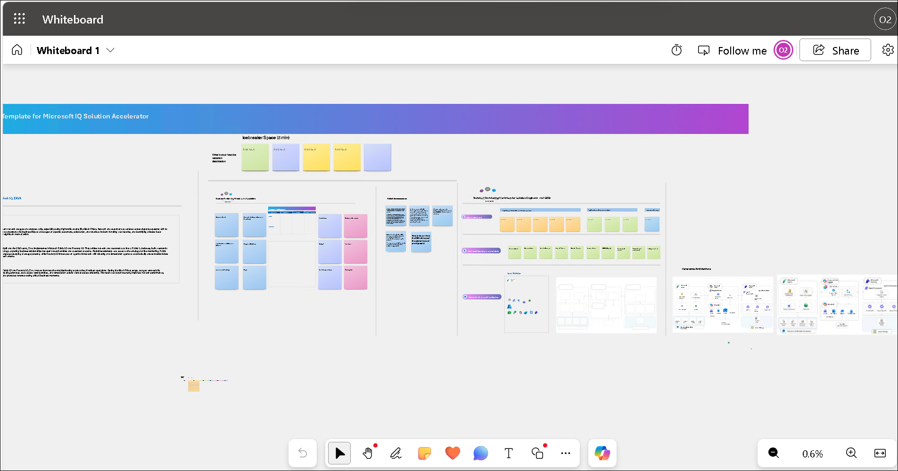

## 1. Envisioning Session Using Whiteboarding

### Step 1: Why Customers should use Whiteboarding

Whiteboarding helps customers quickly align on business goals, current challenges, future-state architecture, and solution priorities. It turns abstract ideas into a shared visual plan and helps accelerate decisions for Microsoft IQ Solution Accelerators.

### Step 2: How to copy the Whiteboard using an existing template URL

1. Navigate to Edge browser.

1. Right click on the Whiteboard template link [Whiteboard Template](https://sandboxailabs1002-my.sharepoint.com/:wb:/g/personal/amplify_user_sandboxailabs1002_onmicrosoft_com/IQD1TBylV2gYT5DVzgl8Xa0eAYKcF8Pu0UnCkRHs6uL1jLE?e=khNEaL&xsdata=MDV8MDJ8fDI2OGNlYjM1ZjNmZTRkMzNlZjE4MDhkZWZjODFkY2QxfDcyZjk4OGJmODZmMTQxYWY5MWFiMmQ3Y2QwMTFkYjQ3fDB8MHw2MzkyMjU4MzE4MTg5MTU2MDh8VW5rbm93bnxWR1ZoYlhOVFpXTjFjbWwwZVZObGNuWnBZMlY4ZXlKRFFTSTZJbFJsWVcxelgwRlVVRk5sY25acFkyVmZVMUJQVEU5R0lpd2lWaUk2SWpBdU1DNHdNREF3SWl3aVVDSTZJbGRwYmpNeUlpd2lRVTRpT2lKUGRHaGxjaUlzSWxkVUlqb3hNWDA9fDF8TDJOb1lYUnpMekU1T2poak16YzROemxrTFRGaU9ETXRORGd5WWkxaE5qZ3lMV1UwT1RKbE5qazNaRFkxTWw5a05XSXdNamszWWkxbE5XWTNMVFJrTnpNdFlUQmpOaTFoTVdVMk9UVmxPV00yTkRGQWRXNXhMbWRpYkM1emNHRmpaWE12YldWemMyRm5aWE12TVRjNE5qazROak00TURjek13PT18ZDk1NTcxNTIzY2Q1NDhiMDc1NDgwOGRlZmM4MWRjZDF8ZWE4NGYwMzA3NDFhNDk1ZTkzZDkwNjU2MGE1NWI3YmE%3D&sdata=SlEzSWxoODYyRlpVcVEyR0g4SmxxS3o1SytmNTkwMjgwR3gvV1dXNGlEZz0%3D&ovuser=6d7e0652-b03d-4ed2-bf86-f1999cecde17%2CPrapthi.S%40spektrasystems.com) then **Copy link** and then paste it on the browser.

1. If promoted, sign in with your ODL user credentials.

1. Once you login, you will get the pop message to create the new Whiteboard. Read the message and click **Got it**.

   

1. Use the **Zoom out** option to view the template clearly.

   

Now, click on **`Next >>`** from the lower right corner to move on to **`Rapid Prototyping`**.
