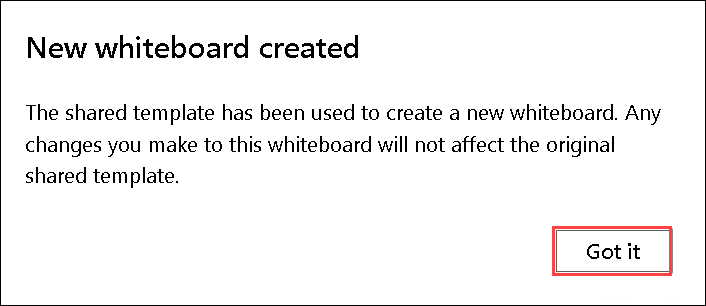
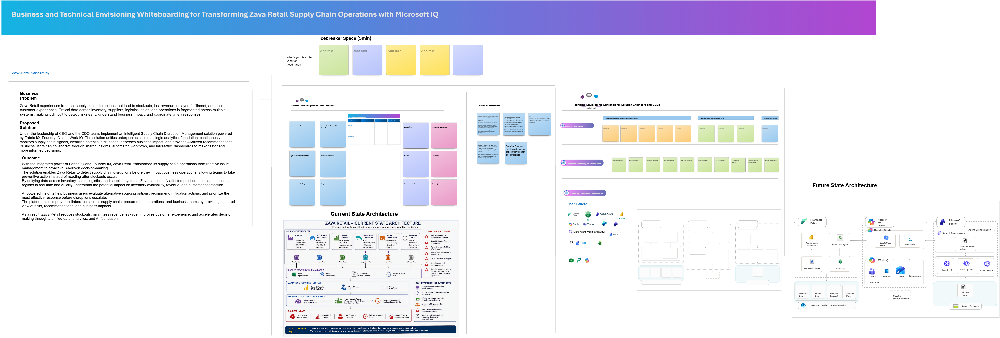

## 1. Envisioning Session Using Whiteboarding

### Why Zava retail should use Whiteboarding

Whiteboarding helps Zava retail quickly align on business goals, current challenges, future-state architecture, and solution priorities. It turns abstract ideas into a shared visual plan and helps accelerate decisions for Microsoft IQ Solution Accelerators.

Zava Retail faces supply chain disruptions that can quickly lead to stockouts, revenue loss, and poor customer experiences. Today, critical data is spread across disconnected systems, making it difficult to identify risks, understand their business impact, and respond in time.
This will demonstrates how a prebuilt intelligent solution can unify data, AI, analytics, and workflows to help Zava Retail:

- Detect supply chain disruptions early
- Identify impacted products, stores, and regions
- Recommend alternative sourcing options
- Coordinate decisions across teams
- Reduce stockouts and protect revenue
- Accelerate business value with Microsoft Fabric, Foundry, Power BI, and AI working together

### How to copy the Whiteboard using an existing template URL

1. Navigate to Edge browser.

1. Right click on the Whiteboard template link [Whiteboard Template](https://sandboxailabs1002-my.sharepoint.com/:wb:/g/personal/amplify_user_sandboxailabs1002_onmicrosoft_com/IQBETd07lrISRKag5iCPOrI7AShmtmhDE5bxvXCSyABrKl4?e=FS47Df&xsdata=MDV8MDJ8fGRkYTc2M2Y0YTRkODRlMzhhYjI1MDhkZWZlMWQyZTY5fDcyZjk4OGJmODZmMTQxYWY5MWFiMmQ3Y2QwMTFkYjQ3fDB8MHw2MzkyMjc1OTg0MTkzNzc5MjF8VW5rbm93bnxWR1ZoYlhOVFpXTjFjbWwwZVZObGNuWnBZMlY4ZXlKRFFTSTZJbFJsWVcxelgwRlVVRk5sY25acFkyVmZVMUJQVEU5R0lpd2lWaUk2SWpBdU1DNHdNREF3SWl3aVVDSTZJbGRwYmpNeUlpd2lRVTRpT2lKUGRHaGxjaUlzSWxkVUlqb3hNWDA9fDF8TDJOb1lYUnpMekU1T2poak16YzROemxrTFRGaU9ETXRORGd5WWkxaE5qZ3lMV1UwT1RKbE5qazNaRFkxTWw5a05XSXdNamszWWkxbE5XWTNMVFJrTnpNdFlUQmpOaTFoTVdVMk9UVmxPV00yTkRGQWRXNXhMbWRpYkM1emNHRmpaWE12YldWemMyRm5aWE12TVRjNE56RTJNekEwTURVeU1BPT18YzVlMDVmM2FlNTU4NDM0NjMxZjcwOGRlZmUxZDJlNjl8NjA0YzNjMmJjZjA3NGEyZGI1YWJiMjRlM2VkYWU4YmY%3D&sdata=YXFtazJoanUzYk9JckwrTW5lR1FqNzJkS2xXcjdwOSthWlU1bWZSU1E5Zz0%3D&ovuser=6d7e0652-b03d-4ed2-bf86-f1999cecde17%2CPrapthi.S%40spektrasystems.com) then **Copy link** and then paste it on the browser.

1. If promoted, sign in with your ODL user credentials.

1. Once you login, you will get the pop message to create the new Whiteboard. Read the message and click **Got it**.

   

1. Use the **Zoom out** option to view the template clearly.

   

### Now, click on **`Next >>`** from the lower right corner to move on to **`Rapid Prototyping`**.
