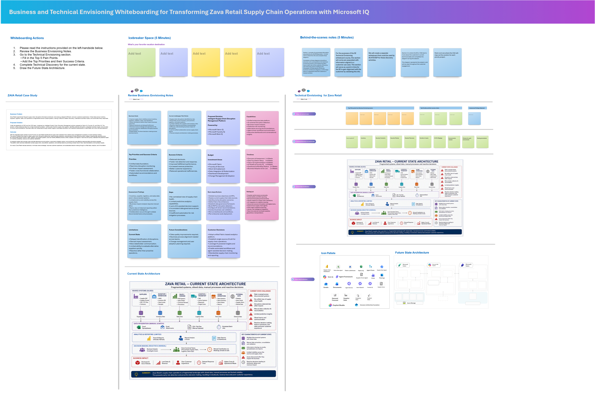

## 1. Envisioning Session Using Whiteboarding

### Whiteboarding

Whiteboarding helps technical teams to quickly align on business goals, current challenges, future-state architecture, and solution priorities. It turns abstract ideas into a shared visual plan and helps accelerate decisions for Microsoft IQ Solution Accelerators.

Let’s consider a common retail use case. Supply chain disruptions can quickly lead to stockouts, revenue loss, and poor customer experiences. Critical data is often spread across disconnected systems, making it difficult to identify risks, understand their business impact, and respond in time.

You will start with whiteboarding to architect a future state of an intelligent solution which can:
- Detect supply chain disruptions early
- Identify impacted products, stores, and regions
- Recommend alternative sourcing options
- Coordinate decisions across teams
- Reduce stockouts and protect revenue
- Accelerate business value with Microsoft Fabric, Foundry, Power BI, and AI working together

### How to copy the Whiteboard using an existing template URL

1. Open a new browser tab in the Edge browser.

1. Right click on the following Whiteboard template link -  ["Whiteboard Template"](https://sandboxailabs1002-my.sharepoint.com/:wb:/g/personal/amplify_user_sandboxailabs1002_onmicrosoft_com/IQBI5vdQvAjLQJJNzWbq7g-EAVTYXp4buMaomLQnHL-uz70?e=yrJqYF), then select **Copy link** and then paste it on the browser tab.

1. If prompted, sign in with your ODL user credentials.

1. Once you login, you will get a pop-up message to create the new Whiteboard. Read the message and click **Got it**.

   

1. Use the **Zoom out** option to view the Whiteboard template clearly.

   

1. Please follow along as the **Facilitator** guides you through the **Business** and **Technical** Envisioning session. During the session, you will identify key business challenges, define priorities, assess the current environment, and design a Future-state solution architecture.

### Activities

1. Review the **Business Envisioning Notes** to understand the organization's goals, challenges, and desired outcomes.

1. Go to the **Technical Envisioning** section and:
   - Capture the **Top 5 Pain Points**.
   - Define the **Top Priorities** and corresponding **Success Criteria**.

1. Complete the **Technical Discovery** by documenting:
   - Current-state architecture
   - Systems

1. Design the **Future State Architecture** to illustrate how the proposed solution addresses business needs and technical requirements.

1. Review the completed envisioning outputs and validate their alignment with the desired business outcomes.

## This completes the Envisioning Session using Microsoft Whiteboarding.

### Now, click on **`Next >>`** from the lower right corner to move on to **`Rapid Prototyping`**.
