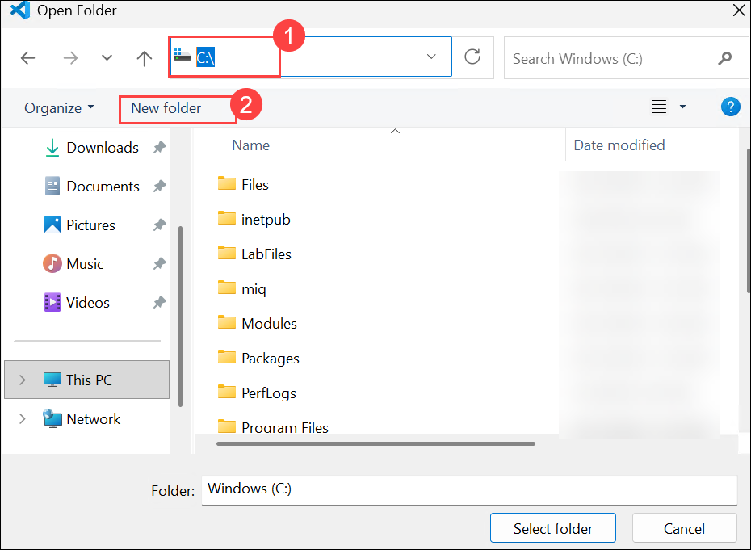
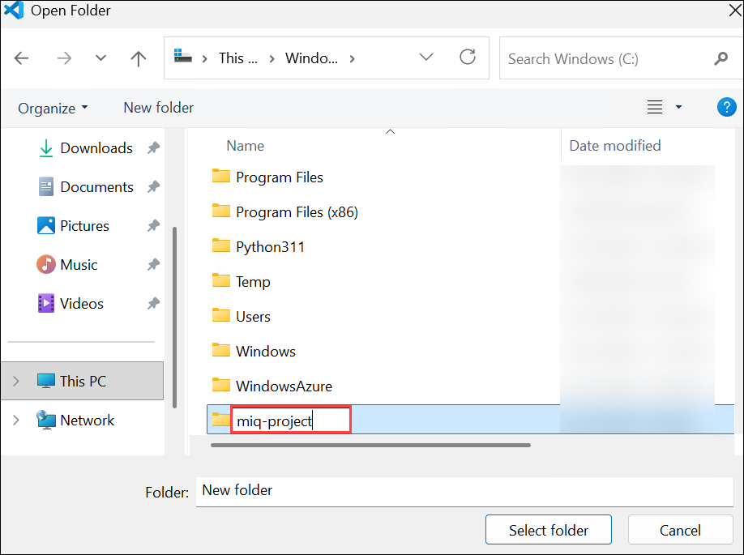
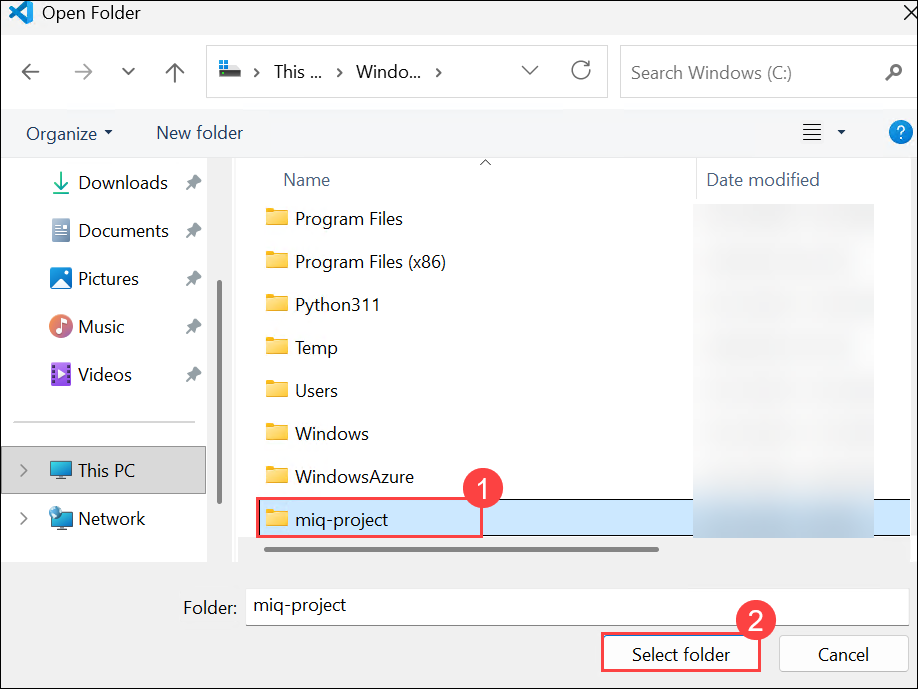
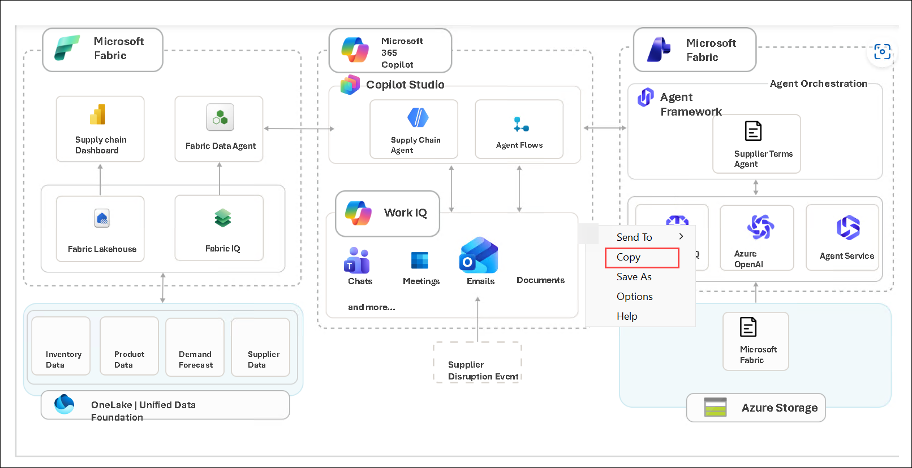

# 2. Rapid Prototyping

Zava Retail faces supply chain disruptions that can quickly lead to stockouts, revenue loss, and poor customer experiences. Today, critical data is spread across disconnected systems, making it difficult to identify risks, understand their business impact, and respond in time.
This will demonstrates how a prebuilt intelligent solution can unify data, AI, analytics, and workflows to help Zava Retail:

- Detect supply chain disruptions early
- Identify impacted products, stores, and regions
- Recommend alternative sourcing options
- Coordinate decisions across teams
- Reduce stockouts and protect revenue
- Accelerate business value with Microsoft Fabric, Foundry, Power BI, and AI working together

As you have completed the envisioning **whiteboard session** and identified key business opportunities, let's now explore how Zava Retail can address its supply chain challenges by transforming disruptions into proactive, data-driven business decisions. Using a unified intelligence platform that brings together enterprise data, AI-powered insights, and business workflows, you can anticipate risks, optimize operations, and respond faster to changing supply chain conditions.

## 2.1 Rapid Prototyping using GitHub Copilot

You will use GitHub Copilot to generate ARM or Bicep templates from the provided natural language business use case/scenario.

1. Click on the **Visual Studio Code** from the VM desktop.

   

1. Click on **Continue with GitHub** to sign in to GitHub Copilot.

   

1. On the **Sign in to GitHub** tab, enter the provided **GitHub username** **(1)** in the input field, and click on **Sign in with your identity provider** to continue **(2)**.

    - **Username:** <inject key="GitHub User Name" enableCopy="true"/>

     

1. Click on **Continue** on the **Single sign-on to CloudLabs Organizations** page to proceed.

   

1. Click on **Accept**.

   

1. Select **Continue** to **Authorize Visual Studio Code**.

   

1. Select **Authorize Visual Studio Code**.

   

1. Select **Open**.

   

1. Once the Visual Studio code opens, choose the theme of your wish **(1)** and then click **Get Started (2)**.

   

   

   >**Note:** If you get any error pop up, please **Close.**

       

1. Select **File (1)** and then **Open Folder (2)**.

   

1. Navigate to **C:\ (1)**, then click **New folder (2)** to create a new folder.

   

1. Name the folder as **miq-project**.

   

1. Click on the folder **(1)** and then click on **Select folder (4)**.

   

1. From the **GitHub Copilt** Chat, select **Models (1)** and then select **Trust Workspace to enable models (2)**.

   

1. Select **Trust Folder and Continue**.

   

1. Click **Auto (1)** and then set the model to **Claude Sonnet 5 (2)**.

   

1. Click on **Default permission (1)** and then set it to **Allow all (2)**.

   

1. Select **Enable**.

   

1. Please navigate to your created **Whiteboard template**.   

1. Search for **Snipping tool (1)** from your VM's Windows search bar and then select **Snipping tool (2)**.

   

1. Click **New** to take the Screenshot.

   

1. Take the screenshot of the Whiteboard image. Then right click on the screeshot and then select **Copy**.

   

1. Navigate back to **GitHub Copilot Chat**.   

1. Paste the image **(1)**, then paste the below prompt along with the image **(2)** and then **Send (3)**.

   ```
   You are my smart agent to read my attached architecture design for Zava Retail and create bicep/ARM template based on the identified resources.
   Please follow these below instructions for Fabric IQ section:
   1. List down all the Azure resources from the architecture diagram.
   2. Crate a new resource group and new Fabric Workspace(SKU F16) for WestUS3 region 
   3. Create Dashboards
   3. Create Lakehouse and store sample data into tables(Tables should be as per architecture design)
   4. Create Fabric Ontology using above Lakehouse tables with proper relationship and generate Ontology Graph View
   5. Create Data Agent using above Ontology as a data source and prepare proper Agent Instruction based on these Ontology Entities.
   Note: After complete all above steps successfully, create MD(mark down) file with deployment instructions and post deployment configurations, and start deployment(create workspace, create lakehouse, table creation, sample data insertion, ontology creation, data agent creation)
   ```

    
   
1. Once Copilot starts generating the response, monitor the process closely. Do not take any action; simply watch the progress.

1. After some time, Copilot may ask you a few questions. Review each question carefully and select the appropriate response. 

1. Select **Yes**, if any question prompts related to `F16` deployement.

   

1. If prompted to provide the UPN for assigning **Fabric Administrator access**, enter **<inject key="AzureAdUserEmail"></inject> (1)** and then select **Submit (2)**. 

    

1. Monitor the process to understand how it generates the response and handles or resolves errors.  

1. Wait for the deployment to complete. This may take approximately `10–20` minutes. Once completed, you will see a Summary/Conclusion similar to the example below, although the details may vary **(1)** and select **Keep (2)** to keep the created files.

   

1. Once the deployment is complete, you can verify the deployed resources by navigating to the newly created resource group.

1. Navigate to the Azure portal. Click on **Resource group**.

   

1. Selected the newly created RG related to retail. 

   

   >**Note:** Note the one **rg-miqsolution**.

1. You should see the deployed Fabric capacity.

   

1. Click on the **App launcher (1)** and select **Microsoft fabric** icon.

   

1. Navigate to **Workspaces**, there should be workspace created with the name similar to **Zava retail**. If your unable to see. Please go back to the **GitHub Copilit Chat**.

   

   >**Note:** Not the one which starts with **Microsoft IQ**.

1. Send the the below prompt to make the UPN **<inject key="AzureAdUserEmail"></inject>** as Fabric admin **(1)** and then **Send (2)**.

   ```
   Please provide Fabric admin access to the UPN <inject key="AzureAdUserEmail"></inject> to see the fabric workspace
   ```

       

1. Wait for the process to complete and then **Keep** the file.

   

1. Now please go back to the Fabric portal, refresh the portal and navigate to the **Workspaces**. Now you should be able to see the Worspace starts with something similar to `Zava Retail`.

   

1. Open the **Zava Retail** workspace.

1. Make sure what are the workspace items that you have mentioned in the prompt are all created.

   

1. Please open each item and verify that it has been created correctly. If anything is missing, go back to the **GitHub Copilot Chat** and provide a follow-up prompt to address the missing item.  

1. In this case, when I opened the workspace. There is no tables created in the Lakehouse.

   

1. Navigate back to the **GitHub Copilot Chat** to send the follow up prompt.

   ```
   Issues identified with the workspace items, please fix this issue.

   No table has been created in the Lakehouse, and no sample data has been loaded.
   The Ontology was created, but no entities or relationships have been added.
   The Ontology has not been configured as the Data Source for the Data Agent.
   ```

    

1. Wait for the process to complete and click **Keep** to keep the file.

   

1. Navigate back to the Fabric workspace, refresh the Lakehouse, and verify that the tables have been created and the sample data has been loaded successfully.

   

1. Open the **Ontology** item and verify that the entities and relationships have been created successfully.

   

1. Open the **Data Agen**t from the workspace and verify that the **Ontology** is configured as the Data Source. If not please go back to **GitHub Copilot Chat** and explain the issue and ask to fix.

1. Navigate back to the **Fabric workspace** and open the **Data Agent**. If the error persists, remove the existing Data Source and manually add the **Ontology** as the Data Source.

   - Click on the **elipses (1)** and then **Remove (2)**

     

   - Select **Add data (1)** drop down and then **Data source (2)**.

        

   - Select the **Ontology (1)** and then **Add (2)**.

             

1. Make sure Ontology is added.

      

   


