# 2. Rapid Prototyping

Zava Retail faces supply chain disruptions that can quickly lead to stockouts, revenue loss, and poor customer experiences. Today, critical data is spread across disconnected systems, making it difficult to identify risks, understand their business impact, and respond in time.
This will demonstrates how a prebuilt intelligent solution can unify data, AI, analytics, and workflows to help Zava Retail:

- Detect supply chain disruptions early
- Identify impacted products, stores, and regions
- Recommend alternative sourcing options
- Coordinate decisions across teams
- Reduce stockouts and protect revenue
- Accelerate business value with Microsoft Fabric, Foundry, Power BI, and AI working together

As you have completed the envisioning **whiteboard session** and identified key business opportunities, let's now explore how Zava Retail can address its supply chain challenges by transforming disruptions into proactive, data-driven business decisions. Using a unified intelligence platform that brings together enterprise data, AI-powered insights, and business workflows, you can anticipate risks, optimize operations, and respond faster to changing supply chain conditions.

## 2.1 Rapid Prototyping using GitHub Copilot

You will use GitHub Copilot to generate ARM or Bicep templates from the provided natural language business use case/scenario.

1. Click on the **Visual Studio Code** from the VM desktop.

   

1. Click on **Continue with GitHub** to sign in to GitHub Copilot.

   

1. On the **Sign in to GitHub** tab, enter the provided **GitHub username** **(1)** in the input field, and click on **Sign in with your identity provider** to continue **(2)**.

    - **Username:** <inject key="GitHub User Name" enableCopy="true"/>

     

1. Click on **Continue** on the **Single sign-on to CloudLabs Organizations** page to proceed.

   

1. Click on **Accept**.

   

1. Select **Continue** to **Authorize Visual Studio Code**.

   

1. Select **Authorize Visual Studio Code**.

   

1. Select **Open**.

   

1. Visual Studio code opens, **Close** the suggestion.

   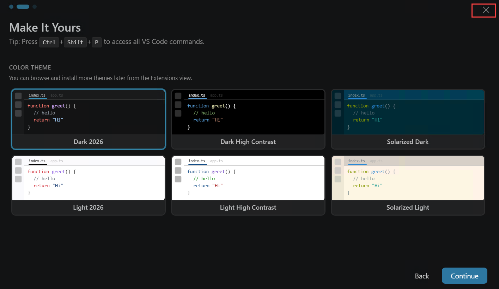

   

1. Select **File (1)** and then **Open Folder (2)**.

   

1. Navigate to **Downloads (1)**, click on **New folder (2)** to create a new folder. Name the folder as **miq (3)** and then **Select folder (4)**.

   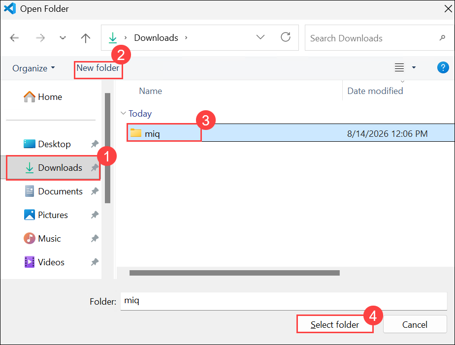

1. From the **GitHub Copilt** Chat, select **Models (1)** and then select **Trust Workspace to enable models (2)**.

   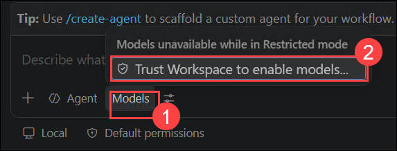

1. Select **Trust Folder and Continue**.

   

1. Click **Auto (1)** and then set the model to **Claude Sonnet 5 (2)**.

   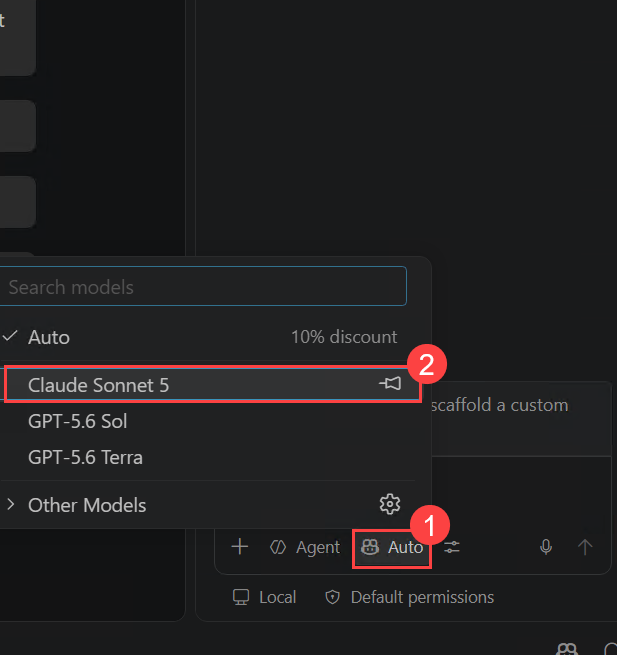

1. Click on **Default permission (1)** and then set it to **Allow all (2)**.

   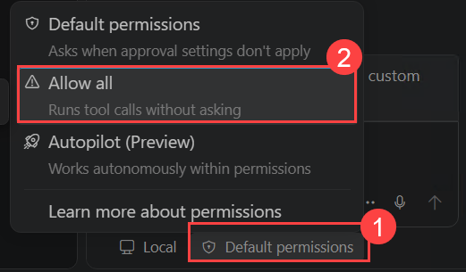

1. Select **Enable**.

   

1. Copy and paste the below Natural language business use case/scenario in the chat to deploy the Microsoft IQ Solution Accelerator.

   ```
   You are the deployment agent operating inside a Windows Azure VM using VS Code, PowerShell, Azure CLI, Azure Developer CLI, Python, Git, and the currently authenticated Azure identity.

   Your objective is to deploy the complete canonical Microsoft IQ Solution Accelerator from:

   https://github.com/microsoft/microsoft-iq-solution-accelerator

   The final deliverable must include:

   * Azure infrastructure
   * Microsoft Foundry resources, models, knowledge base, MCP connection, and agent
   * Microsoft Fabric capacity, workspace, notebooks, lakehouses, ontology, semantic models, reports, and Data Agent
   * Verified human access to both Fabric and Microsoft Foundry
   * A precise Power Platform/Copilot Studio manual handoff
   * Independent post-deployment validation
   * A complete factual deployment report

   Do not reconstruct the repository file by file. Do not generate substitutes, compatibility stubs, placeholders, fake binaries, or approximated Fabric artifacts.

   1. Source acquisition and integrity

   Clone the public canonical repository into the empty working directory.

   Resolve the main branch to an exact commit SHA and report:

   * Repository URL
   * Branch
   * Commit SHA
   * Commit date

   Remain pinned to that commit for the entire run.

   Inspect the following before acting:

   * azure.yaml
   * infra/main.bicep
   * infra/main.parameters.json
   * All referenced Bicep modules
   * infra/scripts/install_microsoft_iq_solution.py
   * Fabric workspace setup and administrator scripts
   * Foundry setup scripts
   * Fabric installer notebook
   * Power Platform solution package
   * DeploymentGuide.md
   * Foundry, Fabric, Copilot Studio, and testing guides

   Do not edit repository source merely to accommodate an environment-setting problem.

   If a genuine source-code change becomes necessary, stop and report:

   * Exact technical reason
   * File and proposed change
   * Expected effect
   * Whether the change diverges from the canonical commit

   Wait for approval before modifying source.

   2. Safety and approval boundaries

   Use granular/default approvals.

   You may perform these preflight activities without repeatedly asking:

   * Clone and inspect the public repository
   * Run read-only Azure, Fabric, Foundry, Microsoft Graph, quota, and provider checks
   * Install missing local validation tooling
   * Create a local Python virtual environment
   * Install the repository's pinned Python dependencies
   * Compile or parse local source
   * Validate JSON, YAML, Bicep, notebooks, and ZIP structure

   Before creating or changing any billable cloud resources, present one consolidated deployment checkpoint and wait for the exact confirmation:

   Proceed with azd up

   Do not perform any of the following without separate explicit authorization:

   * azd down
   * Resource deletion
   * Resource-group deletion
   * Tenant-setting changes
   * Microsoft Graph permission grants
   * Azure role assignments not already approved in the checkpoint
   * Power Platform publication
   * Copilot Studio publication
   * Teams enablement

   Never request, print, store, or expose passwords, access tokens, client secrets, private keys, or connection secrets.

   3. Local toolchain preflight

   Inventory and report versions for:

   * Git
   * Azure CLI
   * Azure Developer CLI
   * PowerShell
   * Python
   * Bicep
   * VS Code support/extensions relevant to Python, PowerShell, Bicep, Azure, and GitHub Copilot

   Install only missing local tooling required for validation.

   The PowerShell VS Code extension is recommended but is not a deployment blocker.

   Run appropriate non-cloud validation, including:

   * git status and pinned-commit verification
   * az bicep build on the canonical entry point
   * ARM JSON validation
   * Python compilation
   * Safe Python import checks
   * PowerShell parser checks
   * azure.yaml validation
   * Notebook JSON validation
   * Power Platform ZIP integrity testing
   * Confirmation that solution.xml and customizations.xml exist
   * Python virtual-environment creation
   * Installation of requirements.txt
   * Verification of pinned Python package versions

   Separate warnings from actual errors. Do not treat expected script behavior as a repository defect.

   4. Azure identity and subscription preflight

   Inspect and report:

   * Current Azure account
   * Account type
   * Tenant ID
   * Service-principal application/client ID
   * Service-principal object ID, if resolvable
   * Accessible subscriptions
   * Current default subscription
   * azd authentication status
   * Existing resource groups are reported for AWARENESS ONLY. Never deploy into
   an existing resource group. This deployment must always create a brand-new,
   empty resource group dedicated to this run.
   * Resource-provider registration status

   If only one subscription is accessible, report its name and ID but still include it in the deployment checkpoint.

   Do not run another interactive login when the required authenticated sessions already exist.

   5. Model quota and regional validation

   Before selecting the AI deployment region, check actual quota and model availability for:

   * gpt-5-mini
   * text-embedding-3-small

   Report:

   * Region
   * Deployment type
   * Model version
   * Requested capacity
   * Current usage
   * Available quota

   Do not assume that the general Azure resource location must also host the model deployments.

   Recommended starting values, only when confirmed available:

   * General Azure location: westus2
   * AI model deployment location: eastus2
   * gpt-5-mini: GlobalStandard, capacity 150
   * text-embedding-3-small: GlobalStandard, capacity 80

   6. Bicep and naming-constraint preflight

   Before creating an azd environment, inspect every Bicep parameter and every mapping in main.parameters.json.

   Validate proposed values against:

   * maxLength
   * minLength
   * allowed values
   * patterns
   * Azure resource naming restrictions
   * Generated resource-name lengths
   * Existing resource-name conflicts

   AZURE_ENV_NAME maps to solutionName, which must not exceed 20 characters.

   Use a short environment name.

   Recommended example:

   miq-accelerator

   If that environment or its resource names already exist, propose a unique short alternative such as:

   miq-demo01

   Do not use microsoft-iq-solution-accelerator as the environment name because it exceeds the canonical Bicep constraint.

   The resource group for this deployment MUST be newly created. Never reuse,
   deploy into, or add resources to any pre-existing resource group, even if
   its name matches the expected pattern below.

   Resource group naming: rg-<short-environment-name>

   Before creating the azd environment, check whether a resource group with
   that exact name already exists in the target subscription:

   * If it does NOT exist, proceed with that name.
   * If it DOES exist, do not reuse it under any circumstances. Automatically
   generate a new, unique environment/resource-group name (for example,
   append a short random or incrementing suffix such as rg-miq-accelerator-02
   or rg-miq-accelerator-<4-char-suffix>), and use that new name for the azd
   environment instead.

   Report the final, confirmed-unique resource-group name in the deployment
   checkpoint. Do not ask the user to manually check for conflicts — perform
   this check yourself before presenting the checkpoint.

   7. Separate administrator mechanisms

   Treat these as separate configuration and validation items:

   A. Fabric capacity administrators

   These are configured through Bicep/ARM on the Fabric capacity.

   B. Fabric workspace administrators

   These are assigned by the Python postprovision installer through Fabric APIs and may require Microsoft Graph identity resolution.

   C. Microsoft Foundry human access

   This requires appropriate Azure/Foundry RBAC and is separate from Fabric access.

   Do not describe these as one generic administrator setting.

   8. Human identity and Microsoft Graph preflight

   Ask for the intended human administrator's:

   * User principal name
   * Microsoft Entra user object ID

   Prefer the Entra object ID for workspace assignments.

   Test whether the deployment service principal can resolve the human through Microsoft Graph using a narrowly scoped read-only lookup.

   If Microsoft Graph returns 403 or Insufficient privileges:

   * Explain that UPN-to-object-ID resolution will fail
   * Do not assume the workspace assignment will work
   * Request the human's Entra object ID
   * Alternatively, ask whether the user accepts a manual post-deployment workspace assignment

   Do not require or recommend Global Administrator.

   For repeatable automatic UPN resolution, report Microsoft Graph User.Read.All application permission with tenant admin consent as an optional administrative solution, subject to security review.

   Supplying the single human user's object ID is the preferred least-privilege solution for one deployment.

   9. Human portal-access requirements

   Treat successful interactive human access as part of the acceptance criteria.

   For Fabric, verify that the human receives an actual workspace role such as Admin. Being a Fabric capacity administrator does not automatically make the workspace visible.

   For Microsoft Foundry, determine whether the human needs:

   * Reader access to see Azure resources
   * Foundry User access at the Foundry resource or project
   * Search Index Data Reader access if the human must inspect indexed Search documents

   Do not silently create role assignments.

   Include proposed role assignments, exact scopes, and principal object IDs in the deployment checkpoint and obtain approval before assigning them.

   For Power Platform and Copilot Studio, ask the administrator to confirm:

   * Access to the intended Power Platform environment
   * Permission to import and publish solutions
   * Copilot Studio entitlement
   * Microsoft Teams availability
   * Office 365 Outlook mailbox access
   * Required connector availability
   * Work IQ availability
   * Whether tenant consent is required for any connection

   10. Consolidated configuration questions

   Ask one consolidated set of questions covering:

   * Subscription
   * Resource-group strategy and name
   * General Azure location
   * AI deployment location
   * Use case
   * New or existing Fabric capacity
   * Fabric capacity SKU
   * Capacity administrators
   * Workspace administrators, including object IDs
   * Human Foundry access and proposed role assignments
   * New or existing Foundry project
   * New or existing Azure AI Search
   * New or existing Storage account
   * New or existing Log Analytics workspace
   * Model names, versions, deployment types, and capacities
   * Whether unresolved human access is a deployment blocker or accepted manual remediation
   * Whether to retain resources after testing

   Offer recommended values but clearly identify:

   * Billable resources
   * Permission-dependent operations
   * Manual post-deployment operations
   * Destructive cleanup operations

   Do not ask the same question repeatedly when a confirmed answer already exists.

   11. Recommended new-environment defaults

   Use these only when available, compliant, and accepted:

   * azd environment: miq-accelerator
   * Resource group: rg-miq-accelerator
   * Azure location: westus2
   * AI location: eastus2
   * Use case: Retail-sales-analysis
   * Fabric capacity: new
   * Fabric SKU: F2
   * Foundry project: new
   * Azure AI Search: new
   * Storage: new
   * Log Analytics: new
   * Chat model: gpt-5-mini
   * Chat deployment type: GlobalStandard
   * Chat capacity: 150
   * Embedding model: text-embedding-3-small
   * Embedding deployment type: GlobalStandard
   * Embedding capacity: 80

   Do not reuse these names if a live environment with the same names already exists.

   12. azd environment configuration

   Create the azd environment only after all Bicep constraints and naming conflicts have been checked.

   Set every azd environment value separately.

   Do not chain several azd env set commands in one multi-line terminal request.

   After all values are set, run:

   azd env get-values

   Verify every intended setting. Redact secrets if any exist.

   Confirm that no setting was silently skipped or partially applied.

   13. Deployment checkpoint

   Before running azd up, present a table containing:

   * Canonical commit
   * Subscription name and ID
   * Tenant ID
   * Deploying principal type and identifiers
   * azd environment name
   * Resource-group name
   * Confirmation that the resource group is newly created and did not previously exist (not a reused or pre-existing group)
   * Azure location
   * AI deployment location
   * Use case
   * Fabric capacity choice and SKU
   * Capacity administrators
   * Workspace administrators
   * Graph lookup result
   * Human Entra object IDs
   * Foundry human-access role assignments and scopes
   * Foundry, Search, Storage, and Log Analytics choices
   * Model deployments, versions, types, capacities, and quota
   * Exact deployment command
   * Expected billable resources
   * Known risks
   * Operations requiring later manual action
   * Confirmation that no new billable resources have yet been created

   Then wait for:

   Proceed with azd up

   14. Deployment execution

   After explicit confirmation:

   * Apply only the role assignments approved in the checkpoint
   * Run azd up
   * Allow canonical Bicep provisioning to complete
   * Allow the canonical postprovision hook to run
   * Allow all six canonical installer steps to execute
   * Do not replace the canonical installer or Fabric notebook
   * Capture timestamps for the complete deployment and every major phase

   Expected six-step installer sequence:

   1. setup_knowledge_base
   2. setup_agent
   3. setup_workspace
   4. setup_administrators
   5. upload_installer
   6. run_installer

   If an operation produces a transient or non-fatal error, follow the canonical script's intended behavior and independently verify the final resource state.

   Do not declare a resource failed solely because one request returned a transient 5xx response.

   15. Failure and recovery rules

   If ARM validation fails before infrastructure creation:

   * Diagnose configuration before considering source changes
   * Check environment-name and parameter constraints
   * Prefer a compliant environment value
   * Confirm whether an empty resource group was created
   * Report the exact empty resource group
   * Do not delete it without permission

   If an azd environment must be recreated:

   * Use a compliant short name
   * Reapply environment values individually
   * Verify all values before retrying

   If a resource-group name collision is discovered only after an azd environment was already created, do not proceed into that group. Recreate the azd environment under a new unique name, following the same naming rule as Section 6, and re-verify before continuing.

   If Graph resolution fails:

   * Do not repeatedly retry the UPN
   * Use the supplied human object ID
   * If no object ID exists, clearly record manual remediation

   If a verification call uses an incorrect endpoint or API version:

   * Correct the verification method
   * Do not misclassify the deployed resource

   16. Independent post-deployment verification

   Do not rely only on azd or installer output.

   Independently verify through direct Azure, Foundry, Search, and Fabric API or SDK reads:

   Azure:

   * Resource group
   * Fabric capacity
   * Managed identity
   * Log Analytics
   * Storage
   * Azure AI Search
   * Foundry/AI Services resource
   * Foundry project
   * Model deployments
   * Project connections

   Foundry:

   * Project endpoint
   * Knowledge source
   * Knowledge base
   * Search index
   * Search document count
   * ChatAgent existence and enabled state
   * Agent model
   * Agent MCP tool
   * MCP connection existence and target
   * Human Foundry project visibility and assigned role

   Fabric:

   * Capacity name and SKU
   * Capacity administrator list
   * Workspace name and ID
   * Capacity assignment
   * Workspace role assignments
   * Human workspace visibility
   * Lakehouses
   * Notebooks
   * Ontology and graph model
   * Semantic models
   * Reports
   * SQL endpoints
   * Fabric Data Agent

   Explicitly report capacity-administrator results separately from workspace-administrator results.

   If the human sees only My workspace, treat the workspace assignment as incomplete even when capacity administration succeeded.

   17. Portal verification

   Provide the human with exact portal navigation.

   Microsoft Foundry:

   * Open https://ai.azure.com
   * Select the correct tenant
   * Open the deployed Foundry project
   * Verify ChatAgent
   * Verify model deployments
   * Verify connected resources
   * Verify the MCP connection
   * Verify Foundry IQ/knowledge components where the portal exposes them

   Azure AI Search:

   * Open the Search resource in the Azure portal
   * Inspect Indexes
   * Inspect Knowledge sources
   * Inspect Knowledge bases
   * Confirm the indexed-document count

   Microsoft Fabric:

   * Open https://app.fabric.microsoft.com
   * Select the correct tenant/account
   * Open the deployed workspace
   * Verify workspace items and Manage access

   If the user cannot see a portal resource, diagnose RBAC or workspace membership before suggesting redeployment.

   18. Manual Power Platform and Copilot Studio handoff

   Do not claim these steps are complete unless an interactive human performed and verified them:

   * Add or verify the human Fabric workspace Admin
   * Import MicrosoftIQAccelerator_1_0_0_3.zip into the intended Power Platform environment
   * Publish all customizations
   * Authorize Work IQ
   * Authorize Microsoft Teams
   * Authorize Copilot Studio
   * Authorize Office 365 Outlook
   * Authorize the Fabric Data Agent connection
   * Authorize the Foundry Agent connection
   * Configure the email-triggered flow
   * Select the mailbox folder
   * Configure any desired subject filter
   * Relink the Foundry ChatAgent
   * Relink the Fabric RetailSC Ontology Agent
   * Verify the three Work IQ MCP tools are enabled and error-free
   * Publish the Copilot Studio agent
   * Enable the Teams channel
   * Run the golden-path test from TestingGuide.md

   Provide exact deployed names and endpoints needed by the interactive user.

   19. Final report requirements

   Produce a factual final report containing:

   * Exact canonical commit
   * Agent configuration and model used
   * Thinking effort
   * Approval configuration
   * Tool versions
   * Subscription and tenant
   * Environment and resource-group names
   * Regions
   * Model configuration and quota
   * Administrator identities and outcomes
   * Every validation result
   * Every deployment step and result
   * Measured timing for preflight, provisioning, postprovision, and total execution
   * Every warning, error, retry, and recovery
   * Exact source modifications, or confirmation that none occurred
   * Azure resources verified
   * Foundry resources verified
   * Fabric workspace items verified
   * Human Fabric visibility result
   * Human Foundry visibility result
   * Power Platform steps still outstanding
   * Billable resources still active
   * Empty failed-attempt resource groups
   * Exact cleanup commands
   * Confirmation that cleanup was not executed

   Clearly distinguish:

   * Recorded duration
   * Derived duration
   * Estimated or unrecorded time
   * Successful automation
   * Partial completion
   * Intentionally manual work

   Attribute limitations to the observed technical cause, such as:

   * Bicep constraint
   * Missing permission
   * Microsoft Graph access
   * Tenant policy
   * Service-side transient response
   * Portal RBAC
   * Documented interactive boundary

   Do not blame the operator without evidence.

   Do not claim unperformed work.

   20. Cleanup boundary

   Do not run azd down automatically.

   When the user is finished testing, provide the exact cleanup plan:

   * Select the correct azd environment
   * Verify the live resource group
   * Run azd down only after explicit confirmation
   * Verify the Fabric workspace cleanup
   * Verify the Azure resource-group cleanup
   * Check for separately created empty resource groups
   * Delete an empty failed-attempt group only after confirming it contains zero resources and receiving approval

   The deployment is complete only when:

   * Azure, Foundry, and Fabric resources are independently verified
   * The intended human can access the Foundry project
   * The intended human can see and administer the Fabric workspace
   * Remaining Power Platform/Copilot Studio work is clearly handed off
   * The final report accurately describes completed, partial, and manual work
    ```
 
    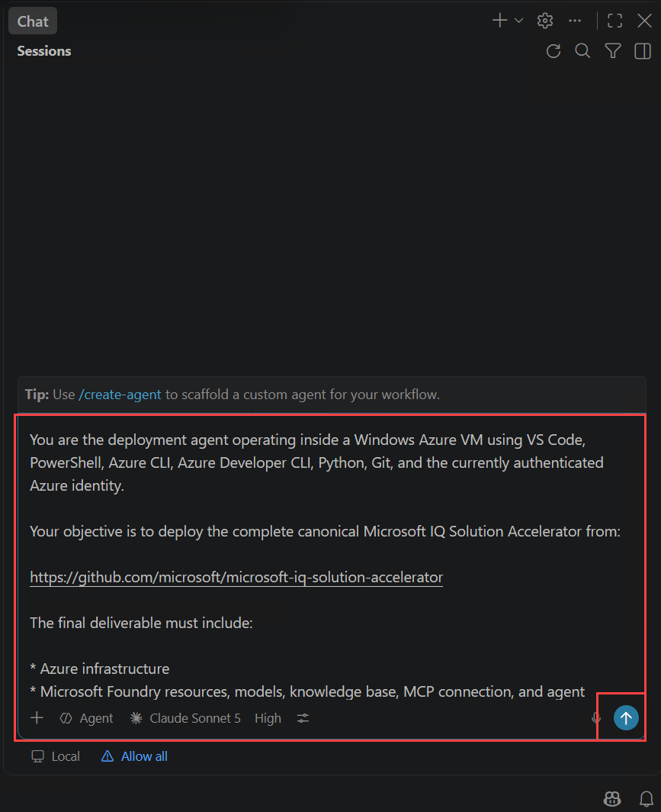

1. Once the deployment starts, you can monitor the progress directly in the chat. Copilot will take some time to explore and analyze the MIQ Accelerator scripts before proceeding with the deployment.

   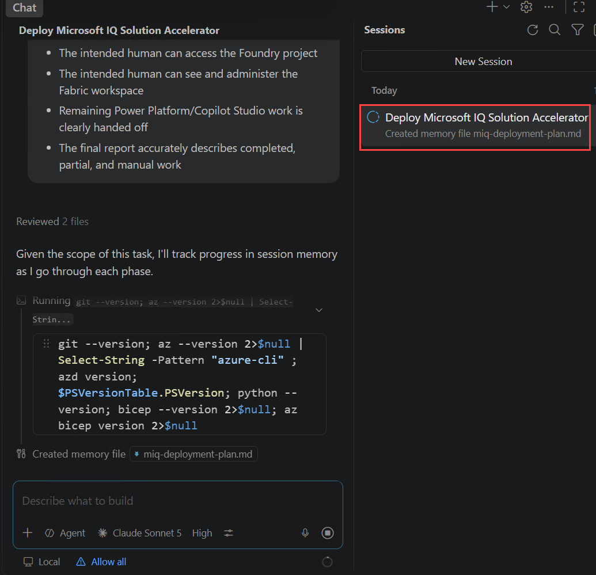

1. Once Copilot starts generating the response, monitor the process closely. Do not take any action; simply watch the progress.

1. After some time, Copilot will ask you a few questions. Review each question carefully and select the appropriate response. For most questions, the default answer will already be selected.

   - Choose the Default Subscription and move to the next selection.

     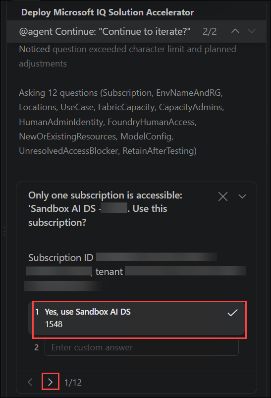

   -  Select **Yes** to create new RG and move to the next.

      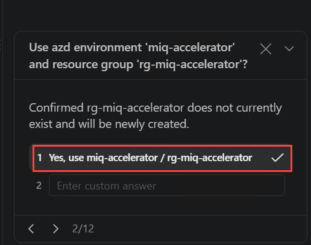     

   - Confirm the location and move to the next.

     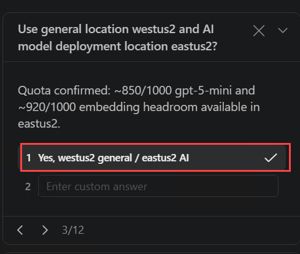     

   - Leave the default industry and move to the next.

     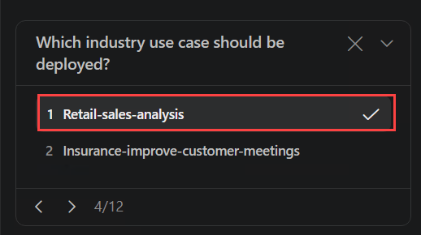     

   - Enter **F16** for Fabric capacity sku and move to next.

     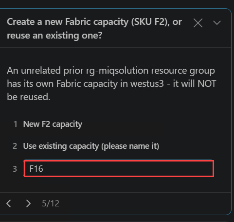 
   
   - Leave default value and move to next.

     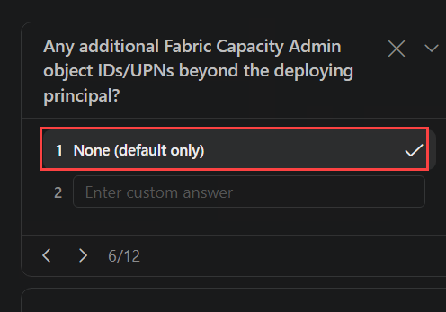 

   - Provide the your UPN **<inject key="AzureAdUserEmail"></inject>** and move to next.

     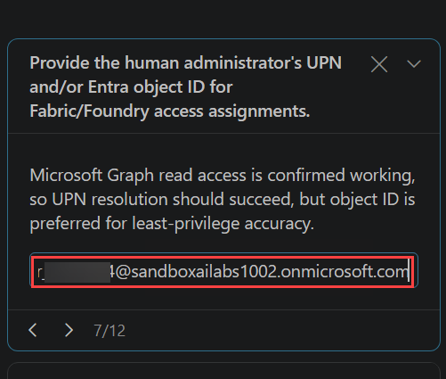   

   - Choose the suggested role and move to the next.

     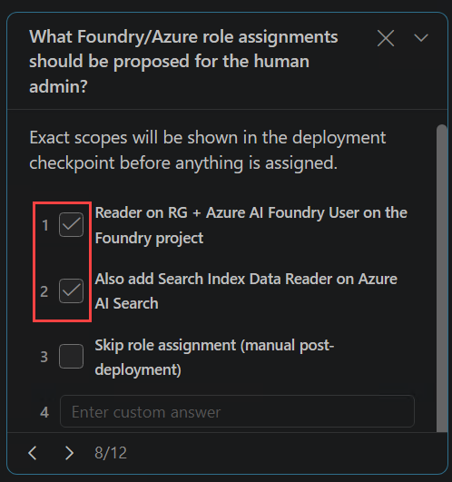      

   - Confirm **Yes** and proceed to next.

     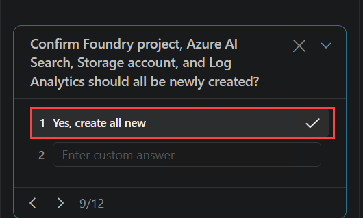    

   - Choose **Must be fully automated** and move to the next.

     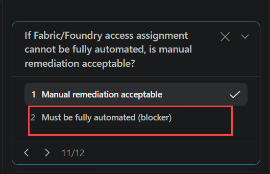      

   - Leave the default to resource retension **(1)** and then **Submit (2)**.

     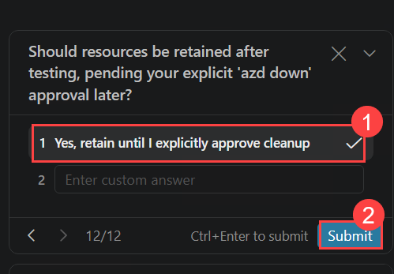 

1. Allow Copilot to continue processing and wait until the Deployment checkpoint appears with the prompt **`Proceed with azd up`**. Once it appears, enter **Proceed with azd up** in the chat and submit it to continue the deployment.

   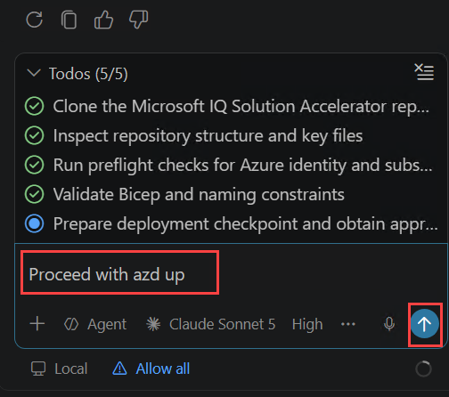 

1. Wait for the deployment to complete. This may take approximately 10–20 minutes. Once completed, you will see a Summary/Conclusion similar to the example below, although the details may vary.

   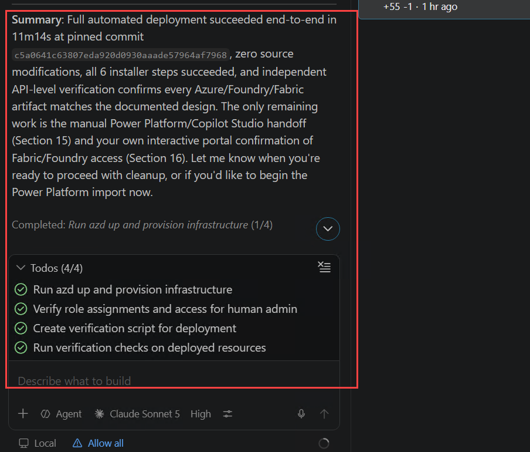

1. Once the deployment is complete, you can verify the deployed resources by navigating to the newly created resource group.

1. Navigate to the Azure portal. Click on **Resource group**.

   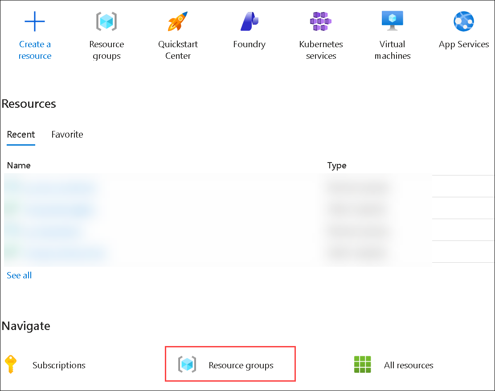

1. Selected the newly created **rg-miq-accelerator**.

   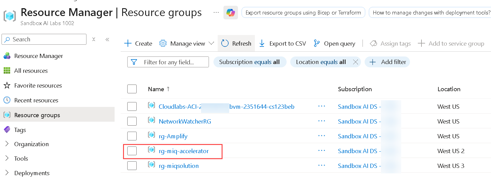

1. You can see the deployed resources.

   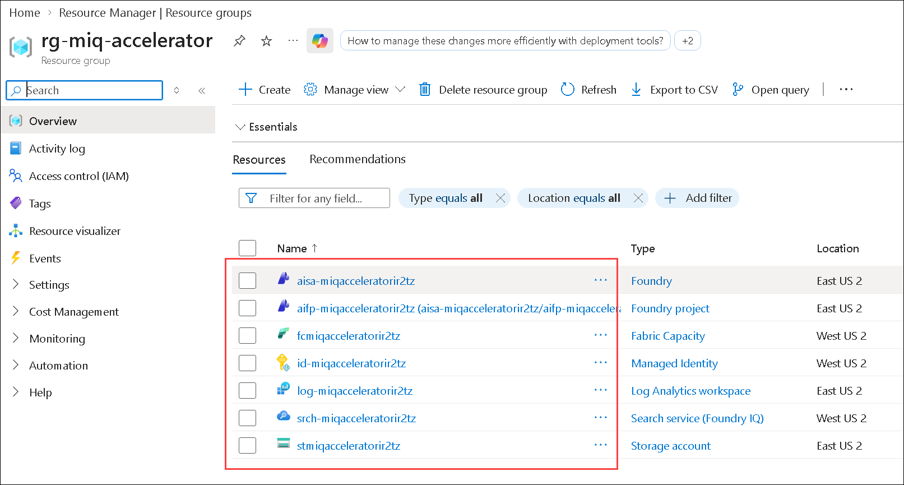


## 2.2 Microsoft IQ Solution Accelerator Fallback Path

If your unable to deploy the generated template with GitHub Copilot, the pre-deployed Microsoft IQ Solution Accelerator is available in the sandbox environment. 

1. Navigate to the Azure portal. Click on **Resource group**.

   

1. Select the pre deployed **rg-miqsolution** resource group.

   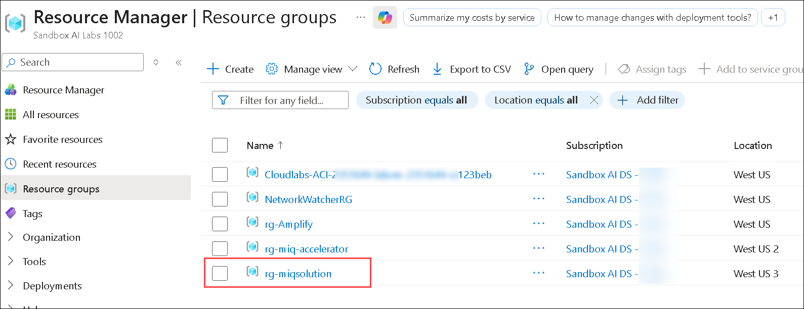

1. Here you can view the pre-deployed Microsoft IQ Solution Accelerator resources.

   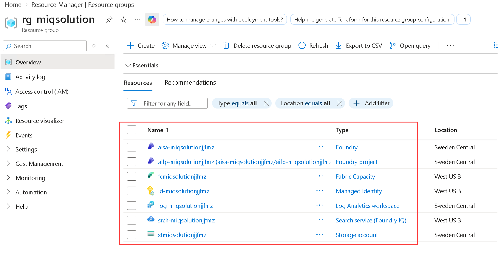

### Now, click on **`Next >>`** from the lower right corner to move on to **`Post deployment Guide - Fabric IQ and Microsoft Foundry`**.   

