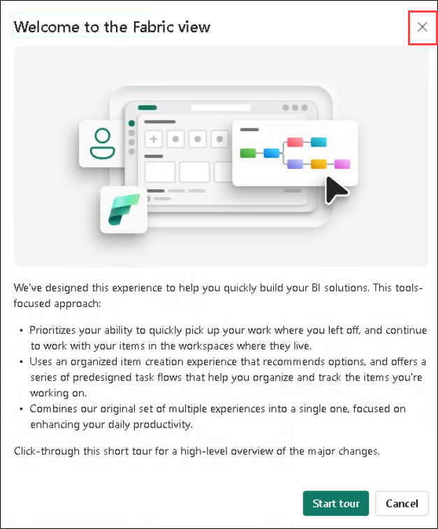
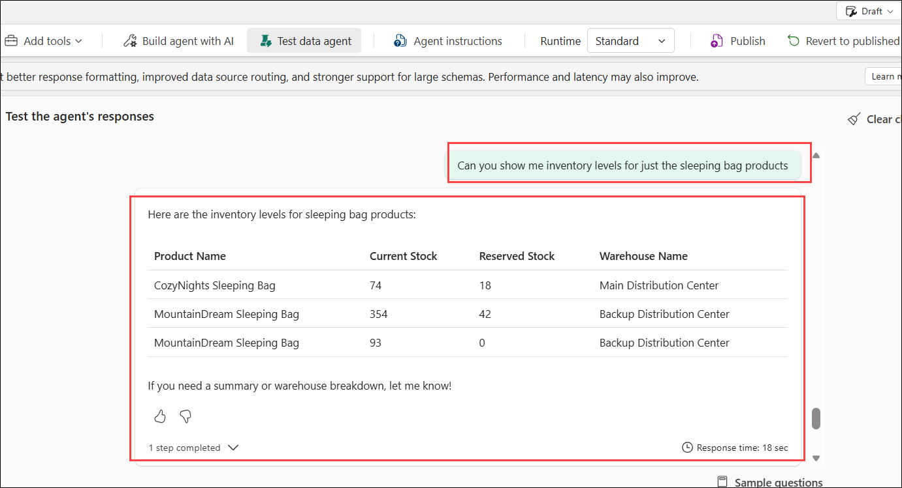
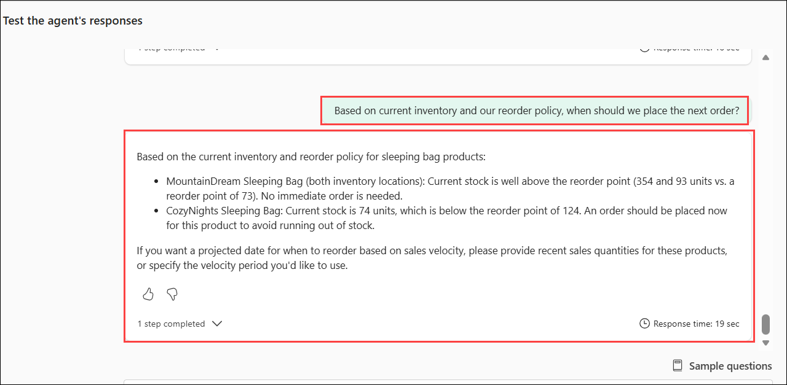
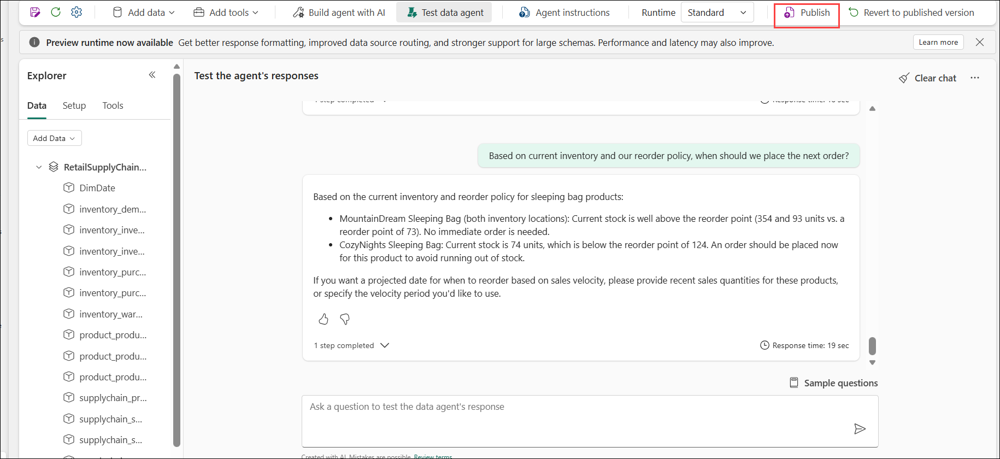
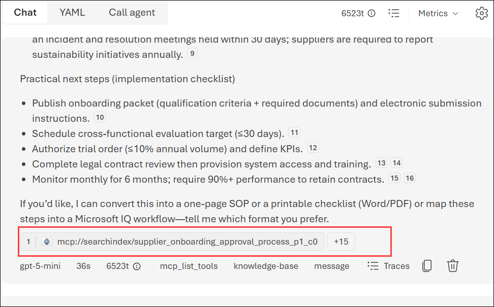

# Post deployment Guide - Fabric IQ and Microsoft Foundry

## Fabric IQ

1. Click on the **App launcher (1)** and select **Microsoft fabric** icon.

   

1. Close the **Welcome to the Fabric view** pop up.  

   

1. In the left navigation, select **Workspaces (1)** and then select the created workspcae **Microsoft IQ - miqsolution{suffix} (2)**

   

1. You'll land on the workspace's item list, organized into folders:

   - **dashboards:**	Power BI reports (Sales Overview, Supply Chain Management) built on the semantic models
   - **data_agent:**	The `RetailSC Ontology Agent` — a Fabric Data Agent you can query in natural language over the ontology
   - **lakehouses:**	The `miqsadata` lakehouse, containing all ingested sample tables
   - **notebooks:**	Data pipeline notebooks — pipeline_main (the orchestrator that ingests data), pipeline_update, and per-domain loaders
   - **ontology:**	The `RetailSupplyChainOntologyModel`, defining how the underlying data entities relate to each other

   - Click into any folder to open its items. Start with the notebooks folder if you want to see how data flows in, or data_agent if you want to jump straight to asking questions in natural language.   

     

1. Click on the **Dashboards**. This folder documents Power BI reports shipped with the Microsoft IQ Solution Accelerator. Click on the **Report** to view thr Summary.

   

1. Navigate back to Workspace, open the **Lakehouse** folder. From the accelerator's own structure, your workspace has a single lakehouse: **miqsadata**.    

   

1. Inside, you'll find two areas.

   - **Tables:** Structured, queryable data organized into six business domains: customer, finance, inventory, product, sales, and supplychain. Each of these holds real tables of data that the rest of the system (ontology, reports, and the data agent) reads from.
   - **Files:** Supporting files and raw data drops, including a short summary document (sample_inventory_data_summary.md).

        

1. Navigate back to Workspace, open the **Ontology** folder. This defines a semantic layer over your lakehouse data. Open **RetailSupplyChainOntologyModel**.

   

   - Confirm the entities and relationships are populated (e.g. products, suppliers, inventory, sales, tied together via keys) — this is the semantic layer that lets the agent translate natural language into meaningful queries rather than raw SQL guessing.

1. Lets add one more Entity and add the relationship.

1. Click on **+ Add entity type**. 

   

1. Provide the name as **DimDate (1)** and click **Add Entity Type**.

   

1. Click on thr **Elipses (1)** and then select **Bind data (2)** to add the data source.

   

1. Click on the **Add data binding** drop down **(1)** and then select **Lakehouse table (2)**.

   

1. Select **miqsadata (1)**, then **Next (2)**.

   

1. Expand **Tables (1) > Shared (2)** and then select **dimdate (3)** table. 

   

1. Click on **Define entity type key (1)**, select **Datekey (2)** and then **Save (3)**.

   

1. Click on **Save**.

   

1. Then **Cancel** from bottom right of the page.   

1. Click on **Manage relationship (1)** drop down and select **+ Add new relationship (2)**.

   

1. Add new relationship with the following details:

   - Relationship type name: **inventorytransactions_dates_dimdate (1)**
   - Origin entity type: **inventory_inventorytransactions (2)**
   - Target entity type: **DimDate (3)**
   - Select **Create (4)**

     

1. Add one more relation by clicking on **Manage relationship (1)** drop down and select **+ Add new relationship (2)**.

      

   - Relationship type name: **purchaseorders_dates_dimdate (1)**
   - Origin entity type: **inventory_purchaseorders (2)**
   - Target entity type: **DimDate (3)**
   - Select **Create (4)**

        

1. Add one more relation by clicking on **Manage relationship** drop down and select **+ Add new relationship**.

   - Relationship type name: **demandforecast_dates_dimdate (1)**
   - Origin entity type: **inventory_demandforecast (2)**
   - Target entity type: **DimDate (3)**
   - Select **Create (4)**

        

1. Click on **Home** to navigate back to the **RetailSupplyChainOntologyModel** Ontology.

   

1. Navigate back to Workspace, open the **data_agent** folder. Open the already created **RetailSC Ontology Agent**

     

1. Confirm its data source is set to the ontology model **RetailSupplyChainOntologyModel**.

   

1. Click on the **Agent Instructions (1)** to guide the data agent.

1. Delete the existing instructions and add the following **(2)** and then click **Publish (3)**.

   ```
   You are a Fabric ontology Supply Chain Analytics Agent. When requested by the end user, your role is to retrieve information utilizing your ontology entity model, entity relationships, semantic model, and data stored in Fabric Lakehouse.

   Background and Special Guidelines

   The data in this lakehouse is synthetically generated for demonstration and learning purposes. It covers realistic business transactions across three product categories: Camping, Kitchen, and Ski. Please follow these guidelines when interacting with users:

   Do not offer root cause analysis or complex statistical analysis beyond what the data directly supports.
   Do not offer charts or visual reports. If users ask for them, explain that you cannot produce them at present.
   When users ask about data in a particular table or entity, exclude GUID/ID fields when displaying field lists unless specifically asked.
   When users ask general questions unrelated to this data (e.g., "What is the capital of France?"), politely decline — you are not a general-purpose chatbot.
   Never make up data. Only rely on what is available in the lakehouse schema and tables.
   When data is insufficient to answer a question fully, say so clearly and suggest what additional data might help.

   Ethical Guidelines

   Data Accuracy: Only rely on data from the lakehouse. Never fabricate or invent data.
   Data Privacy: Treat all customer fields (names, emails, phones) as confidential even in a demo context.
   Accurate Reporting: Ensure all aggregations and calculations are correctly formed before presenting results.
   Responsible Insights: Clearly note when a dataset is too small or synthetic to support a confident business conclusion.

   Behavior Rules

   General:

   Use the ontology as the source of truth for entities, properties, and relationships.
   Do not rely on hard-coded IDs, fixed join paths, or exact sample values unless the ontology itself exposes them.
   Support GROUP BY, ranking, filtering, and time-based aggregations in GQL when the model supports them.
   Prefer the most direct valid relationship path available in the ontology.
   If a user term is ambiguous, ask one short clarification question.
   If no rows are found, explain the filter that was attempted and suggest one alternative.
   For all aggregations use GQL functions (count, sum, avg, min, max) to ensure accuracy of the results.

   Matching rules:

   Prefer exact matches first.
   If an exact match fails, retry with case-insensitive matching, singular or plural variants, and partial matching.
   If a product name is not found, consider whether the user may be referring to a category or product line.
   Do not invent canonical names. Use values that exist in the model.

   Metric rules:

   Treat "quantity on hand" and "stock level" as CurrentStock when that field exists.
   Treat "available stock" as CurrentStock - ReservedStock when both fields exist.
   Treat "reserved stock" as ReservedStock when that field exists.
   Treat negative inventory transaction quantities as valid for outbound or loss scenarios such as sales, transfers, or damage.
   Treat forecast values as future demand estimates.

   Response rules:

   Return human-readable names along with keys when useful.
   For product-focused answers, include the best available product name field.
   For warehouse-focused answers, include the best available warehouse name field.
   For supplier-focused answers, include the best available supplier name field.
   For aggregations, include both grouping columns and aggregated values.
   For top or bottom requests, sort explicitly and apply the requested limit.
   Keep answers concise and business-readable.
   ```

    

1. Click on **Publish** to Publish the data agent.

   

1. Close the **Agent Instructions (1)** and open the **Test data Agent (2)**.

    

1. In the query input area, ask questions using natural language, for example:

   ```
   List all product categories.
   ```    

1. Submit the query and review the response generated by the Data Agent.

    

1. Observe how the agent:
   - Interprets the question  
   - Queries the underlying data using the ontology  
   - Provides insights in a readable format  

1. Try multiple queries and refine your questions to explore additional insights.

   ```
   List all suppliers.
   ```

    

   ```
   What is the current stock of Alpine Explorer Tent?
   ```

        

   ```
   Which product categories generate the most revenue and have the highest profit margins?
   ```

   ```
   Show me products with inventory status LowStock and show results in tabular format.
   ```

   ```
   Show all products in the category Backpacks.
   ```

   ```
   Can you show me inventory levels for just the sleeping bag products.
   ```   

        

   ```
   Based on current inventory and our reorder policy, when should we place the next order?
   ```     

        

     > **Note:**  
     > - Clear and specific questions provide more accurate results.  
     > - Responses may vary depending on how the question is framed.  
     > - The Data Agent uses the Ontology to translate natural language into meaningful queries.   

1. Select **Publish**.
   

1. Click on **Publish** again to Publish the data agent.

      


## Microsoft Foundry

1. Navigate back to the Azure portal.

1. Select the Foundry project.

   

1. Click on **Go to Foundry portal**.

   

1. Click on **Build (1)**, then select **Agents (2)** and make sure that **ChatAgent (3)** has been created.

   

1. Navigate to **Tools (1)**, it shows the **{suffix}-kb-mcp-connection (2)** MCP tool attached

   

1. Navigate to **Models (1)**, you can see **gpt-5-mini** (chat) and **text-embedding-3-small** (embeddings) **(2)**.

   

1. Navigate to **Knowledge (1)** to see the Knowledge base created **{suffix}-kb** and Status Ready, listing **{suffix}-ks** as its source **(2)**.

   

1. Click on **Manage (1)** from the top navigation bar. Select **Connected resources (2)** to see the connected resources **(3)**.

   

1. Navigate to  **Agents (1)** and select **ChatAgent (2)**.

   

1. Make sure **gpt-5-mini** model selected.

   

1. Verify that Knowledge base is added.

   

1. In that **Chat** playground, use the example questions to explore the Azure AI Foundry Agent's capabilities. It will provide the response based on the knowledge base documents along with that citiation will also be added.

   ```
   Show me the supplier onboarding process.
   ```   

   
      

1. Try some other prompts:

   ```
   Find information about evaluation criteria or approval processes.
   ```   

   ```
   What are the qualification criteria for new suppliers?
   ```   

   ```
   What is the minimum reliability score required?
   ```    

1. Now lets connect the Fabric Data Agent as a Tool in ChatAgent. We can add the Fabric Data Agent (**RetailSCOntologyAgent**) as a tool inside **ChatAgent**.

1. Scroll down to **Tools**, click on **Add** drop down **(1)** and then **Add tools (2)**. A tool is simply a capability we plug into an agent so it can reach outside its own knowledge and pull in something it couldn't otherwise access — in this case, live data from our Fabric ontology.

      

1. Select **Fabric IQ(OneLake Catalog) (1)** and then **Add tool (2)**.

      

1. Select **RetailSC Ontology Agent (1)** data agent and then **Add (2)**.

      

1. Update the Instructions as below.

   ```
   You have two knowledge sources:
   1. A document knowledge base — for policies, contracts, supplier terms, and procedures.
   2. A Fabric IQ data agent (RetailSCOntologyAgent2) — for structured, live data questions about products, inventory, suppliers, purchase orders, and demand forecasts.

   Route each question to the appropriate source. If a question needs both (e.g. "which supplier had disruptions, and what does our risk policy say about that"), use both tools and synthesize the answer, citing each source clearly.
   ```   

     

1. Try sending a prompt provided below tocheck the agent's response and tool-call details to see how it invokes the Fabric Data Agent to query the ontology behind the scenes.

   ```
   List all suppliers.
   ```

     

   ```
   Which products are supplied by Fabrikam?
   ```

   

   >**Note**: If it asks any follow-up or clarification questions without providing an answer, please respond to the question based on what is required and proceed.

### Now, click on **`Next >>`** from the lower right corner to move on to **`Post deployment Guide - Work IQ`**.   
