# Post deployment Guide - Work IQ

The third component of the accelerator — Work IQ (the Copilot Studio email-triggered agent that orchestrates Fabric IQ and Foundry IQ from a single conversational ingress)

### Steps need to be performed:

- **Import the solution:** Import the Power Platform zip solution file inside the solution file folder into your Power Platform environment
- **Configure connections:** Sign in to and authorize the Work IQ, Microsoft Teams, Copilot Studio, Office 365 Outlook, Fabric Data Agent, and Foundry Agent connections. 
- **Configure the email trigger** in the Power Automate flow — select the target inbox/folder to monitor and (optionally) add a subject filter such as IQ Request.
- **Publish the agent** in Copilot Studio and enable the Microsoft Teams channel.

## Step 0: Create a Power Platoform Environment with Dataverse enabled

1. Right click on the [make.powerapps.com](https://make.powerapps.com) link then **Copy link** and then paste it on your VM browser tab.

1. On the **Welcome to Power Apps** page, click **Get started**.

   

1. Click on the **Settings (1)** from the top left and then select **Admin center**.

   

1. On the **Power Platform admin center**, click on **Manage (1)** then **Environments (2)** and then click **+ New (3)**.

   

1. On the **New environment** page, provide the following details to create a new environment.

    - **Type:** Choose **Production (1)**
    - **Region:** Leave default
    - **Name:** Enter **Amplify Environment<inject key="DeploymentID" enableCopy="false"/>** **(3)**
    - Then Scroll down to **Change default settings**

      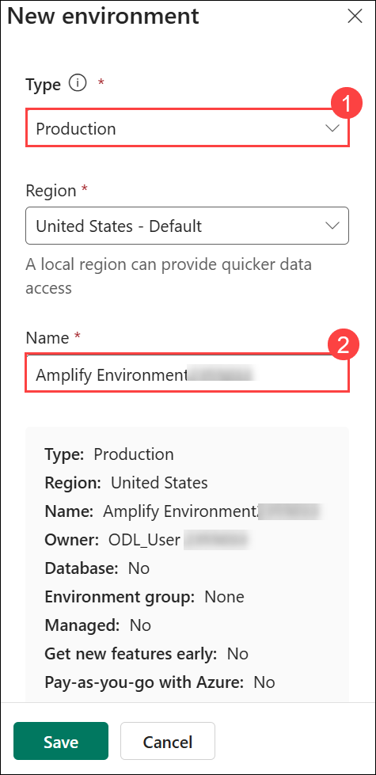

1. Expand **Change default settings (1)** and then **Turn On (2)** setting **Add a Dataverse data  store?** and then click on **Save (3)**.

   

1. Under **Security group**, click **+ Select**.

   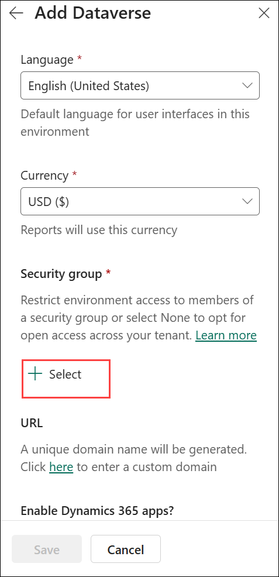

1. Select **None (1)** and then **Done (2)**.

   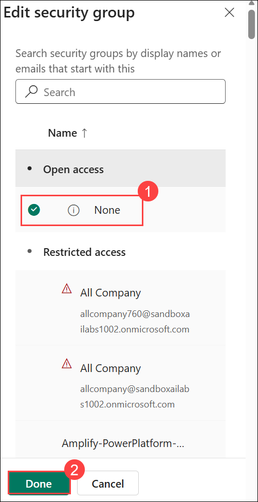

1. Then select **Save**.

   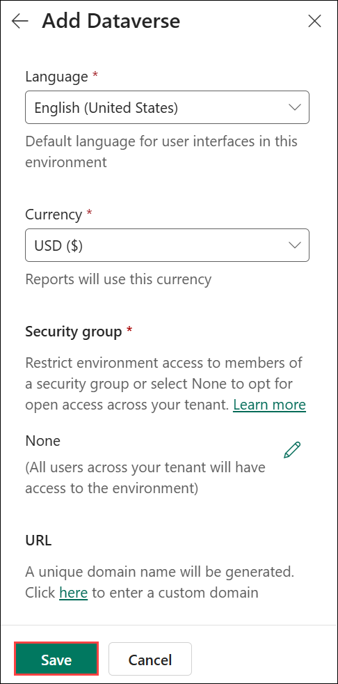

1. Please wait until your **Amplify Environment<inject key="DeploymentID" enableCopy="false"/>** environment is **Ready** before proceeding.

   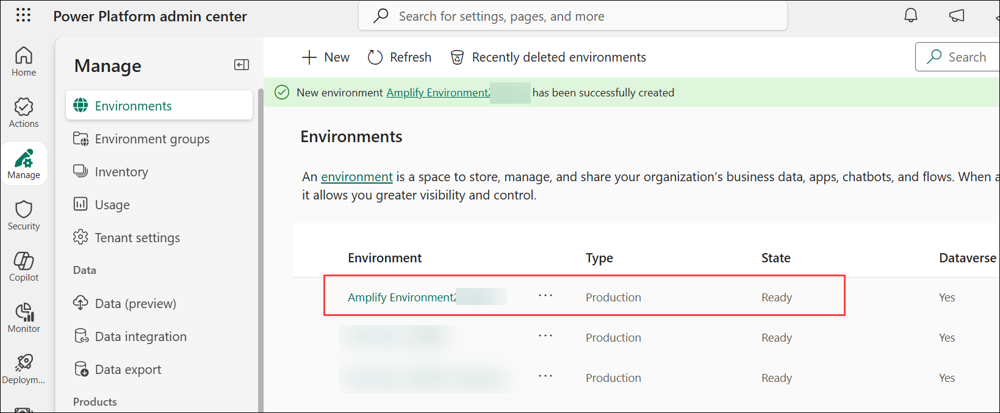

## Step 1: Import the Solution

In this step, you will import the Power Platform zip solution file into your Power Platform environment.

1. Navigate back to **Power Apps** portal.

1. Click on the **default Environment (1)** and then select your **Amplify Environment<inject key="DeploymentID" enableCopy="false"/> (2)** Environment.

   

1. Make sure your in your **Amplify Environment<inject key="DeploymentID" enableCopy="false"/>** Environment.

   

1. Go to **Solutions (1)** and then select **Import solution (2)**.

   

1. Click on **Browse** to select the solution file to import.

   

1. Navigate to **C:\Files (1)**, then select **MicrosoftIQAccelerator (2)** zip file and then **Open (3)**.

   

1. Once the Solution file is imported, click on **Next**.

   

1. Click on **Next** again.

   

1. Make sure you signed in / green check mark is showing up for all the services **(1)** and then **Import (2)**.

   

1. Wait for the Solution to import successfully.

   

1. After importing has completed, click **Publish all customizations** in the top menu.    

   

1. Wait for publishing to complete. 

   

1. When the import is complete, the solution will be available in the environment.

### Step 3: Configure the Email Trigger

Once connections are set, configure the Power Automate flow to monitor the correct inbox:

1. Navigate to **Solutions (1)** then select the imported **Microsoft IQ Accelerator (2)** solution.

   

1. Select the **When a new email arrives (V3)** trigger.

   

1. Click on **Edit**.

   

1. Click on **When a new email arrives (V3)** trigger.

   

1. Delete the **Inbox** folder.

   

1. Once it is deleted, click on the **folder (1)** icon and then select the **Inbox (2)** again. We deleted and selected the folder again because `Even though the Folder field shows 'Inbox,' this solution was imported from a different environment, so it may still be pointing at the wrong mailbox behind the scenes. Delete the value and re-select 'Inbox' from the picker to force it to re-link to your own mailbox.`

   

1. Expand the **Show advanced options** drop down.

   

1. Click the **X **next to that email address to remove it entirely, it is a stale leftover from wherever this solution was originally built/tested. 

   

1. Optionally add a `Subject Filter` to limit which emails trigger the flow (e.g., **IQ Request (1)**) and then **Save (2)** the flow.   

   

## Step 4: Add the External Agents in Copilot Studio   

After import, add the Fabric and Foundry agents again in Copilot Studio. Use Fabric for data questions and Foundry for document questions. If they do not appear yet, finish deploying Fabric and Foundry first, then return to Copilot Studio and refresh the agent list.

### 4.1 Add the Foundry Chat Agent
 
1. Right click on [Copilot Studio](https://copilotstudio.microsoft.com), then **Copy link** and then paste it on your VM browser tab to open the Copilot Studio.

1. Click on the default environment **(1)** and then select your **Amplify Environment<inject key="DeploymentID" enableCopy="false"/> (2)**.

   

1. Make sure your in **Amplify Environment<inject key="DeploymentID" enableCopy="false"/>** Environment.

   

1. Click on **Agents (1)** and then select the **Microsoft IQ Agent (2)**. It's a pre-configured component that came bundled inside the solution package we imported in the Power apps.

   

1. On the **Welocome to Microsoft Copilot Studio** page, click on **Get Started**.

   

    >**Note:** If you get any error like the below **(1)**, go back the previous tab **(2)**. Refresh the browser and then open the agent again.

         

1. Click **Skip** to skip the **Welcome to Copilot Studio** pop up.

   

1. Make sure your in **Amplify Environment<inject key="DeploymentID" enableCopy="false"/>** Environment.

   

1. Click on **+6 (1)** and then select **Agents (2)**.

   

1. Click on **+Add** to add Agent.

   

1. Click on **Connect to an External agent (1)** drop down and select **Microsoft Foundry (2)**.

   

1. Click on **Not connected (1)** drop down and then click **Create new connections (2)**.

   

1. Before proceeding to the next step, navigate back to the **Microsoft Foundry Portal.** Click on the Project name, if prompted **Save** the Agent.

1. Copy and paste the **Project endpoint** in a notepad.

   

1. Navigate back to the **Copilot Studio**.   

1. On the **Azure AI Foundry Agent Service**,

   - **Authentication Type:** Select **Microsoft Entra ID User Login (1)**
   - **Azure AI Project Endpoint:** Paste the Project endpoint you copied in the previous step **(2)** 
   - Then click **Create (3)**

     

1. If prompted, select the user account **<inject key="AzureAdUserEmail"></inject>**.

   

1. Make sure the connection is established **(1)** and then click **Next (2)**.

   

1. On the **Connect Microsft Foundry agent** page, provide the following details:

   - **Name**: Enter **ChatAgent (1)**
   - **Description**: `You are a data analyst assistant for Microsoft IQ with access to documents and reference materials.` **(2)**
   - **Agent Id**: Enter **ChatAgent (3)**
     - This is the same name as the agent in Foundry.
   - Then select **Add and configure (4)**  

     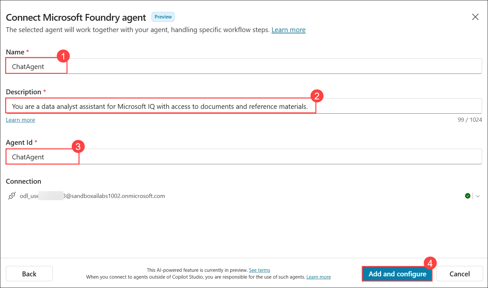

1. Click **Back**.

   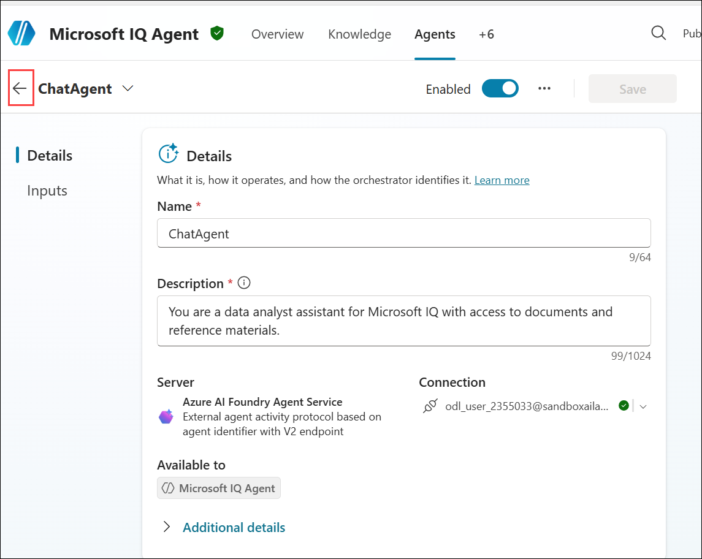

1. Confirm the Foundry agent appears in the connected-agent list **(1)** and then click **+ Add an agent (2)**.

   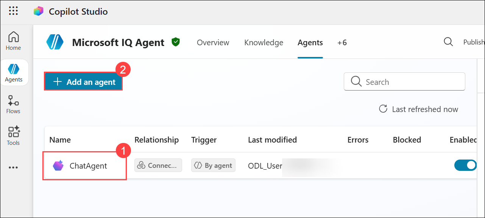

1. Click on **Connect to an External agent (1)** drop down and select **Microsoft Fabric (2)**.

   

1. Click on **Not connected (1)** drop down and then click **Create new connections (2)**.

   

1. Click on **Create**.

   

1. If prompted, select the user account **<inject key="AzureAdUserEmail"></inject>**.

   

1. Make sure the connection is established **(1)** and then click **Next (2)**.

   

1. On the **Select agent to connect** page, select the Ontology model **(1)** and then **Next (2)**.

   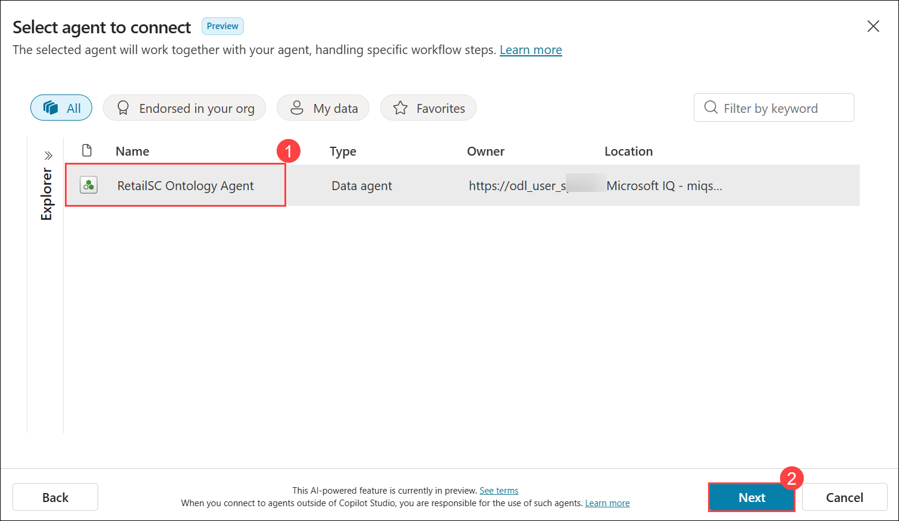

1. On the Ontology Agent page, provide the name as **RetailSC Ontology Agent (1)** and then **Add and Configure (2)**.

   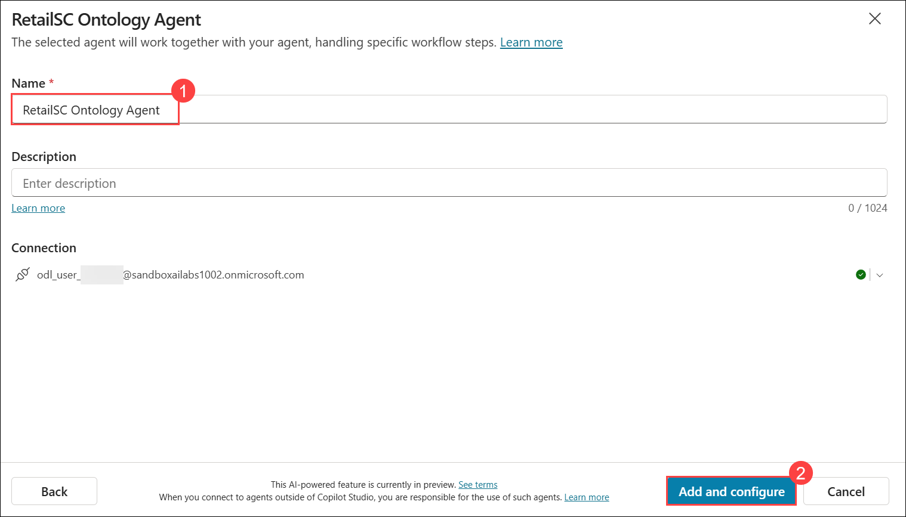

1. Click **Back**.

   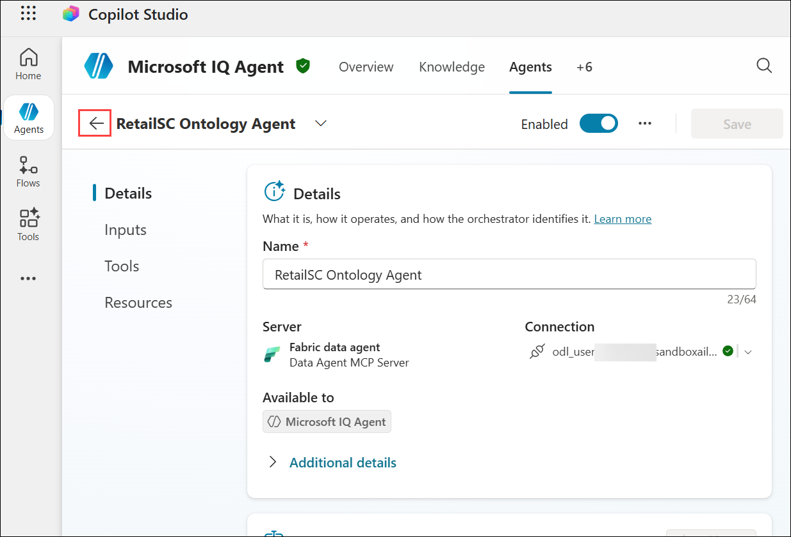

1. Make sure the Fabric agent now shows up in the list of connected agents.

   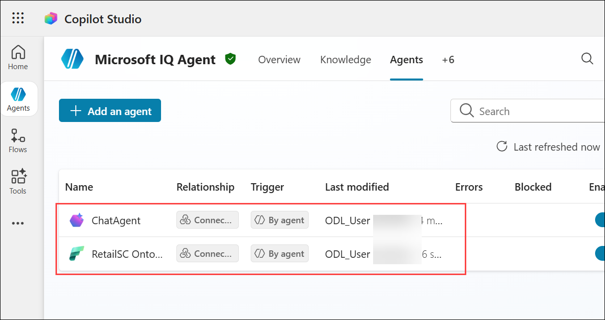

## Step 5: Verify Work IQ connections and MCP tools are connected and enabled
 
1. Click on **+6 (1)** and then open the **Tools (2)** tab.

   

1. Click the **Model Context Protocol (1)** filter chip.

1. Confirm that you can see these three tools **(2)**:
 
   | Tool name | Type | Available to | Trigger |
   |---|---|---|---|
   | Work IQ Copilot (Preview) | Model Context Protocol | Microsoft IQ Agent | By agent |
   | Work IQ Mail (Preview) | Model Context Protocol | Microsoft IQ Agent | By agent |
   | Work IQ User (Preview) | Model Context Protocol | Microsoft IQ Agent | By agent |

       
 
   - For each tool, confirm that:

     - The **Enabled** toggle is set to **On**.
     - The **Errors** column is empty.
     - The **Blocked** column is empty.

## Step 6: Publish the Agent

1. Click on the **Overview (1)** tab and then **Publish (2)**.

   

1. Click on **Publish** to **Publish the agent.**

   
 
1. Wait for publishing to complete (1-2 minutes).

   

1. Once the Agent is published, click on **+6 (1)** and then select **Channels (2)**.

   

1. Select **Microsoft 365 and Microsoft Teams** to configure Teams as a channel.

   

1. On the **Microsoft 365 and Microsoft Teams** page, select **See agent in Teams**.

     

1. Select **Use the web app instead**.

   

1. Click on **Add** to add the agent.

   

1. Once the Agent added, click **Open** to open the agent in Teams.

   

1. Make sure you can see the agent.

   

## Golden Path Testing Flow   

1. dd

   