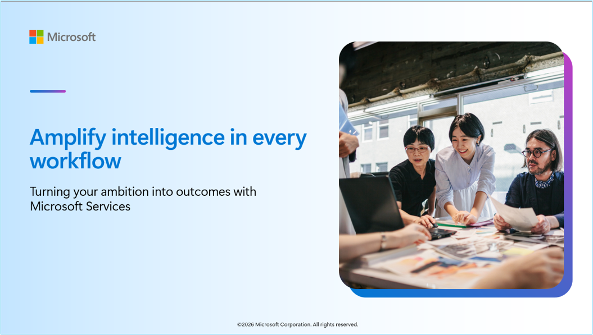
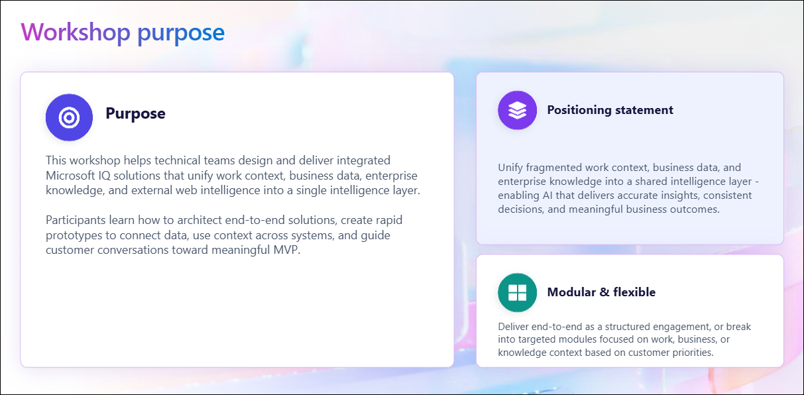
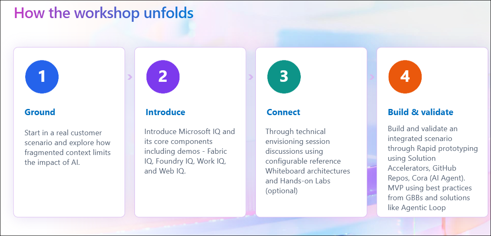
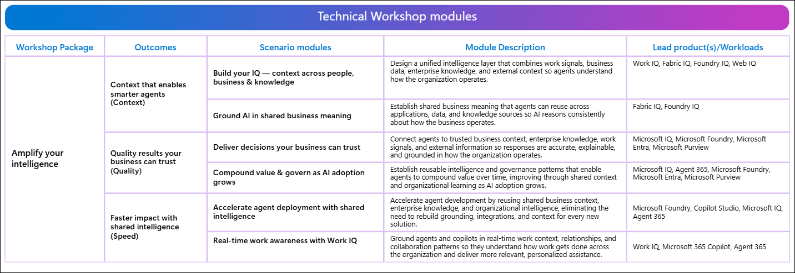

# Amplify Your Intelligence Technical Workshop Sandbox Environment

## Overview

> **Note:** Workshop completion status may take **3-4 hours**.

This workshop is designed to deepen technical expertise across the Microsoft IQ portfolio, including **Fabric IQ**, **Foundry IQ**, **Work IQ**, and **Web IQ**. Participants will gain hands-on experience, improve execution consistency, and build the confidence to lead outcome-driven customer conversations focused on business value and measurable results.

## Learning Objectives

After completing this workshop, you will be able to:

- Understand the core capabilities of Microsoft IQ solutions.
- Build confidence in delivering customer-focused technical discussions.
- Improve consistency in workshop execution and solution demonstrations.
- Connect enterprise data, knowledge, people, and external information to create intelligent AI experiences.

## Envisioning Session
- Customer business challenges and opportunities
- Whiteboarding real-world customer use cases
- Identifying business outcomes and success criteria

## Rapid Prototyping

Rapid Prototyping using:

### GitHub Copilot
- Accelerate solution development and code generation
- Explore AI-assisted productivity scenarios

## Microsoft IQ Accelerators

Microsoft IQ Accelerators bring together organizational context, enterprise data, knowledge, and trusted web information to ground AI with the right intelligence.

Microsoft IQ Accelerators cover the following four areas: Work IQ, Fabric IQ, Foundry IQ, and Web IQ.

### Work IQ

Work IQ provides AI with organizational context by leveraging:

- People and expertise
- Collaboration patterns
- Business processes and workflows
- Workplace activities and interactions

### Fabric IQ

Fabric IQ grounds AI in trusted business data by connecting:

- Enterprise data sources
- Business applications and systems
- Shared business semantics
- Unified and governed data foundations

### Foundry IQ

Foundry IQ transforms enterprise knowledge into reusable intelligence by utilizing:

- Policies and procedures
- Business documentation
- Authoritative enterprise content
- Knowledge assets for AI agents

### Web IQ

Web IQ enriches AI experiences with trusted external information, including:

- Web content
- News and market insights
- Images and multimedia assets
- Videos and external knowledge sources

## Rapid Solution Prototyping using pre-built accelerators

### Workshop Outcome

By the end of this workshop, you will understand how Microsoft IQ capabilities work together to deliver intelligent, context-aware AI solutions. Through hands-on labs and an envisioning session, you will learn how to identify business opportunities, map customer challenges to Microsoft IQ capabilities, and design outcome-driven AI solutions powered by organizational knowledge, trusted business data, enterprise content, and external information.

You will gain the confidence to lead business-focused customer conversations, articulate solution value, and envision AI-powered transformation scenarios that improve productivity, accelerate decision-making, and drive measurable business outcomes.

### 1. Overview about Amplify Your Intelligence

**Workshop Purpose:** This workshop helps technical teams design and deliver integrated Microsoft IQ solutions that unify work context, business data, and enterprise knowledge into a single intelligence layer. Participants learn how to architect end-to-end solutions, connect data and context across systems, and guide customer conversations toward meaningful proof-of-concept outcomes.

**Modularity / flexibility:** The workshop can be delivered end-to-end as a structured engagement or broken into targeted modules focused on work context, business context, or knowledge integration depending on customer priorities.

### How the Workshop unfolds​

This workshop is designed to guide participants through a structured, end-to-end journey of building AI-powered solutions. The sessions combine conceptual understanding, technical demonstrations, and hands-on implementation.

### Technical Workshop modules​

The workshop is organized into a series of technical modules, each focusing on a key business objective. Along with the scenarios, we'll explore how Microsoft AI solutions like Work IQ, Foundry IQ, Fabric IQ, and Microsoft 365 technologies come together to address real-world business challenges.

### 2. Outcomes and Scenarios of Amplify Your intelligence

The following are the key outcomes of Amplify Your Intelligence:

- **Outcome 1: Context that Enables Smarter Agents**

- **Outcome 2: Quality results your business can trust**

- **Outcome 3: Trust intelligence that drives action**

### 3. Sandbox Environment – Included Licenses, Capacity, and Azure Resources

### License and Software Requirements

The following Licenses, Subscriptions, and Software are assigned, installed, or enabled in the Sandbox Environment.

| Item | Requirement | Readiness Check |
|--------|-------------|-----------------|
| Fabric Capacity | F16 SKU | Capacity is available for workshop use. |
| Microsoft 365 (M365) | E5 License | Required Microsoft 365 services are available. |
| Microsoft Foundry | Access Enabled | Foundry opens successfully for assigned users. |
| Azure Subscription | Active Subscription | Subscription is available and accessible for workshop activities. |
| Microsoft Copilot Studio | Product Access Enabled | Copilot Studio opens successfully for assigned users. |
| Microsoft Copilot Studio User License | User License Assigned | Users can author and use Copilot Studio as required. |
| Microsoft Teams | Enabled | Teams access is available for all participants. |
| Microsoft 365 Copilot | License Assigned | Copilot is available to Users. |
| Microsoft Whiteboard | Enabled for All Users | Templates can be opened and copied by customers. |
| GitHub Copilot Enterprise | License/Access Assigned | GitHub Copilot features work in Visual Studio Code. |
| Visual Studio Code (VS Code) | Installed in Workshop VM | VS Code launches successfully in the workshop environment. |

## Envisioning Session Using Whiteboarding

### Step 1: Why Customers should use Whiteboarding

Whiteboarding helps customers quickly align on business goals, current challenges, future-state architecture, and solution priorities. It turns abstract ideas into a shared visual plan and helps accelerate decisions for Microsoft IQ Solution Accelerators.

### Step 2: How to copy the whiteboard using an existing template URL

1. Open the existing whiteboard template URL.
2. Sign in with your Microsoft account.
3. Select **Copy** or **Duplicate** to create your own editable version.
4. Rename the copy for the customer/session.
5. Share it with participants before or during the envisioning session.

### Step 3: Microsoft IQ Solution Accelerator whiteboard URL

Copy/use this template:

https://fy27-caip-whiteboard-experiences.azurewebsites.net/landing/demo1/microsoft-iq-solution-accelerator

### Step 4: Microsoft IQ Solution Accelerator whiteboarding story

Use the whiteboard to guide a customer through how Microsoft IQ can unify enterprise data, knowledge, and decisions across Work IQ, Foundry IQ, and Fabric IQ. The session can start with the customer's current pain points, map those to future-state capabilities, then identify where Solution Accelerators can speed up pilots and production adoption.

