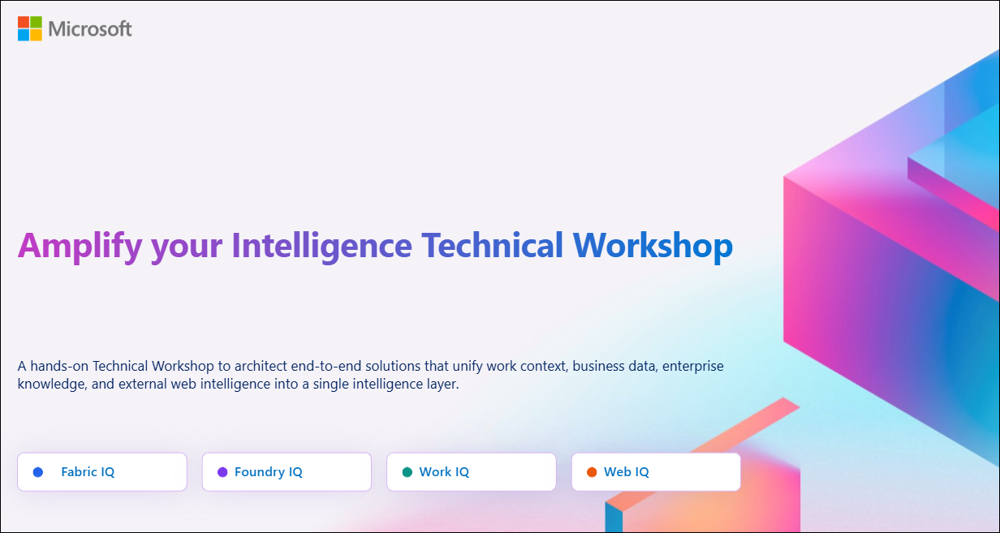
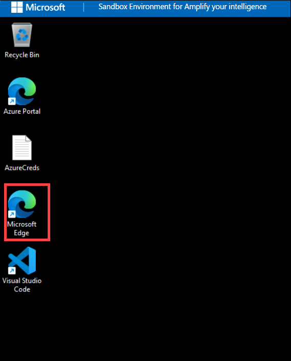
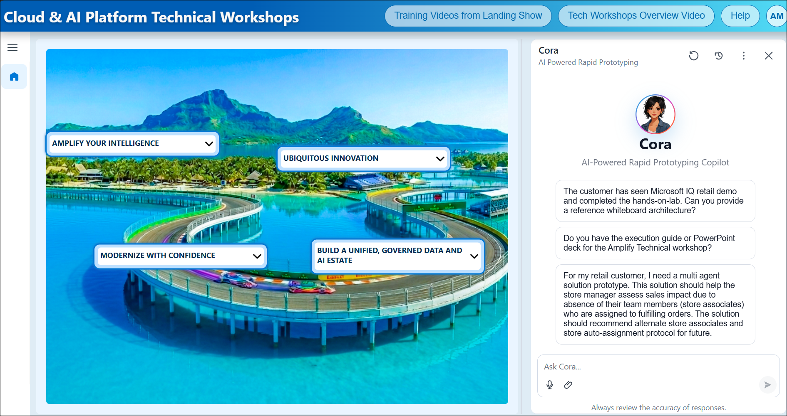
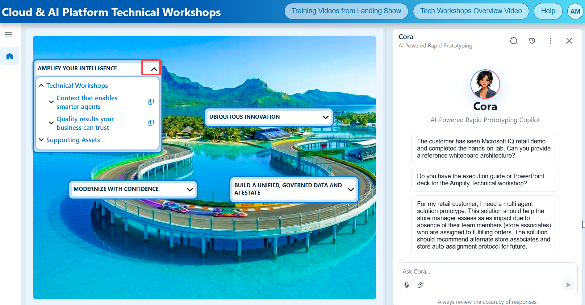
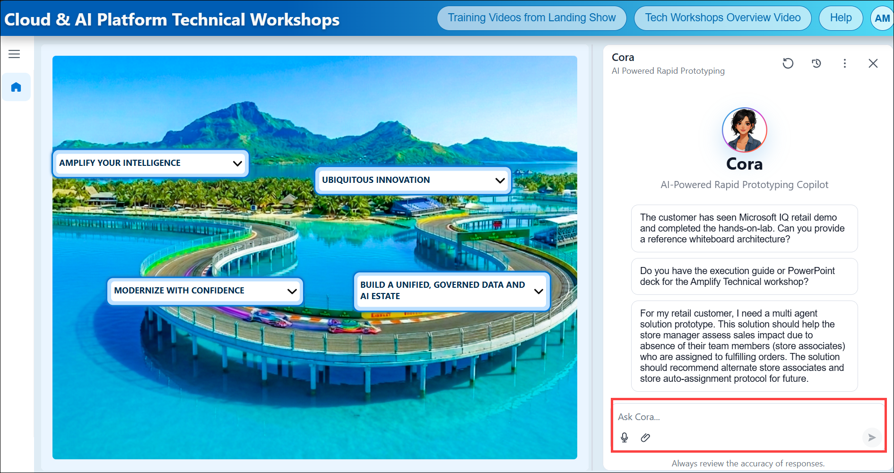

# Amplify Your intelligence Technical Workshop Sandbox Environment

## 1. Overview about Amplify Your intelligence

- [labguidepreview](https://experience.cloudlabs.ai/#labguidepreview/44aa7942-1e5e-43e1-a7ab-21a89506d0b2)

**Workshop Purpose:** This workshop helps technical teams design and deliver integrated Microsoft IQ solutions that unify work context, business data, and enterprise knowledge into a single intelligence layer. Participants learn how to architect end-to-end solutions, connect data and context across systems, and guide customer conversations toward meaningful proof-of-concept outcomes.

**Modularity / flexibility:** The workshop can be delivered end-to-end as a structured engagement or broken into targeted modules focused on work context, business context, or knowledge integration depending on customer priorities.

### How the Workshop unfolds​

This workshop is designed to guide participants through a structured, end-to-end journey of building AI-powered solutions. The sessions combine conceptual understanding, technical demonstrations, and hands-on implementation.

### Technical Workshop modules​

The workshop is organized into a series of technical modules, each focusing on a key business objective. Along with the scenarios, we'll explore how Microsoft AI solutions like Work IQ, Foundry IQ, Fabric IQ, and Microsoft 365 technologies come together to address real-world business challenges.

## 2. Outcomes and Scenarios of Amplify Your intelligence

The following are the key outcomes of Amplify Your Intelligence:

- **Outcome 1: Context that Enables Smarter Agents**

- **Outcome 2: Quality results your business can trust**

## 3. Sandbox Environment – Included Licenses, Capacity, and Azure Resources

- **Licenses/Capacity**   

    - Microsoft Fabric Capacity (F8 or F16 SKU) for individual lab profiles. 

    - Microsoft 365 Copilot Business 

    - Exchange Online Kiosk 

    - Microsoft Teams Essentials 

    - One Drive for Business 

    - Power BI Pro 

    - Github Copilot 

- **Azure Resources** 

    The following Azure services will be deployed using an ARM Template: 

    - Microsoft Foundry 

    - Microsoft Foundry Hub 

    - Microsoft Foundry Project 

    - Azure OpenAI Service 

    - Model: gpt-4o 

## 4. Technical Workshop Web App URLs

Access the Cloud & AI Platform Technical Workshops web application using the following link: [Cloud & AI Platform Technical Workshops](https://caip-tech-workshops.azurewebsites.net/)

### Steps to navigate to CAIP Tech Workshop Web app.

1. Click on the **Microsoft Edge** from the Lab VM desktop.

     

1. Right click on [Cloud & AI Platform Technical Workshops](https://caip-tech-workshops.azurewebsites.net/), then select **Copy link** and then paste the link on the Web browser.

1. Login with the following credentials:

    - Username: **<inject key="AzureAdUserEmail"></inject>**
    - Passowrd: **<inject key="AzureAdUserPassword"></inject>**

1. After the application loads, you will see the workshop site home page as shown below.

    

1. Select the **Amplify Your Intelligence** drop-down menu to explore the available outcomes and workshop scenarios.

    

1.  On the right side of the page, you'll find **Cora**, the AI-Powered Rapid Prototyping Copilot. Use the chat interface to enter prompts and interact with the workshop outcomes and scenarios.

    
