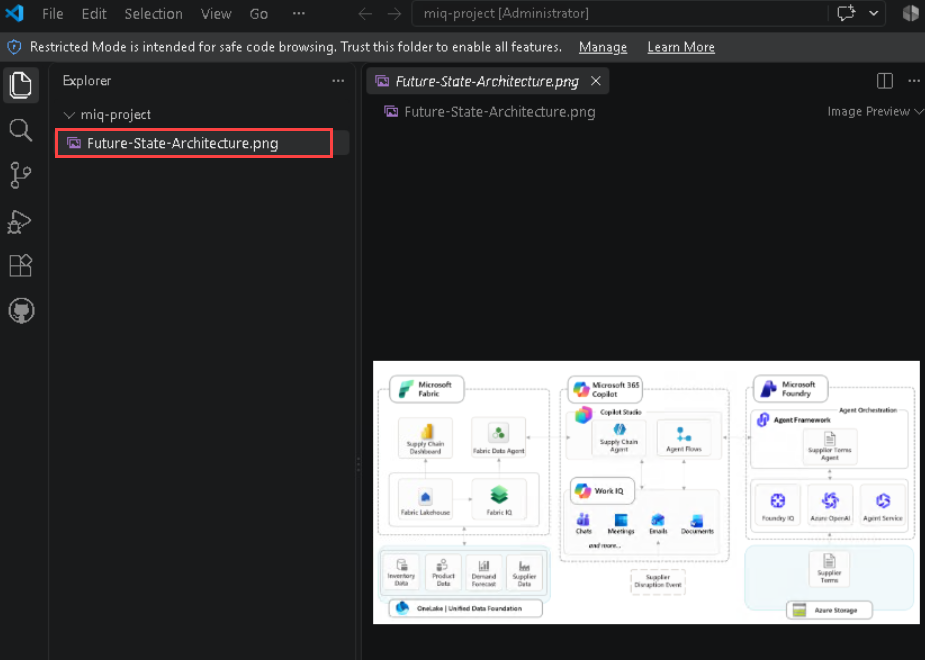

# CAIP Technical Workshop-Roadshow: Caldova Production Challenge

## Overview

>**Note:** This workshop is designed as a hands-on technical roadshow exercise. Participants should use the provided Caldova scenario, current-state details, reference architecture, and sandbox environment to complete the activities.

>**Note:** Teams should export their future-state architecture before starting Rapid prototyping. The exported image will be used to generate deployment assets with GitHub Copilot.

This CAIP Technical Workshop-Roadshow helps participants solve a real-world pharmaceutical manufacturing transformation scenario for **Caldova**. Participants will use business envisioning, whiteboarding, future-state architecture design, Microsoft Fabric, Microsoft Foundry, and GitHub Copilot to create a Rapid prototype that supports manufacturing capacity decisions, data modernization, and governed multi-agent AI.

The workshop is modular and connected. Each stage stands on its own and can be delivered independently but run in sequence they compound: the whiteboard output feeds the prototype, and the prototype is what makes an MVP or pilot conversation credible with a customer.

   

Rapid prototyping is offered in three options. Tech sellers and partners should lead with Option A; Options B and C are used as needed. 

- **Option A** uses Cora, the AI Copilot for rapid prototyping, working from prompts to generate tables, data ontologies and deployable code, alongside GitHub Copilot. 

- **Option B** uses GitHub Copilot. 

- **Option C** uses the agentic loop. 

The roadshow default is Option A; Option B and C are available to attendees.    

## Learning Objectives

After completing this workshop, you will be able to:

- Understand Caldova's product launch challenge and the business drivers behind the transformation.
- Use whiteboarding to map business problems to a future-state technical architecture.
- Design a governed intelligence layer that supports trusted AI agents.
- Rapidly prototype deployment assets from a future-state architecture.
- Use GitHub Copilot in VS Code to generate ARM/Bicep templates and supporting deployment guidance.
- Explain how Microsoft Fabric, Fabric IQ, Microsoft Foundry, and multi-agent patterns can address Caldova's operational challenges.

## Caldova Case Study

The case study is introduced in the opening general session, immediately after the workshop overview and before the whiteboarding walkthrough. The deck introduces it as the Caldova Product Launch Challenge: from fragmented manufacturing operations to a launch decision under pressure. An intro video is included in the deck to carry the story. 

By the end of this introduction, participants should be able to articulate the business problem in a single sentence. Everything after that point, the architecture they draw, the agents they generate and the recommendation they defend, is an answer to that sentence. Time spent making the business problem land is never wasted. 


## 1. Caldova Product Launch Challenge

### 1.1 Company Type and Situation

Caldova is a pharmaceutical company racing to launch an accelerated V2 / next-generation pharma product ahead of a competitor's scheduled release. The launch depends on supply chain, manufacturing, procurement, data, application, and compliance teams working from the same trusted context.

The immediate business pressure is a **7% capacity gap across three manufacturing plants**. Caldova needs to determine whether the gap can be closed internally and, if not, which pre-qualified contract manufacturing organizations can fast-track support in a **3-6 month window**.

Caldova also needs a multi-agent AI solution leveraging Microsoft IQ capabilities to recommend and take action on critical operational issues for the COO.

### 1.2 The business problem

The immediate business pressure is a 7 percent capacity gap across three manufacturing plants. Caldova needs to know whether it can close that gap internally, and if it cannot, which pre-qualified contract manufacturing organizations can fast-track support within a three to six month window. Leadership wants a multi-agent AI solution, built on Microsoft IQ, that can recommend and act on operational issues of this kind for the COO. 

The deck states the same problem in the language you will show on screen: Caldova is preparing for a critical product launch while its manufacturing environment is fragmented across legacy SQL systems, disconnected data domains and specialist processes, and the team must make a defensible recommendation despite a 7 percent production gap, a 30-minute downtime ceiling, undocumented dependencies and a fixed launch window. 

Caldova's leadership has recognised that the core challenge is not the technology infrastructure itself, but the organization's ability to turn data into actionable intelligence. 

Early AI experiments across functions showed promise, but scaling them against a fragmented estate introduced agent drift, duplicated builds, disconnected tools and governance gaps that are unacceptable in a regulated industry. The company wants AI to become a durable operating capability rather than a set of isolated experiments, and the desired end state is one governed, context-rich intelligence layer that every agent can trust, connecting real-time and historical operational data, manufacturing knowledge, supplier intelligence, internal SOPs, escalation paths and web context while honouring identity, permissions, sensitivity and compliance controls. 

The CTO's mandate, Cloud and AI-First Caldova Manufacturing Ops 2027, connects three motions into one transformation. Modernize with Confidence migrates the legacy SQL Server estate to Azure SQL Managed Instance, retiring technical debt while retaining full compatibility, built-in high availability and compliance controls. Amplify Your Intelligence builds a semantic, context-rich intelligence layer with Fabric IQ so manufacturing data speaks the language of the business, plants, lines, batches, suppliers and capacity, and can assess millions of data points to recommend how the gap is closed. Ubiquitous Innovation follows once every agent reasons from the same trusted ontology, letting teams across Caldova rapidly build and deploy governed multi-agent solutions in Microsoft Foundry that turn shared context into decisions. 

This mandate provides a direct link between the case study and the 3 Core Conversations introduced earlier in the day. Make this connection explicit for participants, as it marks the transition from conceptual discussion to practical application within a customer context.

### 1.3 Technical Backdrop

Caldova's existing estate was not originally built for AI workloads:

- The supply chain planning application runs on a legacy system.
- The manufacturing database sits on an on-premises SQL Server estate.
- The broader infrastructure footprint runs on VMware.
- Data is siloed across IoT, supply chain, customer, production, supplier, and manufacturing quality systems.
- Each system has separate definitions, owners, access rules, and governance controls.

Because no single team can see the full picture, no AI agent can be trusted to act without a shared, governed intelligence layer.

### 1.4 Customer Overview

Caldova wants to turn AI from isolated experiments into a durable operating capability for regulated pharmaceutical manufacturing. The desired end state is one governed, context-rich intelligence layer that every agent can trust.

That layer should connect:

- Real-time and historical operational data
- Manufacturing knowledge
- Supplier intelligence
- Internal SOPs
- Escalation paths
- Trusted web context
- Identity, permissions, sensitivity, and compliance controls

## 2. Envisioning Session Using Whiteboarding to Solve Caldova Business Problem

## What the Whiteboarding experience is?

The CAIP DREAM whiteboard experience is a single site for Solution Engineers, GBBs and Specialists, carrying Microsoft Whiteboard templates for the top CAIP reference architectures across three solution plays. The templates are customer-facing and curated from GBBs, Engineering, the Gold Standard accelerators team, the Azure Architecture site, SEs and partners. 

During business and technical envisioning, sellers collaborate with customers and partners to design tailored architectures for a specific scenario, then export those architectures and use Whiteboard Copilot or VS Code to create deployable ARM and Bicep templates for rapid pilots and proofs of concept. The templates live at aka.ms/CAIPWhiteboards, the DREAM templates experience at aka.ms/dreamwhiteboards, and the Seismic business and technical envisioning page carries the reference guide. 

### 2.1 Workshop Exercise

- **Exercise:** Envisioning Session Using Whiteboarding
- **Estimated Time:** 150 minutes team exercise + 15 minutes reporting
- **Team Size:** TBD

### 2.2 Strategic Mandate

**Cloud & AI-First Caldova Manufacturing Ops 2027** connects three transformation motions:

| Pillar | Objective |
|---|---|
| Modernize with Confidence | Migrate the legacy SQL Server estate to Azure SQL Managed Instance while retaining compatibility, availability, and compliance controls. |
| Amplify Your Intelligence | Build a semantic, context-rich intelligence layer with Fabric IQ so manufacturing data speaks the language of the business. |
| Ubiquitous Innovation | Enable teams to rapidly build and deploy governed multi-agent solutions in Microsoft Foundry. |


### 2.3 The steps attendees follow:

1. Go to the Tech Workshop site at https://aka.ms/CAIPTechWorkshops.

1. Navigate to **Modernize with Confidence** section on the left navigation pane.

   

1. Select **Modernize faster with Agentic AI (1)**,  

   - Then select **Agentic App and Databases Modernization (2)**  

   - Select the **Rapid Prototyping Assets (3)** 

   - Select **Prototype using Cora (4)**  

   - Select **Cora (Preview) for Roadshows (5)**

        

1. In Cora chat pane, copy paste the following business problem statement to Cora. 

   ```
   My customer Caldova is a pharmaceutical manufacturer who plans to launch their new V2 product. I have three comments 

   1) Caldova’s supply chain planning application runs on legacy .NET, the manufacturing database sits on an on-premises SQL Server. It’s Data remains siloed across IoT, supply chain, customer, production, supplier, and manufacturing systems. Recommend a solution to migrate the on-premises SQL Server to Azure SQL DB. 

   2) Also, Caldova currently can manufacture 100 million units in 6 months. It needs to ensure the ability to manufacture 107 million units in 6 months, a gap of 7% manufacturing capacity. The closure of the 7% capacity gap across three manufacturing plants is needed to support the upcoming V2 product across multiple plants. Caldova needs to understand whether it can close the gap internally, and if not, which pre-qualified contract manufacturing organizations can fast-track support in a 3–6-month window. 

   3) They want an AI-powered multi-agent solution using Microsoft Fabric and Microsoft Foundry to identify internal improvements to their manufacturing plants as well as recommend contract manufacturing orgs to achieve the desired production capacity.
   ```

   - **Click** to proceed. 

        

1. Review the recommended architecture and open the linked Whiteboard.

      

1. Once *“Cloud & AI Platform Whiteboard Experience”* site opens, Click **Copy Whiteboard Template**. 

    

1. This opens https://whiteboard.cloud.microsoft/ login with your @microsoft.com account. Copy Whiteboard Template action copies and creates new whiteboard in your account. Give it a minute to load, then zoom out to 1% zoom level. 

1. Now you’re ready to do whiteboarding session with attendees.  

1. Start with Run the icebreaker session with an introduction to whiteboarding. 

1. Discuss Notes from Business Envisioning session then current state architecture. 

    

1. Modify selected parts of the architecture to create the `Future State Architecture`. 

   - Drag and drop icons from the Icon Palette to create **Future State Architecture**. 

   - Once complete, take a screenshot of **Future State Architecture** for next section of the workshop. 


    


### 2.4 The Three Challenges

Your team must address the following three challenges. Document your approach, sequencing, risks, and mitigation plan.

#### Challenge 1: SQL Estate Migration to Azure SQL Managed Instance

The group acts as Caldova's migration architect team. The CTO has tasked them with moving the SQL Server estate, BatchManufacturingCore, QualityLIMS, SupplierPayments and the supporting operational databases, out of the London and Miami datacenters ahead of the VMware exit and within a 16-week window. Assessment comes first: the estate must be fully inventoried and assessed before anything moves, which is the practical meaning of modernizing with confidence. 

The questions are how the team will inventory the full estate and assess migration readiness including database, instance-level and cross-database dependencies; what the remediation plan is for deprecated syntax, unsupported SQL Server features, cross-database references and CLR assemblies; and what the migration and cutover sequence looks like, how the availability-group HADR model is replaced, and what the rollback plan is if cutover fails. 

You are the migration architect team for Caldova. The CTO has tasked you with designing a migration strategy to move the SQL Server estate from the London and Miami datacenters to Azure SQL Managed Instance ahead of the VMware exit and within the 16-week window.

**Migration Problem:**

- IT believes there are 10 databases, but audit logs show queries against unknown database names on LEGACY01.
- The estate must be fully inventoried and assessed before migration.
- 247 instances of deprecated SQL syntax must be remediated.
- EXTERNAL_ACCESS and UNSAFE CLR assemblies are not supported on Azure SQL Managed Instance.
- Production runs in an availability group between London and Miami.
- BatchManufacturingCore tolerates a maximum of 30 minutes of downtime.
- GxP records must stay in the UK region.

**Questions to Answer:**

- How will you inventory the full estate and assess migration readiness for Azure SQL Managed Instance?
- How will you categorize compatibility issues as blockers vs. warnings?
- What is your remediation plan for deprecated features and non-SAFE CLR assemblies?
- How will you test remediation without affecting production?
- What is your migration and cutover sequence?
- What is your rollback plan if cutover fails?

#### Challenge 2: Unified Data Intelligence Layer with Fabric IQ

The group acts as the Caldova data engineering team. With the estate modernizing, the CDO wants one governed, context-rich intelligence layer that every future AI agent can trust, built on Microsoft Fabric with Fabric IQ in readiness for the agent fleet. Operational data is siloed across six systems, each with its own definition of plant, batch and capacity. Agents built directly against raw tables drift, duplicate logic and cannot be audited, which is unacceptable for GxP manufacturing, and identity, permissions and sensitivity labels must be honoured end to end from source system to agent answer. 

The questions are how to land the six sources into OneLake through mirroring, shortcuts or pipelines without creating another copy-and-drift problem, and how to model the manufacturing ontology in Fabric IQ, covering plants, lines, batches, suppliers, contract manufacturers, SOPs and capacity, so that agents reason over shared business concepts rather than raw tables. 

You are part of the Caldova data engineering team. The CDO wants one governed, context-rich intelligence layer that every future AI agent can trust, built on Microsoft Fabric with Fabric IQ.

**Unification Problem:**

- Operational data is siloed across six systems: IoT/plant telemetry, supply chain planning, customer/demand, production/MES, supplier/ERP, and quality/LIMS.
- Each system defines concepts such as plant, batch, and capacity differently.
- Agents built directly against raw tables drift, duplicate logic, and cannot be audited.
- Identity, permissions, and sensitivity labels must be honored end-to-end.

**Questions to Answer:**

- How will you land the six sources into OneLake using mirroring, shortcuts, and pipelines without creating another copy-and-drift problem?
- How will you model the manufacturing ontology in Fabric IQ?
- How will agents reason over shared business concepts instead of raw tables?
- How will access controls, sensitivity labels, and auditability be preserved?

#### Challenge 3: Multi-Agent Solution for CMO Recommendation

The group acts as the Caldova data science team. Leadership needs a defensible answer in days, not weeks. Internal headroom analysis requires real-time line, shift and batch-schedule data from all three plants and is currently a multi-week manual exercise. Contract manufacturer selection must weigh qualification status, GMP compliance history, available capacity, tech-transfer time and cost, with the data spread across supplier and ERP systems, quality systems and external sources. Every recommendation must carry a GxP-compliant audit trail recording which data, which agent and which reasoning. 

The questions are how to decompose the problem into agents, for example an orchestrator, current capacity analysis, contract manufacturer analysis, a COO recommender and a compliance guardrail, and how those agents collaborate in Foundry; and how each agent grounds its reasoning in the Fabric IQ ontology rather than in direct database access, and why that matters for trust and reuse. 

You are the Caldova data science team. Leadership needs a defensible answer in days, not weeks: can the 7% capacity gap across the three plants be closed internally, and if not, which pre-qualified contract manufacturing organizations can fast-track support within the 3-6 month window?

**Recommendation Problem:**

- Internal headroom analysis requires real-time line, shift, and batch-schedule data from all three plants.
- CMO selection must weigh qualification status, GMP compliance history, available capacity, tech-transfer time, and cost.
- Data is spread across supplier/ERP, quality, and external sources.
- Every recommendation must carry a GxP-compliant audit trail.

**Questions to Answer:**

- How will you decompose the problem into agents?
- How will the orchestrator, current capacity analysis, contract manufacturer analysis, COO recommender, and compliance guardrail agents collaborate in Foundry?
- How does each agent ground reasoning in the Fabric IQ ontology?
- Why does grounding in shared business concepts matter for trust and reuse?

### 2.5 Current and Reference Architecture Activity

1. Open the current and reference architecture in your Whiteboard.
1. Fill out the business envisioning sections based on the Caldova case study.
1. Identify business goals, technical constraints, and measurable success criteria.
1. Drag and drop the relevant components from the reference architecture.
1. Build a future-state architecture that addresses all three challenges.
1. Export the future-state architecture as an image.

>**Note:** Save the exported future-state architecture image. You will upload it during the rapid prototyping exercise and use it with GitHub Copilot in VS Code.

### 2.6 Database Inventory

| Database | Size | Purpose | Special Features |
|---|---:|---|---|
| BatchManufacturingCore | 8 TB | Electronic batch records, MES transactions, batch genealogy, equipment and line history across the three plants | TDE encrypted |
| QualityLIMS | 3 TB | QC test results, stability studies, deviations and CAPA, batch release records | TDE encrypted |
| SupplierPayments | 300 GB | Procurement and CMO payment processing, supplier banking details | Always Encrypted |
| 7 smaller databases | ~1 TB | Serialization, track-and-trace, label management, environmental monitoring, warehouse and materials, training records, planning staging, and reporting marts | TBD |
| Total: 10 known databases | ~12 TB | Full known SQL estate | TBD |

### 2.7 Application Downtime Tolerances

| Application | Downtime Tolerance | Peak Load |
|---|---:|---:|
| Supply Chain Planning Portal | 5 minutes | 500 req/sec |
| Batch Release & QA Console | 2 minutes | 200 req/sec |
| MES / Batch Execution Service | 0 minutes, 24/7 | 100 req/sec |

### 2.8 Current Environment

#### London Primary Datacenter

- ZAVA-SQL-PROD01: SQL Server 2019 CU25, 64 cores, 512 GB RAM, 15 TB
- ZAVA-SQL-REPORT01: SQL Server 2017 CU31, reporting workload
- ZAVA-SQL-LEGACY01: SQL Server 2016 SP3, pharmacy gateway

#### Miami DR Datacenter

- ZAVA-SQL-DR01: SQL Server 2019 CU25, 32 cores, 256 GB RAM
- Async availability group replication from London

### 2.9 Non-Negotiable Constraints

| Constraint | Requirement |
|---|---|
| Maximum Downtime | 30 minutes for BatchManufacturingCore; an in-process batch cannot lose its electronic batch record mid-run. |
| Data Residency | GxP batch and quality records for BatchManufacturingCore and QualityLIMS must remain in the UK region. |
| Regulatory Compliance | Migration must preserve data integrity per GMP Annex 11 / 21 CFR Part 11 with full audit trail continuity. |
| Launch Window | Migration must complete within the 16-week window and cannot collide with V2 process validation runs. |

### 2.10 Network Environment Requirements

- No direct internet access from datacenter servers.
- All traffic routes through Zscaler proxy with SSL inspection.
- Firewall change control requires 2-week lead time.
- ExpressRoute exists but bandwidth is limited.
- OT and plant-floor networks are segmented from IT.
- MES and IoT historian data crosses only through approved DMZ brokers.
- CMO, supplier, and 3PL API endpoints are IP-allowlisted on both sides.
- Partner-side firewall changes may take up to 4 weeks.

## 3. Rapid Prototyping

Rapid prototyping turns the exported whiteboard into deployment assets. The deck offers three options. Groups run Option 1, may use Option 2 if they prefer to work in VS Code, and watch Option 3 demonstrated. 

### Option 1: Rapid prototyping with Cora

Attendees use Cora in the CAIP technical workshop web app. They upload the future state architecture picture together with a natural language prompt explaining the architecture, generate deployment assets from that architecture, download those assets locally, generate synthetic data and generate an execution guide. 

In session the flow runs as follows: capture the finished future state whiteboard from the previous step, upload the picture to Cora, or the reference architecture as a backup, prompt Cora to generate sample data, deployment code and an execution guide, then download the code and open it in VS Code to review with GitHub Copilot. Where the exercise goes further, the group chooses the solution accelerator Cora recommends, generates the Bicep template and deployment assets, and validates in VS Code before deploying to the sandbox. 

A worked prompt for testing the multi-agent solution is: Assess the real-time line, shift, and batch-schedule data from all three plants to recommend 7% capacity gap closure. If the entire gap cannot be closed internally, please assess all 11 contract manufacturers to weigh their qualification status, GMP compliance history, available capacity, tech-transfer time, and cost to fully close the 7% capacity gap. 

The agents attendees should expect to see in the generated solution are an orchestrator or supervisor, current capacity analysis, contract manufacturer analysis, a COO recommender and a compliance guardrail. Ask the room which of those five they would trust with an unreviewed decision. It is the fastest route into the governance conversation. 

Here are the steps you will follow to create a rapid prototype for Caldova.

1. Leverage the AI assistant **Cora** in the CAIP technical workshop web app.
1. Provide the Caldova business problem statement to Cora.
1. Upload the future-state architecture image created during the whiteboarding exercise.
1. Ask Cora to explain the architecture and recommend the appropriate solution accelerator.
1. Choose the appropriate solution accelerator based on Cora's recommendation.
1. Generate Bicep templates and deployment assets.
1. Validate the generated assets in VS Code.
1. Deploy the solution in the sandbox environment.
1. Review the deployed environment and confirm that all three Caldova challenges are addressed.
1. Test the multi-agent solution.

#### Steps: Access the Cloud & AI Platform Technical Workshops web application

#### `Steps to navigate to CAIP Tech Workshop Web app.`

1. Click on the **Microsoft Edge** from the Lab VM desktop.
   
   
   
1. Right click on [Cloud & AI Platform Technical Workshops](https://caip-tech-workshops.azurewebsites.net/), then select **Copy link** and then paste the link on the Web browser.

1. Login with the following credentials:

    - Username: **<inject key="AzureAdUserEmail"></inject>**
    - Passowrd: **<inject key="AzureAdUserPassword"></inject>**

1. After the application loads, you will see the workshop site home page as shown below.

   

1. Select the **Modernize with confidence** drop-down menu to explore the available outcomes and workshop scenarios.

1. On the right side of the page, you'll find **Cora**, the AI-Powered Rapid Prototyping Copilot. Use the chat interface to enter prompts and interact with the workshop outcomes and scenarios as follows:

   - From the left navigation pane, expand **Modernize with Confidence (1)**.
   - Under **Outcomes**, select **Modernize Faster with Agentic AI (2)**.
   - Under **Scenarios**, select **Agentic App & Databases Modernization (3)**.
   - In the **Technical Workshops** section, expand **Prototype using Cora (4)** and select **Cora (Preview) for Roadshows (5)**.
   
     

1. Continue in the Cora Chat pane for Rapid Prototyping.  

   

1. In Cora chat pane, Upload the final `Future State Architecture` screenshot and copy & paste the following statement on Cora. 

   ```
   Explain this Architecture.
   ``` 

      

1. Review the Architecture Summary provided by Cora.

      

1. **Copy & paste** the following statement on Cora `Generate Synthetic Data`.

     

    >**Note:** It might take 2-3 minutes to generate the data.

1. Review the tables from the generated data and click on **Download full artifacts.**      

     

1. Copy and paste the following prompt on Cora: 

   ```
   Generate the deployment artifacts using this Architecture.
   ```

    

    >**Note:** It might take 1-2 minutes to generate the Deployment artifacts

1. Review the generated files from the Cora and click on **Download the zip file** using the Download button on top left. 

    

1. Save the Downloaded zip file in your preferred location.   

   

1. Click on the prompt `Generate the prototype guide using this context`. It will generate the Exercises in the left. 

   

#### Multi-Agent Solution to Test

The rapid prototype should include the following agents:

- Orchestrator / Supervisor
- Current capacity analysis agent
- Contract manufacturer analysis agent
- COO recommender agent
- Compliance guardrail agent

### Deployment Prompt

```
You are an Azure Cloud Architect and DevOps Engineer.

I have all solution artifacts in this repository. Analyze the repository and deploy the complete solution into my Azure tenant.

Tasks:

1. Review all artifacts and identify:
   - Infrastructure as Code (Bicep, ARM, Terraform)
   - Application code
   - Azure resources required
   - Configuration files
   - Deployment dependencies

2. Create a deployment plan before executing:
   - Resource Groups
   - Networking
   - Storage Accounts
   - Key Vaults
   - Microsoft Fabric integrations
   - Microsoft Foundry
   - Azure OpenAI
   - Azure Functions
   - App Services
   - SQL Databases
   - Any other required resources

3. Validate:
   - Resource naming conventions
   - RBAC permissions
   - Managed identities
   - Environment variables
   - Secrets and Key Vault references
   - Cost estimates
   - Azure Policy compliance

4. Generate:
   - deployment.md
   - architecture.md
   - deploy.sh
   - deploy.ps1
   - GitHub Actions workflow

5. Deploy the solution to Azure using best practices:
   - Create resource group if it does not exist
   - Provision infrastructure
   - Configure networking and security
   - Deploy applications
   - Configure monitoring and logging
   - Validate deployment health

6. After deployment provide:
   - Deployed resource inventory
   - Resource IDs
   - URLs and endpoints
   - Validation results
   - Any deployment issues and resolutions

Azure Details:
- Tenant ID: <TENANT_ID>
- Subscription ID: <SUBSCRIPTION_ID>
- Resource Group: <RESOURCE_GROUP>
- Region: <REGION>

Do not make assumptions.
Ask for missing information.
Use Azure CLI and Bicep wherever possible.
Follow Microsoft Well-Architected Framework and security best practices.
```

### 3.3 Sample Test Prompt

Use a prompt similar to the following:

> Assess the real-time line, shift, and batch-schedule data from all three plants to recommend 7% capacity gap closure. If the entire gap cannot be closed internally, assess all 11 contract manufacturers and weigh their qualification status, GMP compliance history, available capacity, tech-transfer time, and cost to fully close the 7% capacity gap.

## Option 2: Rapid prototyping with GitHub Copilot

Option 2 uses the whiteboarding session to map business challenges to a future-state technical architecture, designs a governed intelligence layer that enables trusted and secure AI agents, and rapidly prototypes deployment assets from the target architecture. GitHub Copilot in VS Code generates the ARM and Bicep templates, synthetic data and the supporting deployment guidance. Use this path to demonstrate how Microsoft Fabric, Fabric IQ, Microsoft Foundry and multi-agent patterns address Caldova's operational challenges and accelerate modernization. 

### GitHub Copilot Role in the Workshop

Use GitHub Copilot to accelerate the creation, validation, and refinement of deployment assets. Copilot should help participants:

- Convert architecture decisions into deployable infrastructure definitions.
- Generate ARM/Bicep templates.
- Create supporting parameter files.
- Review dependencies and deployment sequencing.
- Explain template sections and resource relationships.
- Identify missing networking, identity, monitoring, or security configuration.
- Produce deployment instructions for the sandbox environment.

### Upload Future State Architecture and Generate ARM/Bicep Template in VS Code

Follow these steps in VS Code:

1. Open the workshop repository or sandbox folder in VS Code.
2. Create a folder named `deployment-assets`.
3. Add the exported future-state architecture image to the folder.
4. Open GitHub Copilot Chat in VS Code.
5. Attach or reference the future-state architecture image.
6. Ask Copilot to analyze the architecture and identify the Azure resources required.
7. Ask Copilot to generate an ARM or Bicep template based on the architecture.
8. Ask Copilot to create a parameter file for the sandbox deployment.
9. Ask Copilot to validate dependencies, naming conventions, and resource group assumptions.
10. Review the generated files before deployment.

### GitHub Copilot Setup

You will use GitHub Copilot to generate ARM or Bicep templates from the provided natural language business use case/scenario.

1. Click on the **Visual Studio Code** from the VM desktop.

   

1. Click on **Continue with GitHub** to sign in to GitHub Copilot.

   

1. On the **Sign in to GitHub** tab, enter the provided **GitHub username** **(1)** in the input field, and click on **Sign in with your identity provider** to continue **(2)**.

   - **Username:** <inject key="GitHub User Name" enableCopy="true"/>

     

1. Click on **Continue** on the **Single sign-on to CloudLabs Organizations** page to proceed.

   

1. Click on **Accept**.

   

1. Select **Continue** to **Authorize Visual Studio Code**.

   

1. Select **Authorize Visual Studio Code**.

   

1. Select **Open**.

   

1. Once the Visual Studio code opens, choose the theme of your wish **(1)** and then click **Get Started (2)**.

   

   

   >**Note:** If you get any error pop up, please **Close.**

    


### Caldova Deployment Prompts

#### **Prompt 1: Azure SQL Database**

1. Right click on the [Future-State-Architecture](https://stcalodva.blob.core.windows.net/future-state-architecture/Future-State-Architecture), then select **Copy link** and then paste it on the new browser tab inside the VM.

   

1. Once the **Future State Architecture** is shown up, click on **Ctrl+S** to save the Architecture.

1. Navigate to `C:\miq-project` folder **(1)**, enter the name as **Future State Architecture (2)** and then **Save (3)**.

   


1. Navigate back to **VS Code.**

1. Select **File (1)** and then **Open Folder (2)**.

   

1. Navigate to **`C:\`** path **(1)**, then select the **miq-project** folder **(2)** and then **Select folder (3)**.

   

1. From the **GitHub Copilot** Chat, select **Models (1)** and then select **Trust Workspace to enable models (2)**.

   

1. Select **Trust Folder and Continue**.

   

1. Click **Auto (1)** and then set the model to **Claude Sonnet 5 (2)**.

   

1. Click on **Default permission (1)** and then set it to **Allow all (2)**.

   

1. Select **Enable**.

   

1. Select the **Future-State-Architecture.png**.

   

1. From the **GitHub Copilot Chat**, click on **+ (1)** and then select the **Future-State-Architecture.png (2)**.

      

1. Send the prompts below into **GitHub Copilot Chat** along with the attached **Future State Architecture**.

   ```
   You are my smart agent. Review the problem statement and planned solution architecture design below to help Caldova overcome its challenges. Then prepare Bicep/ARM templates and deploy the resources in the respective environment.
   Problem Statement
   Caldova is accelerating the launch of its next-generation pharma product ahead of a competitor, requiring supply chain, manufacturing, procurement, data, application, and compliance teams to work from a single trusted context.
   With a 7% capacity gap across three manufacturing plants, Caldova must determine whether the gap can be closed internally or through pre-qualified contract manufacturers within 3-6 months, while leveraging a multi-agent AI solution powered by Microsoft IQ capabilities to provide the COO with trusted recommendations and enable timely action on critical operational issues.
   Planned Solution Architecture Design:Attached Caldova-architecture.png.
   Scope:
   First, build the **"1-Modernize with Confidence"** section from the planned solution architecture design using **Azure SQL Database**.
   Instructions:
   1. Create a new Resource Group naming as "RG_Caldova_Pharma" in Azure in the region of "West US3" and proceed further.
   2. Create an Azure SQL server and one Azure SQL Database on that server, as shown in the architecture diagram (Business Critical tier, TDE enabled).
   3. Enable the system-assigned managed identity on the logical server and allow Azure services and resources to access the server. This is required for Fabric mirroring in the next phase.
   4. Generate sample data files based on the problem statement: a 7% capacity gap across three manufacturing plants.
   5. Create tables for the sample data in the Azure SQL Database.
   Note: Ensure the data is properly relational, with a primary key on every table and explicit foreign key relationship, so it can support Fabric mirroring, Fabric Ontology, and Data Agent creation in the future. Also create markdown(.md) files with deployment instructions and post deployment configurations and start deployment.
   ```


#### **Prompt 2: Fabric IQ**

**Step 2:** Copy the prompts below into **GitHub Copilot**.

   ```
   Great, you have created Azure SQL Server and Database. Now follow the instructions below to build **Fabric IQ**.
   Note: Please use same Resource Group as "RG_Caldova_Pharma" for all the below resources.
   
   Instructions:
   1. List all Azure resources from the architecture diagram.
   2. Create a new Fabric Capacity using **SKU F16** for the **West US 3** region.
   3. Create a new Fabric Workspace attaching with above newly created capacity.
   4. Please grant admin access to the UPN: <inject key="AzureAdUserEmail"></inject> in the Fabric Workspace 
   5. Create a Lakehouse and load tables from the Azure SQL Database using Fabric mirroring (Mirrored Azure SQL Database).
   6. Create a Fabric Ontology using the Lakehouse tables with proper relationships and generate the Ontology Graph view.
   7. Create a Data Agent using the Ontology as a data source, and prepare proper Agent Instructions based on the Ontology entities to support the business problem.
   Completion Requirement:
   
   After completing the steps successfully, create a Markdown file with:
   - Deployment instructions
   - Deployment startup steps for:
   - Creating the workspace
   - Creating the Lakehouse
   - Loading data from Azure SQL Database into Lakehouse using mirroring
   - Creating the Ontology
   - Creating the Data Agent
   - Post-deployment configurations
   Then start deploying.
   ```


#### **Prompt 3: Foundry IQ**

**Step 3:** Copy the prompts below into **GitHub Copilot**.

   ```
   Great, you have created both Azure SQL Database and Fabric IQ. Now follow the instructions below to build **Foundry IQ**.
   
   Note: Please use same Resource Group as "RG_Caldova_Pharma" for all the below resources.
   
   Instructions
   1. List all Azure Foundry-related resources from the architecture diagram.
   2. Create Foundry resources in Azure.
   3. In the Foundry Project, create one standard model: **gpt-5-mini**.
   4. In the Foundry Project, create an agent named **Capacity-Planning-Foundry-Agent** and attach the Fabric Data Agent, **Capacity-Planning-Agent**, by tool calling.
   5. Create proper instructions for the agent so it provides useful responses.
   6. Once **Capacity-Planning-Foundry-Agent** is created, validate that the prompt works and returns valid results, then provide confirmation.
   7. Ensure the agent instruction, prompt, and response fulfill the problem statement.
   Completion Requirement: 
   After completing all steps successfully, create a Markdown file with:
   - Deployment instructions
   - Post-deployment configurations
   Then start deployment.
   ```


### Supporting Prompt

If the agent is not visible, use this prompt:

>Not able to see agent, please refresh and load it.


### Validation Prompts

Once all resources are deployed and the agent is ready, use the prompts below in both the Fabric Data Agent and Microsoft Foundry to validate the Caldova production issue.

#### Validation Prompt 1

```
List down products per plan wise.
```

#### Validation Prompt 2

```
Assess the real-time line, shift, and batch-schedule data from all three plants to recommend 7% capacity gap closure. If the entire gap cannot be closed internally, assess all 11 contract manufacturers and weigh their qualification status, GMP compliance history, available capacity, tech-transfer time, and cost to fully close the 7% capacity gap.
```


>**Note:** Treat generated templates as a rapid prototype starting point. Teams must validate resource availability, region support, security settings, and workshop sandbox constraints before deployment.

## Option 3: Rapid prototyping using the agentic loop

An agentic loop is how an AI agent works toward a goal: understand, plan, act, check results and adjust. The loop repeats until the agent reaches the desired outcome. In Microsoft Foundry this helps agents complete business workflows more independently and reliably. The instructor demonstrates the loop, and attendees may use it as a third path if time allows. 

If the customer already has unified data in the cloud, the key challenge is to build a governed multi-agent solution.

Use an **agentic loop** where agents can plan, reason, act, validate, and improve recommendations using trusted cloud data.

### Steps to Access

1. Open your preferred web browser.
2. Navigate to the Agentic Loop application:
[Agentic Loop - Build with Copilot, Run with Foundry](https://agentic-loop-geguehdxa0c0h4bx.b02.azurefd.net/)
3. Sign in if prompted.
4. Once the application loads, explore the available features and agent experiences.
5. Begin interacting with the application by selecting a scenario or entering a prompt.


Challenge:
Build a Microsoft Foundry multi-agent solution that analyzes the 7% capacity gap, evaluates internal capacity and qualified CMOs, and provides auditable COO-ready recommendations through an agentic loop.

## 6. Deliverables

Your team should produce:

1. Answers to all questions in the three challenges.
2. A completed future-state architecture created through whiteboarding.
3. An exported image of the future-state architecture.
4. Generated ARM/Bicep deployment assets.
5. A validation checklist for the sandbox deployment.
6. A short explanation of how the prototype addresses Caldova's capacity gap decision.

## 7. Report Back to Everyone

Two teams will be selected to present their solution in 10 minutes each:

- **2 minutes:** Approach overview
- **7 minutes:** Solution and answers to challenges
- **1 minute:** Biggest risk and mitigation

## 8. Workshop Recap & Next Steps

By the end of this workshop, you will have learned how to:

- Perform business and technical envisioning.
- Use whiteboarding to solve a customer business problem.
- Create a future-state architecture that addresses customer challenges.
- Use the future-state architecture to create a rapid prototype.
- Collaborate with customers using architecture visuals and AI-assisted prompts.
- Generate GitHub Copilot-assisted ARM/Bicep deployment assets.
- Validate a multi-agent solution that recommends how Caldova can close the 7% capacity gap.

### Next Step

Once deployed, the multi-agent solution should be able to provide a recommendation to close the 7% capacity gap for Caldova. If the gap cannot be fully closed internally, the solution should recommend the most suitable contract manufacturers based on qualification status, GMP compliance history, available capacity, tech-transfer time, cost, and auditability.
