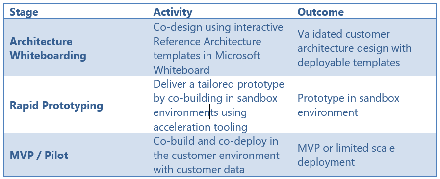

# CAIP Technical Workshop-Roadshow: Caldova Production Challenge

## Overview

>**Note:** This workshop is designed as a hands-on technical roadshow exercise. Participants should use the provided Caldova scenario, current-state details, reference architecture, and sandbox environment to complete the activities.

>**Note:** Teams should export their future-state architecture before starting Rapid prototyping. The exported image will be used to generate deployment assets with GitHub Copilot.

This CAIP Technical Workshop-Roadshow helps participants solve a real-world pharmaceutical manufacturing transformation scenario for **Caldova**. Participants will use business envisioning, whiteboarding, future-state architecture design, Microsoft Fabric, Microsoft Foundry, and GitHub Copilot to create a Rapid prototype that supports manufacturing capacity decisions, data modernization, and governed multi-agent AI.

The workshop is modular and connected. Each stage stands on its own and can be delivered independently but run in sequence they compound: the whiteboard output feeds the prototype, and the prototype is what makes an MVP or pilot conversation credible with a customer.

   

Rapid prototyping is offered in three options. Tech sellers and partners should lead with Option A; Options B and C are used as needed. 

- **Option A** uses Cora, the AI Copilot for rapid prototyping, working from prompts to generate tables, data ontologies and deployable code, alongside GitHub Copilot. 

- **Option B** uses GitHub Copilot. 

- **Option C** uses the agentic loop. 

The roadshow default is Option A; Option B and C are available to attendees.    

## Learning Objectives

After completing this workshop, you will be able to:

- Understand Caldova's product launch challenge and the business drivers behind the transformation.
- Use whiteboarding to map business problems to a future-state technical architecture.
- Design a governed intelligence layer that supports trusted AI agents.
- Rapidly prototype deployment assets from a future-state architecture.
- Use GitHub Copilot in VS Code to generate ARM/Bicep templates and supporting deployment guidance.
- Explain how Microsoft Fabric, Fabric IQ, Microsoft Foundry, and multi-agent patterns can address Caldova's operational challenges.

## Caldova Case Study

The case study is introduced in the opening general session, immediately after the workshop overview and before the whiteboarding walkthrough. The deck introduces it as the Caldova Product Launch Challenge: from fragmented manufacturing operations to a launch decision under pressure. An intro video is included in the deck to carry the story. 

By the end of this introduction, participants should be able to articulate the business problem in a single sentence. Everything after that point, the architecture they draw, the agents they generate and the recommendation they defend, is an answer to that sentence. Time spent making the business problem land is never wasted. 

## 1. Caldova Product Launch Challenge

### 1.1 Company Type and Situation

Caldova is a pharmaceutical company racing to launch an accelerated V2 / next-generation pharma product ahead of a competitor's scheduled release. The launch depends on supply chain, manufacturing, procurement, data, application, and compliance teams working from the same trusted context.

The immediate business pressure is a **7% capacity gap across three manufacturing plants**. Caldova needs to determine whether the gap can be closed internally and, if not, which pre-qualified contract manufacturing organizations can fast-track support in a **3-6 month window**.

Caldova also needs a multi-agent AI solution leveraging Microsoft IQ capabilities to recommend and take action on critical operational issues for the COO.

### 1.2 The business problem

The immediate business pressure is a 7 percent capacity gap across three manufacturing plants. Caldova needs to know whether it can close that gap internally, and if it cannot, which pre-qualified contract manufacturing organizations can fast-track support within a three to six month window. Leadership wants a multi-agent AI solution, built on Microsoft IQ, that can recommend and act on operational issues of this kind for the COO. 

The deck states the same problem in the language you will show on screen: Caldova is preparing for a critical product launch while its manufacturing environment is fragmented across legacy SQL systems, disconnected data domains and specialist processes, and the team must make a defensible recommendation despite a 7 percent production gap, a 30-minute downtime ceiling, undocumented dependencies and a fixed launch window. 

Caldova's leadership has recognised that the core challenge is not the technology infrastructure itself, but the organization's ability to turn data into actionable intelligence. 

Early AI experiments across functions showed promise, but scaling them against a fragmented estate introduced agent drift, duplicated builds, disconnected tools and governance gaps that are unacceptable in a regulated industry. The company wants AI to become a durable operating capability rather than a set of isolated experiments, and the desired end state is one governed, context-rich intelligence layer that every agent can trust, connecting real-time and historical operational data, manufacturing knowledge, supplier intelligence, internal SOPs, escalation paths and web context while honouring identity, permissions, sensitivity and compliance controls. 

The CTO's mandate, Cloud and AI-First Caldova Manufacturing Ops 2027, connects three motions into one transformation. Modernize with Confidence migrates the legacy SQL Server estate to Azure SQL Managed Instance, retiring technical debt while retaining full compatibility, built-in high availability and compliance controls. Amplify Your Intelligence builds a semantic, context-rich intelligence layer with Fabric IQ so manufacturing data speaks the language of the business, plants, lines, batches, suppliers and capacity, and can assess millions of data points to recommend how the gap is closed. Ubiquitous Innovation follows once every agent reasons from the same trusted ontology, letting teams across Caldova rapidly build and deploy governed multi-agent solutions in Microsoft Foundry that turn shared context into decisions. 

This mandate provides a direct link between the case study and the 3 Core Conversations introduced earlier in the day. Make this connection explicit for participants, as it marks the transition from conceptual discussion to practical application within a customer context.

### 1.3 Technical Backdrop

Caldova's existing estate was not originally built for AI workloads:

- The supply chain planning application runs on a legacy system.
- The manufacturing database sits on an on-premises SQL Server estate.
- The broader infrastructure footprint runs on VMware.
- Data is siloed across IoT, supply chain, customer, production, supplier, and manufacturing quality systems.
- Each system has separate definitions, owners, access rules, and governance controls.

Because no single team can see the full picture, no AI agent can be trusted to act without a shared, governed intelligence layer.

### 1.4 Customer Overview

Caldova wants to turn AI from isolated experiments into a durable operating capability for regulated pharmaceutical manufacturing. The desired end state is one governed, context-rich intelligence layer that every agent can trust.

That layer should connect:

- Real-time and historical operational data
- Manufacturing knowledge
- Supplier intelligence
- Internal SOPs
- Escalation paths
- Trusted web context
- Identity, permissions, sensitivity, and compliance controls

### 2.4 The Three Challenges

Your team must address the following three challenges. Document your approach, sequencing, risks, and mitigation plan.

### Challenge 1: SQL Estate Migration to Azure SQL Managed Instance

The group acts as Caldova's migration architect team. The CTO has tasked them with moving the SQL Server estate, BatchManufacturingCore, QualityLIMS, SupplierPayments and the supporting operational databases, out of the London and Miami datacenters ahead of the VMware exit and within a 16-week window. Assessment comes first: the estate must be fully inventoried and assessed before anything moves, which is the practical meaning of modernizing with confidence. 

The questions are how the team will inventory the full estate and assess migration readiness including database, instance-level and cross-database dependencies; what the remediation plan is for deprecated syntax, unsupported SQL Server features, cross-database references and CLR assemblies; and what the migration and cutover sequence looks like, how the availability-group HADR model is replaced, and what the rollback plan is if cutover fails. 

You are the migration architect team for Caldova. The CTO has tasked you with designing a migration strategy to move the SQL Server estate from the London and Miami datacenters to Azure SQL Managed Instance ahead of the VMware exit and within the 16-week window.

**Migration Problem:**

- IT believes there are 10 databases, but audit logs show queries against unknown database names on LEGACY01.
- The estate must be fully inventoried and assessed before migration.
- 247 instances of deprecated SQL syntax must be remediated.
- EXTERNAL_ACCESS and UNSAFE CLR assemblies are not supported on Azure SQL Managed Instance.
- Production runs in an availability group between London and Miami.
- BatchManufacturingCore tolerates a maximum of 30 minutes of downtime.
- GxP records must stay in the UK region.

**Questions to Answer:**

- How will you inventory the full estate and assess migration readiness for Azure SQL Managed Instance?
- How will you categorize compatibility issues as blockers vs. warnings?
- What is your remediation plan for deprecated features and non-SAFE CLR assemblies?
- How will you test remediation without affecting production?
- What is your migration and cutover sequence?
- What is your rollback plan if cutover fails?

### Challenge 2: Unified Data Intelligence Layer with Fabric IQ

The group acts as the Caldova data engineering team. With the estate modernizing, the CDO wants one governed, context-rich intelligence layer that every future AI agent can trust, built on Microsoft Fabric with Fabric IQ in readiness for the agent fleet. Operational data is siloed across six systems, each with its own definition of plant, batch and capacity. Agents built directly against raw tables drift, duplicate logic and cannot be audited, which is unacceptable for GxP manufacturing, and identity, permissions and sensitivity labels must be honoured end to end from source system to agent answer. 

The questions are how to land the six sources into OneLake through mirroring, shortcuts or pipelines without creating another copy-and-drift problem, and how to model the manufacturing ontology in Fabric IQ, covering plants, lines, batches, suppliers, contract manufacturers, SOPs and capacity, so that agents reason over shared business concepts rather than raw tables. 

You are part of the Caldova data engineering team. The CDO wants one governed, context-rich intelligence layer that every future AI agent can trust, built on Microsoft Fabric with Fabric IQ.

**Unification Problem:**

- Operational data is siloed across six systems: IoT/plant telemetry, supply chain planning, customer/demand, production/MES, supplier/ERP, and quality/LIMS.
- Each system defines concepts such as plant, batch, and capacity differently.
- Agents built directly against raw tables drift, duplicate logic, and cannot be audited.
- Identity, permissions, and sensitivity labels must be honored end-to-end.

**Questions to Answer:**

- How will you land the six sources into OneLake using mirroring, shortcuts, and pipelines without creating another copy-and-drift problem?
- How will you model the manufacturing ontology in Fabric IQ?
- How will agents reason over shared business concepts instead of raw tables?
- How will access controls, sensitivity labels, and auditability be preserved?

### Challenge 3: Multi-Agent Solution for CMO Recommendation

The group acts as the Caldova data science team. Leadership needs a defensible answer in days, not weeks. Internal headroom analysis requires real-time line, shift and batch-schedule data from all three plants and is currently a multi-week manual exercise. Contract manufacturer selection must weigh qualification status, GMP compliance history, available capacity, tech-transfer time and cost, with the data spread across supplier and ERP systems, quality systems and external sources. Every recommendation must carry a GxP-compliant audit trail recording which data, which agent and which reasoning. 

The questions are how to decompose the problem into agents, for example an orchestrator, current capacity analysis, contract manufacturer analysis, a COO recommender and a compliance guardrail, and how those agents collaborate in Foundry; and how each agent grounds its reasoning in the Fabric IQ ontology rather than in direct database access, and why that matters for trust and reuse. 

You are the Caldova data science team. Leadership needs a defensible answer in days, not weeks: can the 7% capacity gap across the three plants be closed internally, and if not, which pre-qualified contract manufacturing organizations can fast-track support within the 3-6 month window?

**Recommendation Problem:**

- Internal headroom analysis requires real-time line, shift, and batch-schedule data from all three plants.
- CMO selection must weigh qualification status, GMP compliance history, available capacity, tech-transfer time, and cost.
- Data is spread across supplier/ERP, quality, and external sources.
- Every recommendation must carry a GxP-compliant audit trail.

**Questions to Answer:**

- How will you decompose the problem into agents?
- How will the orchestrator, current capacity analysis, contract manufacturer analysis, COO recommender, and compliance guardrail agents collaborate in Foundry?
- How does each agent ground reasoning in the Fabric IQ ontology?
- Why does grounding in shared business concepts matter for trust and reuse?

### 2.5 Current and Reference Architecture Activity

1. Open the current and reference architecture in your Whiteboard.
1. Fill out the business envisioning sections based on the Caldova case study.
1. Identify business goals, technical constraints, and measurable success criteria.
1. Drag and drop the relevant components from the reference architecture.
1. Build a future-state architecture that addresses all three challenges.
1. Export the future-state architecture as an image.

>**Note:** Save the exported future-state architecture image. You will upload it during the rapid prototyping exercise and use it with GitHub Copilot in VS Code.

### 2.6 Database Inventory

| Database | Size | Purpose | Special Features |
|---|---:|---|---|
| BatchManufacturingCore | 8 TB | Electronic batch records, MES transactions, batch genealogy, equipment and line history across the three plants | TDE encrypted |
| QualityLIMS | 3 TB | QC test results, stability studies, deviations and CAPA, batch release records | TDE encrypted |
| SupplierPayments | 300 GB | Procurement and CMO payment processing, supplier banking details | Always Encrypted |
| 7 smaller databases | ~1 TB | Serialization, track-and-trace, label management, environmental monitoring, warehouse and materials, training records, planning staging, and reporting marts | TBD |
| Total: 10 known databases | ~12 TB | Full known SQL estate | TBD |

### 2.7 Application Downtime Tolerances

| Application | Downtime Tolerance | Peak Load |
|---|---:|---:|
| Supply Chain Planning Portal | 5 minutes | 500 req/sec |
| Batch Release & QA Console | 2 minutes | 200 req/sec |
| MES / Batch Execution Service | 0 minutes, 24/7 | 100 req/sec |

### 2.8 Current Environment

#### London Primary Datacenter

- ZAVA-SQL-PROD01: SQL Server 2019 CU25, 64 cores, 512 GB RAM, 15 TB
- ZAVA-SQL-REPORT01: SQL Server 2017 CU31, reporting workload
- ZAVA-SQL-LEGACY01: SQL Server 2016 SP3, pharmacy gateway

#### Miami DR Datacenter

- ZAVA-SQL-DR01: SQL Server 2019 CU25, 32 cores, 256 GB RAM
- Async availability group replication from London

### 2.9 Non-Negotiable Constraints

| Constraint | Requirement |
|---|---|
| Maximum Downtime | 30 minutes for BatchManufacturingCore; an in-process batch cannot lose its electronic batch record mid-run. |
| Data Residency | GxP batch and quality records for BatchManufacturingCore and QualityLIMS must remain in the UK region. |
| Regulatory Compliance | Migration must preserve data integrity per GMP Annex 11 / 21 CFR Part 11 with full audit trail continuity. |
| Launch Window | Migration must complete within the 16-week window and cannot collide with V2 process validation runs. |

### 2.10 Network Environment Requirements

- No direct internet access from datacenter servers.
- All traffic routes through Zscaler proxy with SSL inspection.
- Firewall change control requires 2-week lead time.
- ExpressRoute exists but bandwidth is limited.
- OT and plant-floor networks are segmented from IT.
- MES and IoT historian data crosses only through approved DMZ brokers.
- CMO, supplier, and 3PL API endpoints are IP-allowlisted on both sides.
- Partner-side firewall changes may take up to 4 weeks.

<!--
## Option 3: Rapid prototyping using the agentic loop

An agentic loop is how an AI agent works toward a goal: understand, plan, act, check results and adjust. The loop repeats until the agent reaches the desired outcome. In Microsoft Foundry this helps agents complete business workflows more independently and reliably. The instructor demonstrates the loop, and attendees may use it as a third path if time allows. 

If the customer already has unified data in the cloud, the key challenge is to build a governed multi-agent solution.

Use an **agentic loop** where agents can plan, reason, act, validate, and improve recommendations using trusted cloud data.

### Steps to Access

1. Open your preferred web browser.
2. Navigate to the Agentic Loop application:
[Agentic Loop - Build with Copilot, Run with Foundry](https://agentic-loop-geguehdxa0c0h4bx.b02.azurefd.net/)
3. Sign in if prompted.
4. Once the application loads, explore the available features and agent experiences.
5. Begin interacting with the application by selecting a scenario or entering a prompt.

Challenge:
Build a Microsoft Foundry multi-agent solution that analyzes the 7% capacity gap, evaluates internal capacity and qualified CMOs, and provides auditable COO-ready recommendations through an agentic loop.

-->

