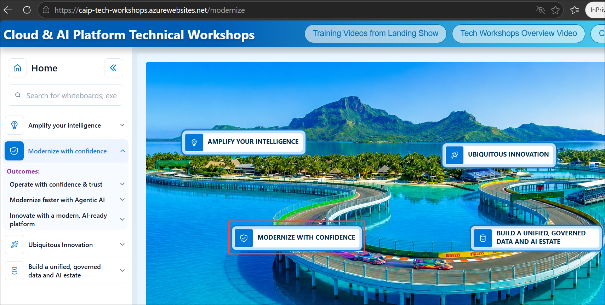
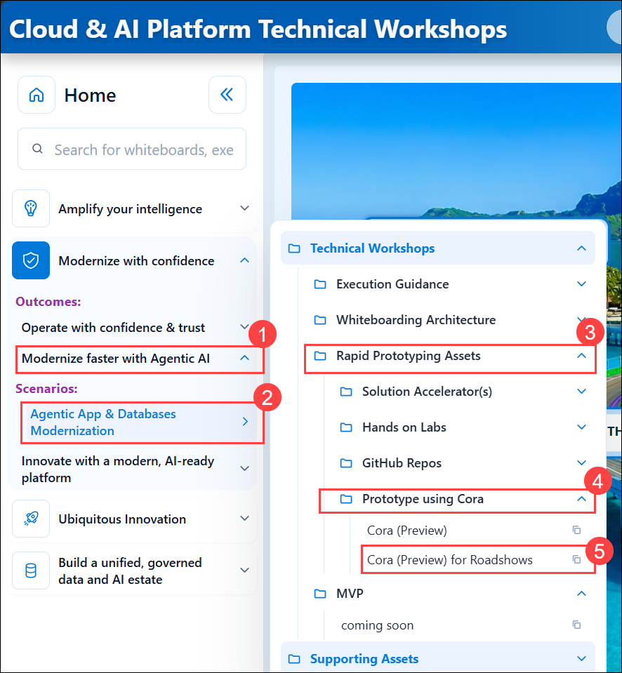
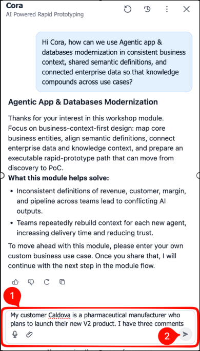
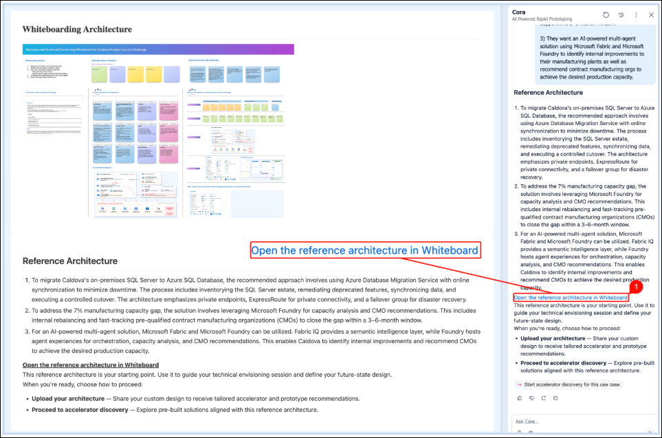
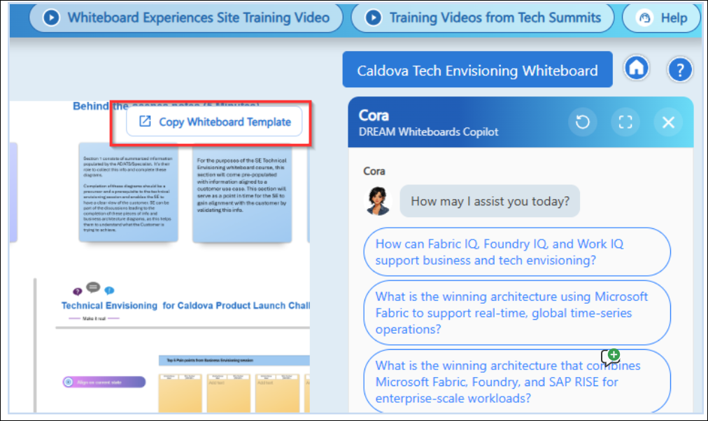
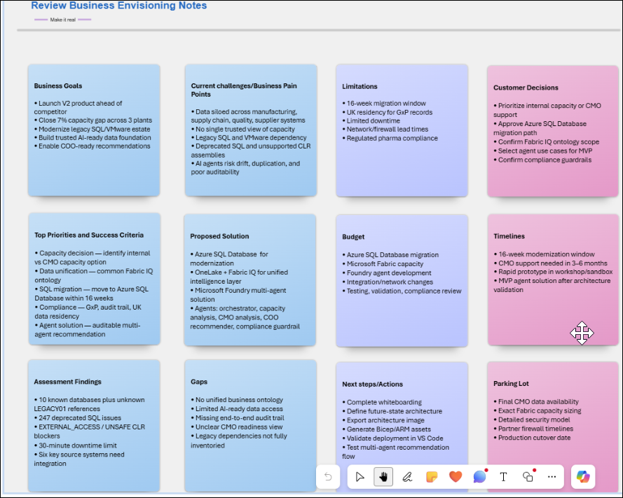
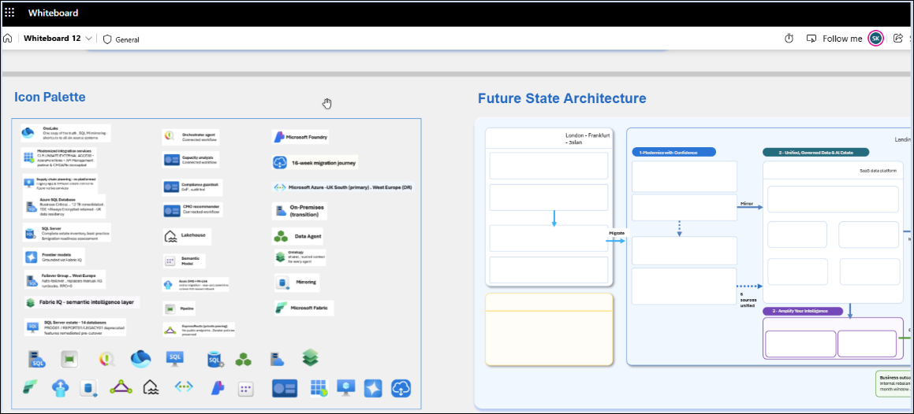

# 1. Envisioning Session Using Whiteboarding to Solve Caldova Business Problem

## What the Whiteboarding experience is?

The CAIP DREAM whiteboard experience is a single site for Solution Engineers, GBBs and Specialists, carrying Microsoft Whiteboard templates for the top CAIP reference architectures across three solution plays. The templates are customer-facing and curated from GBBs, Engineering, the Gold Standard accelerators team, the Azure Architecture site, SEs and partners. 

During business and technical envisioning, sellers collaborate with customers and partners to design tailored architectures for a specific scenario, then export those architectures and use Whiteboard Copilot or VS Code to create deployable ARM and Bicep templates for rapid pilots and proofs of concept. The templates live at aka.ms/CAIPWhiteboards, the DREAM templates experience at aka.ms/dreamwhiteboards, and the Seismic business and technical envisioning page carries the reference guide. 

### Workshop Exercise

- **Exercise:** Envisioning Session Using Whiteboarding
- **Estimated Time:** 150 minutes team exercise + 15 minutes reporting
- **Team Size:** TBD

### Strategic Mandate

**Cloud & AI-First Caldova Manufacturing Ops 2027** connects three transformation motions:

| Pillar | Objective |
|---|---|
| Modernize with Confidence | Migrate the legacy SQL Server estate to Azure SQL Managed Instance while retaining compatibility, availability, and compliance controls. |
| Amplify Your Intelligence | Build a semantic, context-rich intelligence layer with Fabric IQ so manufacturing data speaks the language of the business. |
| Ubiquitous Innovation | Enable teams to rapidly build and deploy governed multi-agent solutions in Microsoft Foundry. |


### The steps attendees follow:

1. Go to the Tech Workshop site at https://aka.ms/CAIPTechWorkshops.

1. Navigate to **Modernize with Confidence** section on the left navigation pane.

   

1. Select **Modernize faster with Agentic AI (1)**,  

   - Then select **Agentic App and Databases Modernization (2)**  

   - Select the **Rapid Prototyping Assets (3)** 

   - Select **Prototype using Cora (4)**  

   - Select **Cora (Preview) for Roadshows (5)**

        

1. In Cora chat pane, copy paste the following business problem statement to Cora. 

   ```
   My customer Caldova is a pharmaceutical manufacturer who plans to launch their new V2 product. I have three comments 

   1) Caldova’s supply chain planning application runs on legacy .NET, the manufacturing database sits on an on-premises SQL Server. It’s Data remains siloed across IoT, supply chain, customer, production, supplier, and manufacturing systems. Recommend a solution to migrate the on-premises SQL Server to Azure SQL DB. 

   2) Also, Caldova currently can manufacture 100 million units in 6 months. It needs to ensure the ability to manufacture 107 million units in 6 months, a gap of 7% manufacturing capacity. The closure of the 7% capacity gap across three manufacturing plants is needed to support the upcoming V2 product across multiple plants. Caldova needs to understand whether it can close the gap internally, and if not, which pre-qualified contract manufacturing organizations can fast-track support in a 3–6-month window. 

   3) They want an AI-powered multi-agent solution using Microsoft Fabric and Microsoft Foundry to identify internal improvements to their manufacturing plants as well as recommend contract manufacturing orgs to achieve the desired production capacity.
   ```

   - **Click** to proceed. 

        

1. Review the recommended architecture and open the linked Whiteboard.

      

1. Once *“Cloud & AI Platform Whiteboard Experience”* site opens, Click **Copy Whiteboard Template**. 

    

1. This opens https://whiteboard.cloud.microsoft/ login with your @microsoft.com account. Copy Whiteboard Template action copies and creates new whiteboard in your account. Give it a minute to load, then zoom out to 1% zoom level. 

1. Now you’re ready to do whiteboarding session with attendees.  

1. Start with Run the icebreaker session with an introduction to whiteboarding. 

1. Discuss Notes from Business Envisioning session then current state architecture. 

    

1. Modify selected parts of the architecture to create the `Future State Architecture`. 

   - Drag and drop icons from the Icon Palette to create **Future State Architecture**. 

   - Once complete, take a screenshot of **Future State Architecture** for next section of the workshop. 


    


## This completes the Envisioning Session using Microsoft Whiteboarding.

### Now, click on **`Next >>`** from the lower right corner to move on to **`Rapid Prototyping using Cora`**.