# 2. Rapid Prototyping

Rapid prototyping turns the exported whiteboard into deployment assets. The deck offers three options. Groups run Option 1, may use Option 2 if they prefer to work in VS Code, and watch Option 3 demonstrated. 

## Option 1: Rapid prototyping with Cora

Attendees use Cora in the CAIP technical workshop web app. They upload the future state architecture picture together with a natural language prompt explaining the architecture, generate deployment assets from that architecture, download those assets locally, generate synthetic data and generate an execution guide. 

In session the flow runs as follows: capture the finished future state whiteboard from the previous step, upload the picture to Cora, or the reference architecture as a backup, prompt Cora to generate sample data, deployment code and an execution guide, then download the code and open it in VS Code to review with GitHub Copilot. Where the exercise goes further, the group chooses the solution accelerator Cora recommends, generates the Bicep template and deployment assets, and validates in VS Code before deploying to the sandbox. 

A worked prompt for testing the multi-agent solution is: Assess the real-time line, shift, and batch-schedule data from all three plants to recommend 7% capacity gap closure. If the entire gap cannot be closed internally, please assess all 11 contract manufacturers to weigh their qualification status, GMP compliance history, available capacity, tech-transfer time, and cost to fully close the 7% capacity gap. 

The agents attendees should expect to see in the generated solution are an orchestrator or supervisor, current capacity analysis, contract manufacturer analysis, a COO recommender and a compliance guardrail. Ask the room which of those five they would trust with an unreviewed decision. It is the fastest route into the governance conversation. 

Here are the steps you will follow to create a rapid prototype for Caldova.

1. Leverage the AI assistant **Cora** in the CAIP technical workshop web app.
1. Provide the Caldova business problem statement to Cora.
1. Upload the future-state architecture image created during the whiteboarding exercise.
1. Ask Cora to explain the architecture and recommend the appropriate solution accelerator.
1. Choose the appropriate solution accelerator based on Cora's recommendation.
1. Generate Bicep templates and deployment assets.
1. Validate the generated assets in VS Code.
1. Deploy the solution in the sandbox environment.
1. Review the deployed environment and confirm that all three Caldova challenges are addressed.
1. Test the multi-agent solution.

### Steps: Access the Cloud & AI Platform Technical Workshops web application

### `Steps to navigate to CAIP Tech Workshop Web app.`

1. Click on the **Microsoft Edge** from the Lab VM desktop.
   
   
   
1. Right click on [Cloud & AI Platform Technical Workshops](https://caip-tech-workshops.azurewebsites.net/), then select **Copy link** and then paste the link on the Web browser.

1. Login with the following credentials:

    - Username: **<inject key="AzureAdUserEmail"></inject>**
    - Password: **<inject key="AzureAdUserPassword"></inject>**

1. After the application loads, you will see the workshop site home page as shown below.

   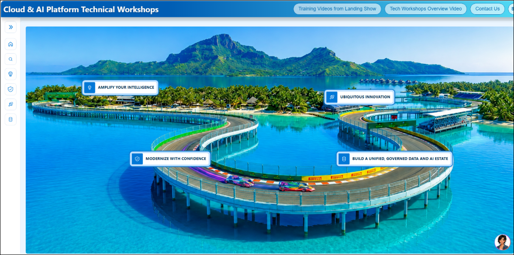

1. Select the **Modernize with confidence** drop-down menu to explore the available outcomes and workshop scenarios.

1. On the right side of the page, you'll find **Cora**, the AI-Powered Rapid Prototyping Copilot. Use the chat interface to enter prompts and interact with the workshop outcomes and scenarios as follows:

   - From the left navigation pane, expand **Modernize with Confidence (1)**.
   - Under **Outcomes**, select **Modernize Faster with Agentic AI (2)**.
   - Under **Scenarios**, select **Agentic App & Databases Modernization (3)**.
   - In the **Technical Workshops** section, expand **Prototype using Cora (4)** and select **Cora (Preview) for Roadshows (5)**.
   
     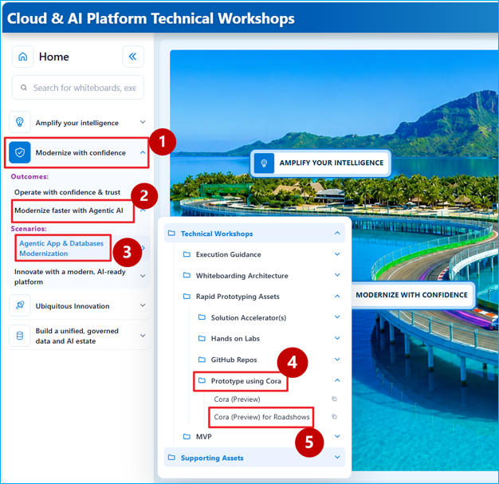

1. Continue in the Cora Chat pane for Rapid Prototyping.  

   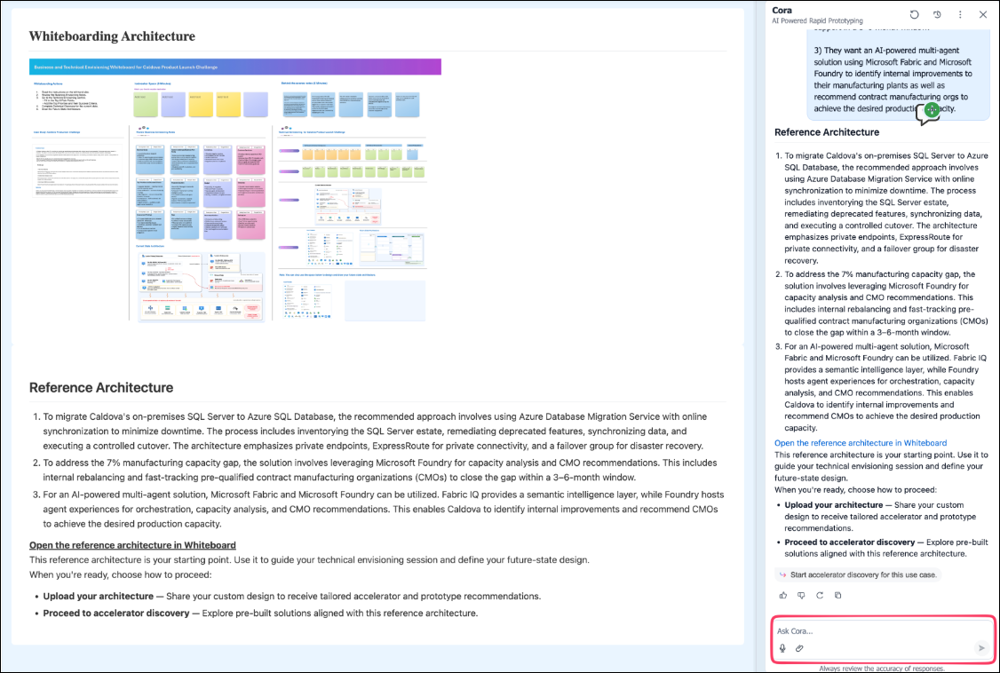

1. In Cora chat pane, Upload the final `Future State Architecture` screenshot and copy & paste the following statement on Cora. 

   ```
   Explain this Architecture.
   ``` 

   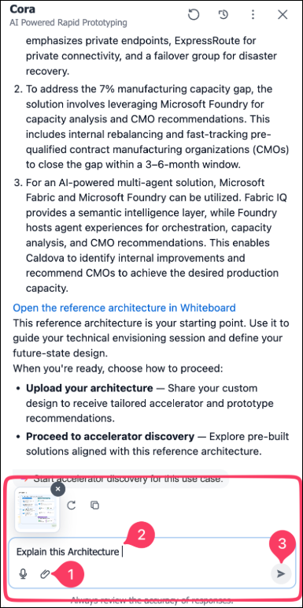   

1. Review the Architecture Summary provided by Cora.

   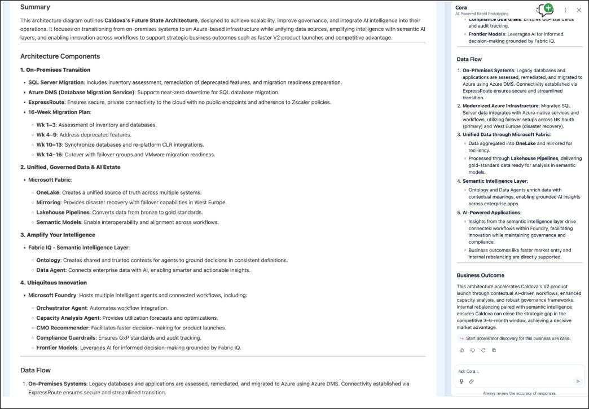   

1. **Copy & paste** the following statement on Cora `Generate Synthetic Data`.

   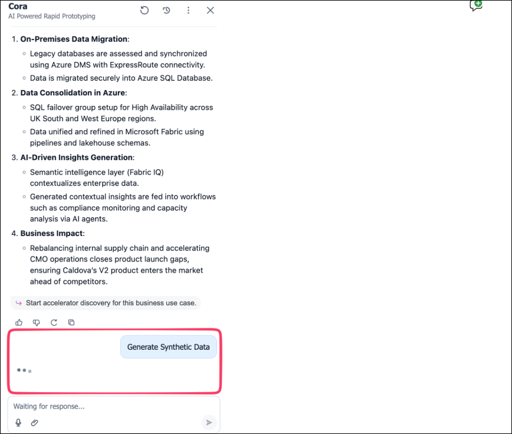  

    >**Note:** It might take 2-3 minutes to generate the data.

1. Review the tables from the generated data and click on **Download full artifacts.**      

   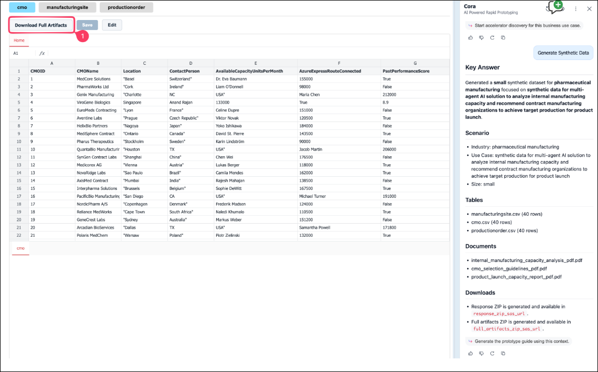  

1. Copy and paste the following prompt on Cora: 

   ```
   Generate the deployment artifacts using this Architecture.
   ```

   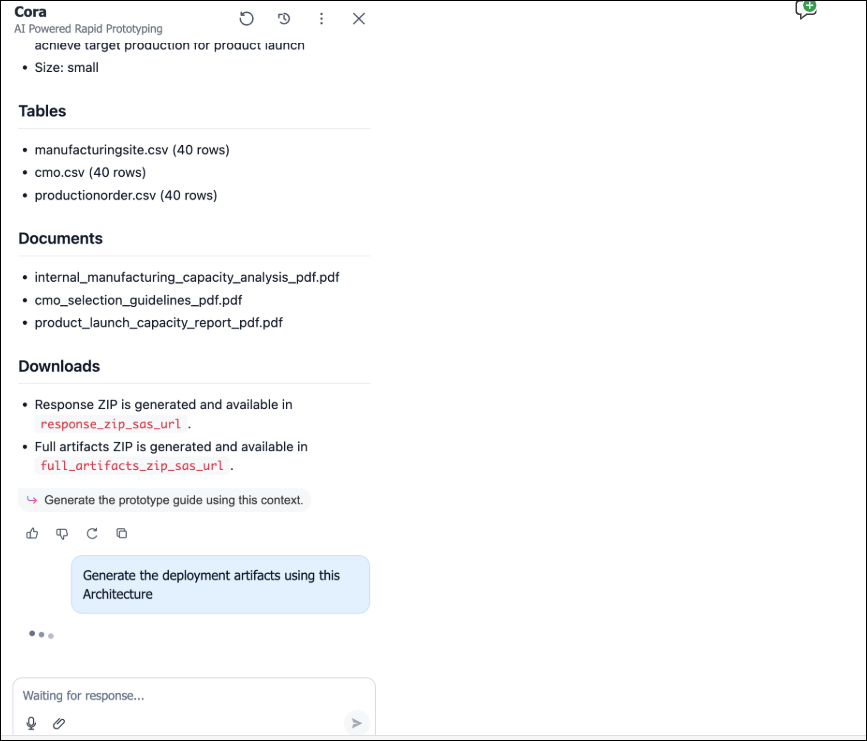 

    >**Note:** It might take 1-2 minutes to generate the Deployment artifacts

1. Review the generated files from the Cora and click on **Download the zip file** using the Download button on top left. 

   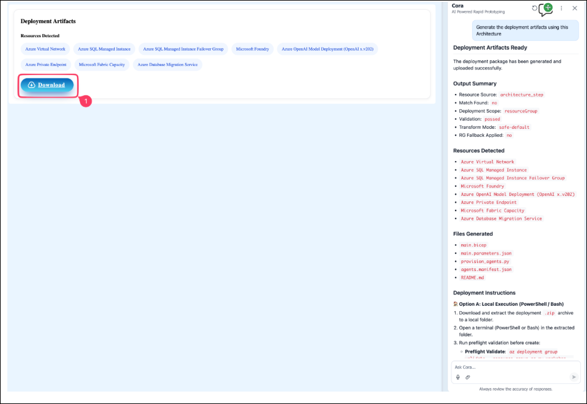 

1. Save the Downloaded zip file in your preferred location.   

   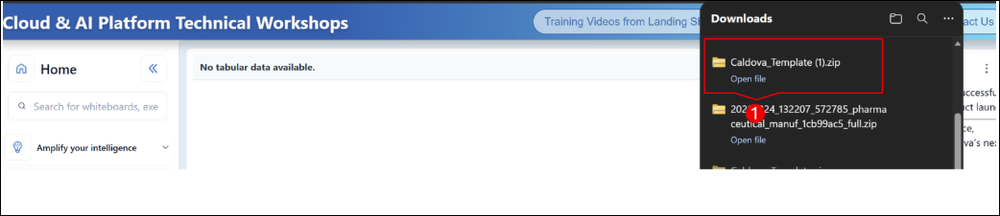

1. Click on the prompt `Generate the prototype guide using this context`. It will generate the Exercises in the left. 

   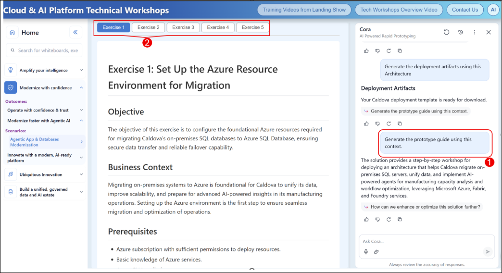

#### Multi-Agent Solution to Test

The rapid prototype should include the following agents:

- Orchestrator / Supervisor
- Current capacity analysis agent
- Contract manufacturer analysis agent
- COO recommender agent
- Compliance guardrail agent

### Deployment Prompt

```
You are an Azure Cloud Architect and DevOps Engineer.

I have all solution artifacts in this repository. Analyze the repository and deploy the complete solution into my Azure tenant.

Tasks:

1. Review all artifacts and identify:
   - Infrastructure as Code (Bicep, ARM, Terraform)
   - Application code
   - Azure resources required
   - Configuration files
   - Deployment dependencies

2. Create a deployment plan before executing:
   - Resource Groups
   - Networking
   - Storage Accounts
   - Key Vaults
   - Microsoft Fabric integrations
   - Microsoft Foundry
   - Azure OpenAI
   - Azure Functions
   - App Services
   - SQL Databases
   - Any other required resources

3. Validate:
   - Resource naming conventions
   - RBAC permissions
   - Managed identities
   - Environment variables
   - Secrets and Key Vault references
   - Cost estimates
   - Azure Policy compliance

4. Generate:
   - deployment.md
   - architecture.md
   - deploy.sh
   - deploy.ps1
   - GitHub Actions workflow

5. Deploy the solution to Azure using best practices:
   - Create resource group if it does not exist
   - Provision infrastructure
   - Configure networking and security
   - Deploy applications
   - Configure monitoring and logging
   - Validate deployment health

6. After deployment provide:
   - Deployed resource inventory
   - Resource IDs
   - URLs and endpoints
   - Validation results
   - Any deployment issues and resolutions

Azure Details:
- Tenant ID: <TENANT_ID>
- Subscription ID: <SUBSCRIPTION_ID>
- Resource Group: <RESOURCE_GROUP>
- Region: <REGION>

Do not make assumptions.
Ask for missing information.
Use Azure CLI and Bicep wherever possible.
Follow Microsoft Well-Architected Framework and security best practices.
```

### 3.3 Sample Test Prompt

Use a prompt similar to the following:
```
Assess the real-time line, shift, and batch-schedule data from all three plants to recommend 7% capacity gap closure. If the entire gap cannot be closed internally, assess all 11 contract manufacturers and weigh their qualification status, GMP compliance history, available capacity, tech-transfer time, and cost to fully close the 7% capacity gap.
```

## This completes the Rapid Prototyping using Cora.

### Now, click on **`Next >>`** from the lower right corner to move on to **`Rapid Prototyping using GitHub Copilot`**.