# Option 2: Rapid prototyping with GitHub Copilot

Option 2 uses the whiteboarding session to map business challenges to a future-state technical architecture, designs a governed intelligence layer that enables trusted and secure AI agents, and rapidly prototypes deployment assets from the target architecture. GitHub Copilot in VS Code generates the ARM and Bicep templates, synthetic data and the supporting deployment guidance. Use this path to demonstrate how Microsoft Fabric, Fabric IQ, Microsoft Foundry and multi-agent patterns address Caldova's operational challenges and accelerate modernization. 

### GitHub Copilot Role in the Workshop

Use GitHub Copilot to accelerate the creation, validation, and refinement of deployment assets. Copilot should help participants:

- Convert architecture decisions into deployable infrastructure definitions.
- Generate ARM/Bicep templates.
- Create supporting parameter files.
- Review dependencies and deployment sequencing.
- Explain template sections and resource relationships.
- Identify missing networking, identity, monitoring, or security configuration.
- Produce deployment instructions for the sandbox environment.

### Upload Future State Architecture and Generate ARM/Bicep Template in VS Code

Follow these steps in VS Code:

1. Open the workshop repository or sandbox folder in VS Code.
2. Create a folder named `deployment-assets`.
3. Add the exported future-state architecture image to the folder.
4. Open GitHub Copilot Chat in VS Code.
5. Attach or reference the future-state architecture image.
6. Ask Copilot to analyze the architecture and identify the Azure resources required.
7. Ask Copilot to generate an ARM or Bicep template based on the architecture.
8. Ask Copilot to create a parameter file for the sandbox deployment.
9. Ask Copilot to validate dependencies, naming conventions, and resource group assumptions.
10. Review the generated files before deployment.

### GitHub Copilot Setup

You will use GitHub Copilot to generate ARM or Bicep templates from the provided natural language business use case/scenario.

1. Click on the **Visual Studio Code** from the VM desktop.

   

1. Click on **Continue with GitHub** to sign in to GitHub Copilot.

   

1. On the **Sign in to GitHub** tab, enter the provided **GitHub username** **(1)** in the input field, and click on **Sign in with your identity provider** to continue **(2)**.

   - **Username:** <inject key="GitHub User Name" enableCopy="true"/>

     

1. Click on **Continue** on the **Single sign-on to CloudLabs Organizations** page to proceed.

   

1. Click on **Accept**.

   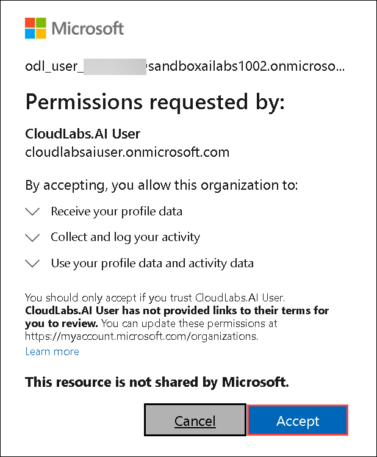

1. Select **Continue** to **Authorize Visual Studio Code**.

   

1. Select **Authorize Visual Studio Code**.

   

1. Select **Open**.

   

1. Once the Visual Studio code opens, choose the theme of your wish **(1)** and then click **Get Started (2)**.

   

   

   >**Note:** If you get any error pop up, please **Close.**

    


### Caldova Deployment Prompts

#### **Prompt 1: Azure SQL Database**

1. Right click on the [Future-State-Architecture](https://stcalodva.blob.core.windows.net/future-state-architecture/Future-State-Architecture), then select **Copy link** and then paste it on the new browser tab inside the VM.

   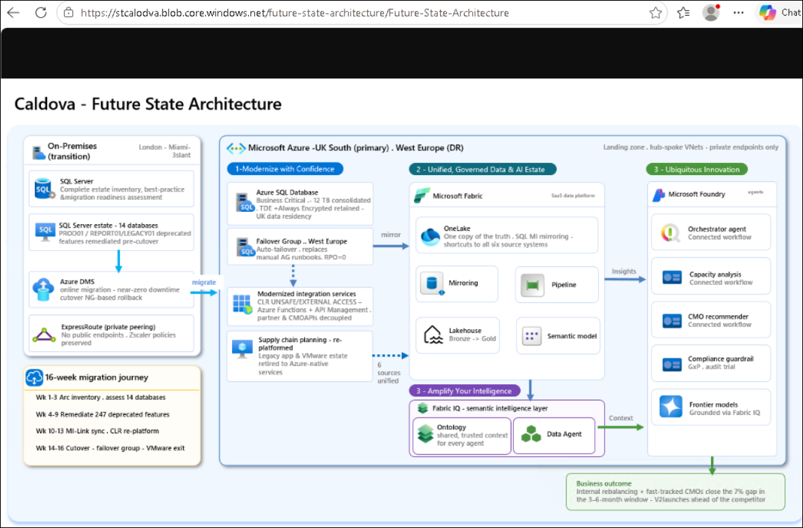

1. Once the **Future State Architecture** is shown up, click on **Ctrl+S** to save the Architecture.

1. Navigate to `C:\miq-project` folder **(1)**, enter the name as **Future State Architecture (2)** and then **Save (3)**.

   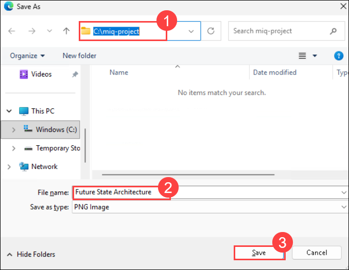

1. Navigate back to **VS Code.**

1. Select **File (1)** and then **Open Folder (2)**.

   

1. Navigate to **`C:\`** path **(1)**, then select the **miq-project** folder **(2)** and then **Select folder (3)**.

   

1. From the **GitHub Copilot** Chat, select **Models (1)** and then select **Trust Workspace to enable models (2)**.

   

1. Select **Trust Folder and Continue**.

   

1. Click **Auto (1)** and then set the model to **Claude Sonnet 5 (2)**.

   

1. Click on **Default permission (1)** and then set it to **Allow all (2)**.

   

1. Select **Enable**.

   

1. Select the **Future-State-Architecture.png**.

   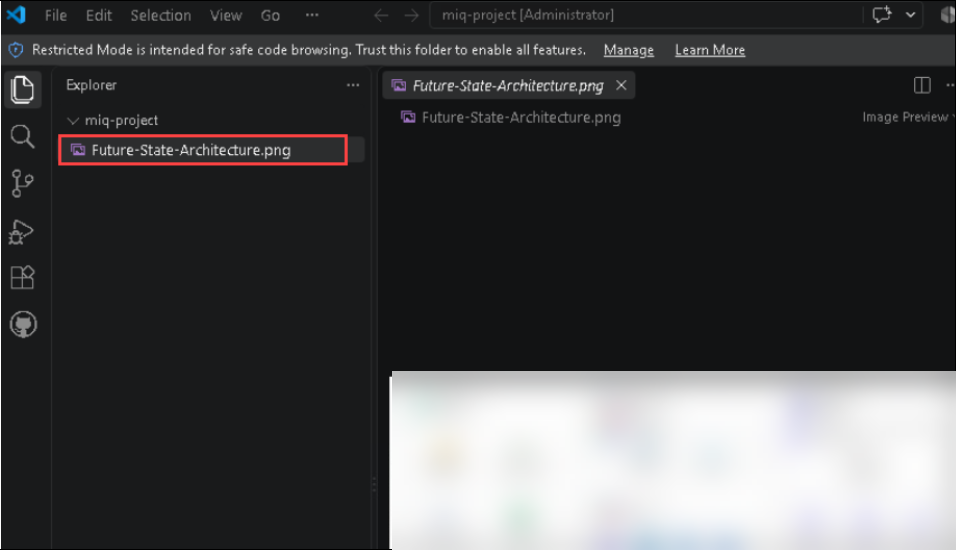

1. From the **GitHub Copilot Chat**, click on **+ (1)** and then select the **Future-State-Architecture.png (2)**.

      

1. Send the prompts below into **GitHub Copilot Chat** along with the attached **Future State Architecture**.

   ```
   You are my smart agent. Review the problem statement and planned solution architecture design below to help Caldova overcome its challenges. Then prepare Bicep/ARM templates and deploy the resources in the respective environment.
   Problem Statement
   Caldova is accelerating the launch of its next-generation pharma product ahead of a competitor, requiring supply chain, manufacturing, procurement, data, application, and compliance teams to work from a single trusted context.
   With a 7% capacity gap across three manufacturing plants, Caldova must determine whether the gap can be closed internally or through pre-qualified contract manufacturers within 3-6 months, while leveraging a multi-agent AI solution powered by Microsoft IQ capabilities to provide the COO with trusted recommendations and enable timely action on critical operational issues.
   Planned Solution Architecture Design:Attached Caldova-architecture.png.
   Scope:
   First, build the **"1-Modernize with Confidence"** section from the planned solution architecture design using **Azure SQL Database**.
   Instructions:
   1. Create a new Resource Group naming as "RG_Caldova_Pharma" in Azure in the region of "West US3" and proceed further.
   2. Create an Azure SQL server and one Azure SQL Database on that server, as shown in the architecture diagram (Business Critical tier, TDE enabled).
   3. Enable the system-assigned managed identity on the logical server and allow Azure services and resources to access the server. This is required for Fabric mirroring in the next phase.
   4. Generate sample data files based on the problem statement: a 7% capacity gap across three manufacturing plants.
   5. Create tables for the sample data in the Azure SQL Database.
   Note: Ensure the data is properly relational, with a primary key on every table and explicit foreign key relationship, so it can support Fabric mirroring, Fabric Ontology, and Data Agent creation in the future. Also create markdown(.md) files with deployment instructions and post deployment configurations and start deployment.
   ```

   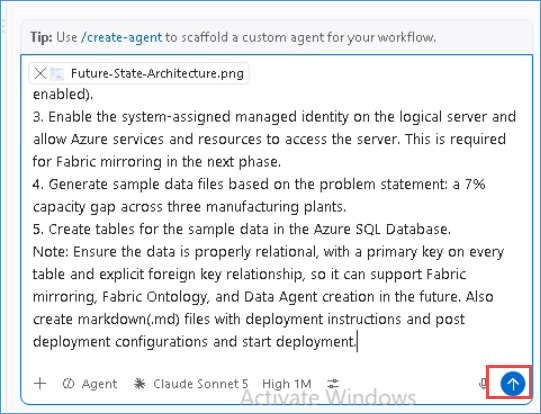

1. Once the deployment is complete, you can verify the deployed resources by navigating to the newly created resource group.

1. Navigate to the [Azure portal](https://portal.azure.com). Search for Resource groups in search tab and click on **Resource Groups**

   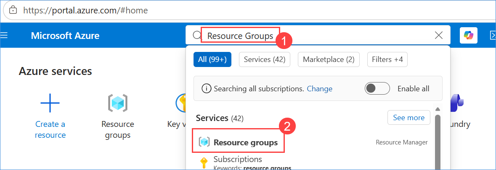

1. Click on **RG_Caldova_Pharma** Resource Group
    
   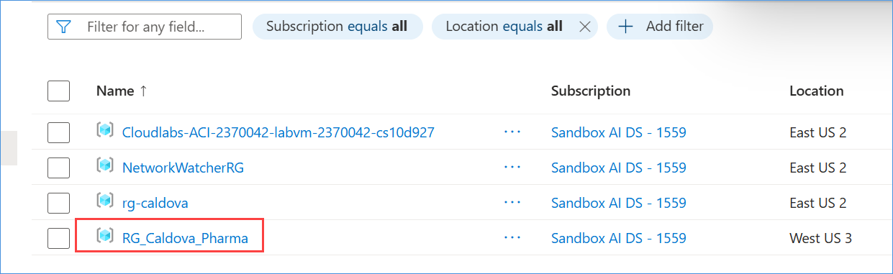

1. Click on Created **SQLDatabase** 

1. In the left navigation pane, click Query Editor (Preview).

1. If prompted to sign in, click Sign in and complete the authentication process.

1. In the Explorer pane, expand Pharma DB, then expand dbo. Select Tables to view the list of tables in the database.

   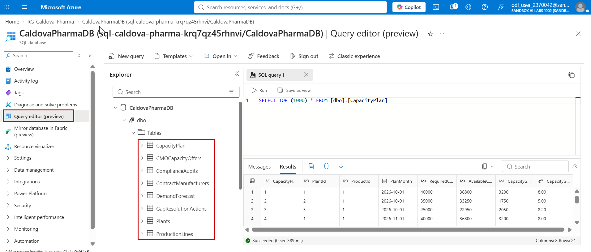


#### **Prompt 2: Fabric IQ**

**Step 2:** 
1. Navigate to **Vscode** again

1. Copy the prompts below into **GitHub Copilot**.

   ```
   Great, you have created Azure SQL Server and Database. Now follow the instructions below to build **Fabric IQ**.
   Note: Please use same Resource Group as "RG_Caldova_Pharma" for all the below resources.
   
   Instructions:
   1. List all Azure resources from the architecture diagram.
   2. Create a new Fabric Capacity using **SKU F16** for the **West US 3** region.
   3. Create a new Fabric Workspace attaching with above newly created capacity.
   4. Please grant admin access to the UPN: <inject key="AzureAdUserEmail"></inject> in the Fabric Workspace 
   5. Create a Lakehouse and load tables from the Azure SQL Database using Fabric mirroring (Mirrored Azure SQL Database).
   6. Create a Fabric Ontology using the Lakehouse tables with proper relationships and generate the Ontology Graph view.
   7. Create a Data Agent using the Ontology as a data source, and prepare proper Agent Instructions based on the Ontology entities to support the business problem.
   Completion Requirement:
   
   After completing the steps successfully, create a Markdown file with:
   - Deployment instructions
   - Deployment startup steps for:
   - Creating the workspace
   - Creating the Lakehouse
   - Loading data from Azure SQL Database into Lakehouse using mirroring
   - Creating the Ontology
   - Creating the Data Agent
   - Post-deployment configurations
   Then start deploying.
   ```

1. Once deployment is completed, please navigate to Azure portal

1. Click on **Microsoft Cloude Menu** and select **Fabric**

    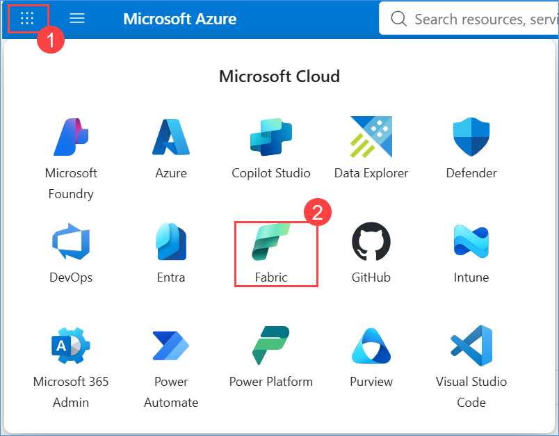

1. It will open Fabric portal in new tab

1. Click on **workspaces** and select **Caldova Pharma Fabric IQ** workspace 

1. Click on **CaldoveLakehouse** 

   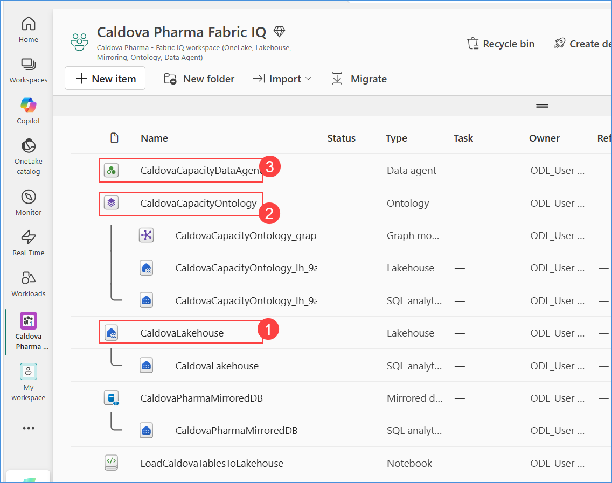

1. Select Tables to view the list of tables in the Lakehouse.

1. Then Click on **CaldovaCapacityOntology** and then Select **Product** in the Entity Types and Click on **View Entity Type Details**

   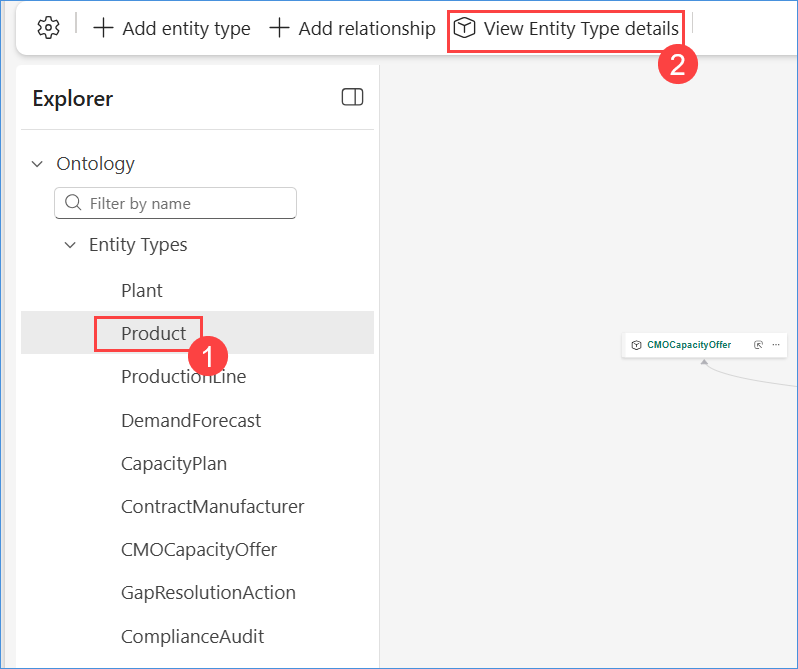

1. Click on **Overview** to view the graph model.

   

1. Navigate back to workspace and Click on **CaldovaCapacityDataagent**

1. Navigate to Test data agent, send the following prompts in Data agent input box 

   ```What CMO capacity offers are currently available?```

   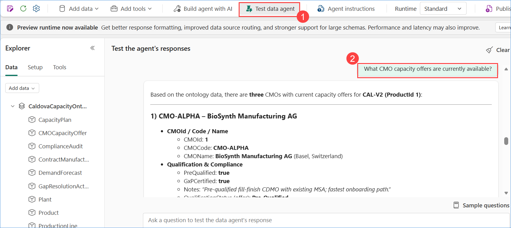

   ```Are there any products where forecasted demand exceeds available production capacity?```

   ```Which capacity gaps have been identified, and what actions have been recommended to resolve them?```

1. Click on **Publish** to publish the DataAgent.

#### **Prompt 3: Foundry IQ**

**Step 3:** 

1. Navigate back to the GitHub Copilot Chat to deploy the Foundry resources.

1. Navigate back to the GitHub Copilot Chat

1. Copy the below prompt into the chat and send.

   ```
   Great, you have created both Azure SQL Database and Fabric IQ. Now follow the instructions below to build **Foundry IQ**.
   
   Note: Please use same Resource Group as "RG_Caldova_Pharma" for all the below resources.
   
   Instructions
   1. List all Azure Foundry-related resources from the architecture diagram.
   2. Create Foundry resources in Azure.
   3. In the Foundry Project, create one standard model: **gpt-5-mini**.
   4. In the Foundry Project, create an agent named **Capacity-Planning-Foundry-Agent** and attach the Fabric Data Agent, **Capacity-Planning-Agent**, by tool calling.
   5. Create proper instructions for the agent so it provides useful responses.
   6. Once **Capacity-Planning-Foundry-Agent** is created, validate that the prompt works and returns valid results, then provide confirmation.
   7. Ensure the agent instruction, prompt, and response fulfill the problem statement.
   Completion Requirement: 
   After completing all steps successfully, create a Markdown file with:
   - Deployment instructions
   - Post-deployment configurations
   Then start deployment.
   ```


   ### Supporting Prompt

   If the agent is not visible, use this prompt:

   >Not able to see agent, please refresh and load it.

1. Once deployment is completed, please navigate to Azure portal

1. Click on **RG_Caldova_Pharma** Resource Group

1. Select Foundry Project

1. Click On **Go to Foundry portal**

1. Click on Build

1. Navigate to Agents and click on the **Capacity-Planning-Foundry-Agent**

1. Copy the below prompts and paste it in the agent chat window 

   ```Assess the real-time line, shift, and batch-schedule data from all three plants to recommend 7% capacity gap closure. If the entire gap cannot be closed internally, assess all 11 contract manufacturers and weigh their qualification status, GMP compliance history, available capacity, tech-transfer time, and cost to fully close the 7% capacity gap.```

   

   
   

>**Note:** Treat generated templates as a rapid prototype starting point. Teams must validate resource availability, region support, security settings, and workshop sandbox constraints before deployment.
